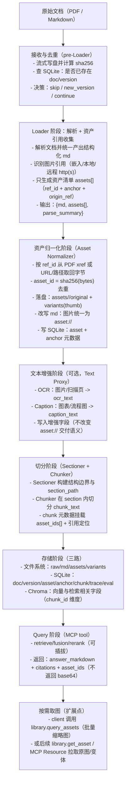

# DEV_SPEC

> 先定总体方向与结构，细节逐节讨论。

---

## 1. 项目概述

本项目旨在构建一套**面向工程实践的 RAG 文档理解与检索系统**，重点解决多格式文档解析不稳定、检索结果不可溯源、以及策略演进成本高等问题。系统强调清晰的职责分层、可回放的数据流水线与可插拔的检索策略，而非一次性 Demo。

### 1.1 目标

构建一个 **RAG 文档助手**，支持 `PDF / Markdown` 文档入库、解析、切分、向量化、检索与生成，并整体封装为 **MCP Server** 对外提供能力。

### 1.2 能力与知识点覆盖

* RAG 全链路：Loader → Transformer&Enrichment（pre：去噪/规范化；post：元数据注入/多模态挂载） → Sectioner → Chunker → Embedding → 检索 → 重排 → 生成

* 可插拔策略设计（接口化 + 注册/配置驱动）

* 向量检索 / 混合检索 / 重排

* 多模态文档处理（图片、资产引用、OCR/Caption 扩展）

* 元数据增强与可溯源展示

* 可观测性（状态、日志、统计、诊断）

* RAG 评估体系（离线/回放/指标化）

* MCP Tool 化接口设计

### 1.3 约束与假设

* **唯一入口**：仅通过 MCP Tool 调用
* **默认单租户**：不引入 ACL / RBAC
* **保留扩展点**：多租户、权限控制、外部存储可后续扩展

---

## 2. 核心特点

本章总结系统在设计与实现上的核心特点，突出其工程化取向与差异化亮点。

### 2.1 RAG 策略与设计亮点

* 覆盖完整 RAG 全链路：文档解析 → 切分 → 索引构建 → 检索 → 重排 → 生成
* 明确区分离线文档处理与在线查询路径，降低在线推理成本
* 支持向量检索、BM25 与混合检索，并为重排与 Query 改写预留扩展点

### 2.2 全链路可插拔设计

* 系统不仅在算法层（Chunker / Retriever / Reranker 等）提供可插拔能力，还在**流程层（Ingestion Pipeline）**冻结执行拓扑、开放实现策略。
* 离线文档处理采用**单一入口 + 配置驱动流水线**的设计：流程拓扑固定，阶段实现通过 provider 注册与配置选择，从而在不修改主流程代码的前提下支持能力演进。
* 该设计使新增能力（如新的解析器、切分策略、Embedding 模型或索引后端）体现为“新增/替换阶段实现”，而非对系统整体结构的侵入式修改。

这一特性保证了系统在策略快速试验、能力扩展与长期维护之间的平衡，是后续可观测性、评估与回放机制能够成立的前提。

### 2.3 MCP 生态集成

* 系统能力统一以 MCP Tool 形式对外暴露
* 明确 Tool 输入输出 schema，作为系统对外契约层
* 支持将文档处理与查询能力嵌入 MCP 生态中的其他 Agent 或工具

### 2.4 多模态图像处理

* 在文档解析阶段识别并定位图片资产，但不在 Loader 内处理
* 通过统一资产归一化器实现图片提取、去重与引用替换
* 为 OCR、Caption 与多模态检索预留清晰扩展路径

### 2.5 可观测性与评估体系

* 在解析、切分与索引阶段持续产出结构化诊断信号
* 支持文档级、chunk 级的状态追踪与失败定位
* 通过回放、统计与评估指标支撑 RAG 质量诊断与策略迭代

---

## 3. 文档处理、接口与系统设计

本章从系统维度而非实现顺序出发，对离线文档处理、对外接口、架构扩展性、可观测性以及多模态能力进行分层说明。

---

### 3.1 文档处理（离线 Ingestion Pipeline）

本节描述文档入库阶段的**离线处理流程**，用于构建解析事实层与运行索引层，不直接参与在线查询路径。

---

#### 3.1.0 Ingestion Pipeline 规则与约束

本系统的离线摄取遵循以下**强约束规则**，作为 ingestion pipeline 的设计基线，所有实现与扩展均不得违反。

##### 规则 1：单一入口原则（Single Entry Point）

* 系统仅允许通过 `IngestionPipeline.run()` 触发离线文档摄取流程。
* CLI、Dashboard、自动化测试等所有调用形态，均不得自行拼装或绕过 pipeline 内部流程。
* 任何新增的调用入口，本质上都应被视为对 `run()` 的封装，而非新的执行路径。

该规则用于确保不同使用场景下**执行语义完全一致**，并为后续回放、评估与问题复现提供稳定锚点。

---

##### 规则 2：流程拓扑冻结，阶段实现可插拔

* ingestion pipeline 的阶段顺序由拓扑定义并被冻结：

  * `Loader → Transformer&Enrichment(pre) → Sectioner → Chunker → Transformer&Enrichment(post) → Embedding → Upsert`
  * 说明：同一模块允许以 **pre/post 两次 hook** 形式参与流水线，但对外仍视作同一阶段能力，不得分叉拓扑；
* 阶段内部的**实现策略**允许替换，但不得改变阶段之间的依赖关系与数据流向；
* 新能力应体现为新增/替换阶段实现，而非修改主流程控制逻辑。

**实现要点（摘要）**：

* 使用配置驱动的 pipeline 定义（如 `pipeline.yaml`）描述步骤序列；
* 通过 provider 注册表将阶段名称映射到具体实现；
* 阶段对外仅暴露统一接口，屏蔽内部实现细节；
* dev/test/prod 之间仅允许资源配置差异，不得分叉 pipeline 拓扑。

---

##### 规则 3：阶段级可观测性（Observability First）

* ingestion pipeline 在阶段级别提供统一的观测点，而非仅在整体成功/失败时输出日志；
* 每个阶段至少应暴露执行开始/结束事件、耗时与基础统计信息；
* 观测能力通过统一的 hook/回调机制实现，与具体调用入口解耦。

**实现要点（摘要）**：

* `IngestionPipeline.run(..., on_progress)` 提供统一进度回调；
* runtime 在每个阶段前后触发观测 hook，收集并上报统计；
* 阶段实现不得直接打印或上报进度，避免入口侧逻辑分叉。

---

##### 规则 4：失败可控与状态可诊断

* 单个阶段的失败应被显式建模并记录，而非隐式吞掉；
* pipeline 在失败情况下仍应尽可能保留可诊断的中间状态；
* 是否允许失败后继续执行，应由阶段策略而非调用入口决定。

---

#### 3.1.1 文档处理总体流程

MCP Tool 作为入库触发入口，接收文件后：

1. 流式写盘
2. 同时计算 `sha256`
3. 基于 SQLite 做文件级去重（`skip / new_version`）
4. 仅在需要时进入解析与索引构建流程

**`sha256` 计算规范（`file_sha256`）**

目标：在不依赖内存缓存的前提下，对“上传文件的原始字节流”生成稳定指纹，用于文件级去重与版本决策（pre-Loader）。

* **输入（参与 hash 的内容）**：上传文件的**原始字节流** `bytes`（binary），按接收顺序完整参与；不引入文件名、时间戳、路径、用户信息等任何外部字段（避免非内容因素导致 hash 漂移）。
* **输出格式**：`file_sha256` 为 64 位小写十六进制字符串（`hashlib.sha256(...).hexdigest()`）。
* **实现方式**：边写盘边 hash（单次遍历；避免读两遍/全量进内存）。
* **关键参数（工程参数，不影响语义）**：
  * `read_chunk_size_bytes`：每次从输入流读取的块大小（建议默认 `8 MiB`，可配置）；
  * `max_bytes`：最大允许摄取文件大小（用于保护资源；超限直接拒绝/中止摄取）；
  * `hash_alg_id`：固定为 `sha256`（未来若升级算法必须版本化，例如 `sha256.v1`，并写入元数据）。

参考伪代码：

```python
import hashlib

def compute_sha256_while_spooling(src_stream, dst_file, read_chunk_size_bytes=8*1024*1024):
    h = hashlib.sha256()
    total = 0
    while True:
        chunk = src_stream.read(read_chunk_size_bytes)
        if not chunk:
            break
        dst_file.write(chunk)
        h.update(chunk)
        total += len(chunk)
    return h.hexdigest(), total
```

**离线处理流水线（统一拓扑）**：

```
Upload
  → Hash & 去重
  → Loader（结构化重建，仅产出解析事实）
  → 资产与图片归一化（asset_id 去重 + 引用改写为 asset://）
  → Transformer&Enrichment(pre：去噪 / 规范化)
  → Sectioner（结构切分）
  → Chunker（长度/语义切分）
  → Transformer&Enrichment(post：元数据注入 / 多模态挂载)
  → 向量化（Embedding）
  → 索引写入（SQLite / Chroma）
```

**各阶段主要输入 / 输出（摘要）**

* `Hash & 去重（pre-Loader）`
  * 输入：上传文件 `raw_bytes`（流式）+ 原始文件名/类型（仅用于路由与展示，不参与 hash）
  * 输出：`raw_path`（落盘路径）、`file_sha256`、`dedup_decision`（`skip/new_version/continue`）、（若命中）`doc_id/version_id`
* `Loader`
  * 输入：`raw_path` + `doc_id/version_id`（新建或复用）+ 文件类型
  * 输出：`md`（结构化事实文本）、`assets[]`（`ref_id/origin_ref/anchor`）、`parse_summary`（`pages/text_chars/images/warnings` 等）
* `资产与图片归一化（Asset Normalizer）`
  * 输入：`raw_path`（必要时回读 PDF）、`md`、`assets[]`
  * 输出：`assets_resolved`（`ref_id -> asset_id` 映射）+ `md_assets`（图片引用已统一改写为 `asset://<asset_id>`）+ 资产统计（new/reused/failed）
* `Transformer&Enrichment(pre)`
  * 输入：`md_assets`
  * 输出：`md_norm`（仅去噪/规范化，不改写语义）+ 规范化统计（用于 trace/诊断）
* `Sectioner`
  * 输入：`md_norm`
  * 输出：`sections[]`（`section_id/section_path/section_text` 或等价引用）+ `section_count/section_hash`
* `Chunker`
  * 输入：`sections[]`
  * 输出：`chunks[]`（`chunk_id/chunk_text/section_path/page_range?` 等）+ `chunk_count/chunk_hash`
* `Transformer&Enrichment(post)`
  * 输入：`chunks[]` + `assets_resolved?`（归一化后的 `asset_id` 映射）+ 可选 OCR/Caption 结果
  * 输出：`chunk_retrieval_text`（检索视图，可选）+ `chunk_metadata`（`asset_ids/anchors/tags/...`）
  * 说明：`chunk_retrieval_text` 由 `transform_post` 以模板把 `chunk_text` 与可选增强片段（标题原文/OCR/Caption/关键词等）拼接得到，用作后续 dense embedding / sparse 索引的输入；该阶段不做编码，只做“视图组装”，编码与索引由后续阶段完成，便于 A/B（换模板不改 encoder）。
* `Embedding`
  * 输入：`chunk_retrieval_text`（或 `chunk_text`，由编码策略决定）+ `text_norm_profile_id`
  * 输出：`embeddings[]` + `content_hash=sha256(canonical(text))`（用于缓存/幂等）
* `索引写入（SQLite / Chroma）`
  * 输入：`doc/version` 元数据 + `assets/anchors` + `chunks` + `embeddings`
  * 输出：SQLite 结构化元数据落库（可溯源）+ Chroma 向量 upsert（可检索）

说明：

* Loader 仅负责**结构化重建与语义保真**，不得进行清洗或改写；

* Transformer&Enrichment 以 **pre/post 两段** 参与流水线：

  * **pre-chunk**：仅负责文本去噪与规范化（统一换行、去除控制字符、页眉页脚清理等），输出保持可回放与可诊断；
  * **post-chunk**：负责元数据注入与多模态挂载（如将 section_path/page_range/asset_ids 写入 chunk 元数据，挂载 OCR/Caption 结果等），不影响切分边界；

* 去噪操作必须满足“不会改变语义边界”的原则，不得进行摘要、重排或语义改写；

* Sectioner 与 Chunker 基于已规范化的 md 构建运行索引视图。

---

#### 3.1.2 存储分层设计（解析事实 vs 运行索引）

本系统通过区分“解析事实”与“运行索引”两类数据形态，实现生命周期解耦与策略可演进。

* **原始文件（File）**：事实来源，仅作为解析输入保留。
* **结构化 md（本地文件系统）**：解析事实层（Document Fact），由 Loader 产出，完整保留语义结构与上下文连续性，与切分和检索策略解耦，作为所有派生数据的 source of truth。
* **SQLite（结构化索引层）**：运行索引层（Retrieval View），存储文档、版本、资产、锚点及 chunk 等元数据与清洗后的 chunk 文本，服务于高频查询与溯源展示，可随策略变化重建。
* **Chroma（向量索引层）**：相似度检索专用，仅保存向量及最小必要元数据，可完全由 SQLite 重新生成。

核心原则：**解析阶段产出的是事实，检索阶段维护的是视图；事实长期存在，视图可随策略演进而重建。**

---

#### 3.1.3 文件处理器设计（Loader 模式）

> **一句话工程总结**：文件处理器采用插件化 Loader 架构，仅负责异构文档的结构化解析与资产定位，通过统一中间表示（结构化 md + 资产清单 + 解析摘要）彻底屏蔽文件类型差异，为后续清洗、切分、检索和多模态扩展提供稳定、可观测、可溯源的基础。

**职责边界（必须明确）**

* **文件级去重在 pre-Loader 完成**：以 `file_sha256=sha256(raw_bytes)` 在进入 Loader 前做 `skip/new_version/continue` 决策；Loader **不负责**去重（避免重复解析资源浪费）。
* Loader 只负责“解析事实”（结构化重建 + 资产引用定位），不负责清洗/改写/多模态理解，也不负责资产字节下载与落盘（资产由 3.1.4 统一处理）。

**Loader 输出规范**

```ts
load(input) -> {
  doc_id,
  version_id,
  md,
  assets: [
    { ref_id, source_type, origin_ref, anchor { ... }, context_hint? }
  ],
  parse_summary { pages?, paragraphs?, images, text_chars, warnings[], errors[]? },
  md_artifacts?
}
```

**执行流程（概览）**

1. 文件级去重（前置）
2. Loader 路由（`can_handle()`）
3. 结构化解析（标题 / 段落 / 代码块）
4. 资产识别与锚点定位（不处理）
5. 生成结构化 md
6. 输出统一中间产物

**不同格式的 Loader 行为（必须一致的“事实层”口径）**

下面描述的是 Loader 对不同格式输入“会做什么 / 不会做什么”。目标是：不管输入是 PDF 还是 Markdown，最终都输出同一份中间表示：`md + assets[] + parse_summary`，供后续统一处理（切分、索引、资产归一化、多模态增强）。

##### 3.1.3.1 Markdown vs PDF：信息模型 → 处理差异 → 关键字段差异（精炼）

**底层信息模型差别**

* Markdown：线性文本为主，结构信号（headings/列表/代码块/图片链接）是**显式语法**；
* PDF：页面布局为主，文本与图片是**绘制对象**，阅读顺序与结构边界往往是**隐式**的。

**因此处理上不一样**

* MarkdownLoader：以语法解析为主，基本不需要“顺序重建”；识别图片引用时直接读取显式 `url/path`；
* PDFLoader：以“顺序重建 + 结构推断”为主（按页/坐标聚合文本）；识别图片时遍历页面资源/对象引用。

**因此关键字段不一样（但语义一致）**

* `origin_ref`（资产字节来源引用）：
  * Markdown：`origin_ref` ≈ `url_or_path`，示例：`"https://example.com/img/1.jpg"`、`"./images/1.jpg"`；
  * PDF：`origin_ref` ≈ `pdf_object_ref`，示例：`"pdf:xref=1234:0"`（退化：`"pdf:page=5#image_index=2"`）。
* `anchor`（引用点可回放定位锚）：
  * Markdown：`anchor` ≈ `{ heading_path, line_start? }`，示例：`{heading_path:"/Guide/Install", line_start:120}`；
  * PDF：`anchor` ≈ `{ page_number, pdf_obj_no?, bbox? }`，示例：`{page_number:5, pdf_obj_no:1234}`。

约束：给定 `(doc_id, version_id, origin_ref, anchor)` 必须可在对应事实层中回放定位；取回 bytes 与改写引用交由 3.1.4 资产归一化阶段。

**设计要点（基础）**

* `BaseLoader` 抽象统一生命周期与输出
* 文件类型差异仅存在于 Loader 内部
* Loader 只识别资产，不做资产处理

---

##### Loader 必须补充的关键约束（高风险点）

**1. 输出可复现性与版本绑定（Determinism & Versioning）**

* Loader 的输出必须具备可复现性，同一文件在相同配置下重复解析应产出语义等价的结构化 md。
* 每次解析结果必须绑定以下元信息，用于诊断解析漂移与索引不一致问题：

  * `loader_name` / `loader_version`
  * `parser_engine` / `engine_version`
  * `parse_profile`（影响解析策略的配置摘要）
* `parse_summary` 中应包含解析结果的稳定指纹（如 `md_sha256`），用于对比不同版本间的差异。

该约束用于避免：解析器升级或配置变化导致 md 结构漂移，进而引发 chunk、embedding 与索引结果不可解释的变化。

---

**2. Loader 仅产出“解析事实”，不得做清洗或改写**

* Loader 的职责被严格限定为**结构化重建与语义保真**：

  * 保留标题层级、段落边界、代码块、表格等语义结构；
  * 最大化保留原始内容信息，不做不可逆变换。
* 以下行为**明确禁止**出现在 Loader 内：

  * 文本清洗、去噪、归一化（如合并空白、修正标点）；
  * 内容改写、摘要或重排；
  * OCR、Caption 或任何多模态理解行为。

清洗、规范化与语义变换应作为后续 Transformer&Enrichment/Chunker 阶段的职责，并保持可配置、可回放。

---

**3. ************************************`ref_id`************************************ 为解析期临时标识，不具备跨版本稳定性**

* Loader 生成的 `ref_id` 仅在**单次解析上下文中有效**，用于连接解析产物与资产锚点信息。
* 不得在任何持久化或跨版本逻辑中依赖 `ref_id` 作为稳定主键。
* 跨版本与跨解析的稳定关联必须基于：

  * 资产内容指纹（如 `sha256(bytes)` 生成的 `asset_id`）；
  * 文档版本标识（`doc_id` / `version_id`）；
  * 明确的锚点语义（见下条）。

该约束用于避免 PDF 重排、xref 变化等导致资产与溯源关系断裂。

---

**4. 锚点（Anchor）必须具备可验证的定位语义**

* Loader 产出的锚点信息必须支持后续**可回放定位**，而不仅是展示用的弱提示。
* 不同文档类型的最小锚点语义要求如下：

  * **PDF**：至少提供 `page_number` + `order`（页面内顺序）；`bbox` 为可选增强信息，需明确坐标系定义；
  * **Markdown**：优先使用 `heading_path` 作为结构锚点；`line_start / line_end` 仅作为辅助信息。
* 规范约束：锚点应满足“给定文档版本与锚点信息，可以在原始文档或渲染视图中复现定位结果”。

该约束是实现可信溯源展示与解析回放的前提条件。

---

#### 3.1.4 资产与图片归一化

Loader 不处理资产，所有图片与多媒体资源由资产归一化器统一接管。

* 图片字节提取（PDF xref / bbox，Markdown path / URL）
* 内容级去重（`sha256`）
* 统一落盘与 `asset://` 引用替换
* 可选 OCR / Caption 作为扩展能力

---

#### 3.1.5 Chunk 构建与文本视图生成

Chunk 构建阶段负责将“解析事实层（结构化 md）”投影为“运行索引视图（chunk）”。

本系统采用**两段式切分模型**：

1. **Sectioner（结构切分）**——决定结构边界与 `section_path`；
2. **Chunker（长度/语义切分）**——在 section 内生成可用于索引的 `chunk_text`。

---

##### 为什么采用两段式切分模型（设计动机）

两段式切分的核心目标是：把“结构边界决定权”（Sectioner）与“长度/窗口策略”（Chunker）解耦，便于在真实演进中**局部重建、快速归因、保证溯源准确**。

1. **提升 chunk 复用（内容改动更常见）**：文档更多发生“正文局部修改”而非整篇重写。先用 Sectioner 把章节边界切定后，正文改动通常只会影响某个 `section` 内的 chunk，避免因为前文插入/删减导致后续全篇 chunk 发生联动漂移，从而提高后续 chunk/embedding 的复用率。
2. **漂移可诊断（定位到正确模块）**：区分结构漂移与长度漂移可以把问题快速指向正确的模块：结构漂移通常意味着章节边界/标题路径/段落归属出了问题（优先排查解析器/Sectioner）；长度漂移通常来自 `chunk_size/overlap` 等参数或 Chunker 算法变化（优先排查 Chunker profile）。
3. **溯源更可信（引用不偏）**：结构漂移会改变 `section_path/page_range/line_range` 等溯源字段的语义归属，进而导致命中 chunk 后的出处展示与跳转出现偏差；因此必须能准确识别并报告结构漂移与长度漂移。

---

##### chunk 漂移的定义与分类（用于诊断口径）

本系统将策略导致的 chunk 变化（Drift）拆为两类，用于观测、回归与排障：

* **结构漂移（Structure Drift）**：`Sectioner` 结果变化导致 `section_path/section_count/section_hash` 等发生变化，通常意味着章节边界或结构推断改变。
* **长度漂移（Length Drift）**：在 `Sectioner` 结果不变的前提下，`Chunker` 的参数/算法变化导致 `chunk_count/chunk_hash` 变化，通常来自 `chunk_size/overlap` 等配置调整。

---

##### 针对 chunk 漂移的工程策略（必须遵守）

以下策略用于在“允许策略演进”的同时，保持索引可控、可回放、可解释。

**策略 1：固定事实层，视图可重建**

* Loader 产出的结构化 md 作为事实层长期保留（3.1.2）；
* chunk 视图属于运行索引，可随策略变化重建；
* 任何切分/增强策略的变更必须能通过“重建视图”复现，不允许在事实层做不可逆改写。

**策略 2：两段式切分将漂移局部化**

* 先稳定产出 `SectionIR[]`（结构边界与路径），再在 section 内做 chunk 切分；
* Chunker 不得跨 section 重排或合并内容，避免全篇联动漂移。

**策略 3：切分配置与版本绑定（可回放）**

* Sectioner/Chunker 必须把影响切分结果的参数写入 `chunk_build_profile`（例如 `max_section_level/include_heading/min_section_chars/chunk_size/overlap/separators/length_function`）；
* 每次入库在 SQLite 记录 `chunk_build_profile_id`（hash），用于回放与对比。

**策略 4：稳定 ID 规则，限制“无意义变化”扩散**

* `section_id` 建议由 `(doc_id, section_path, ordinal)` 计算得到（hash/稳定拼接），**不得包含 version_id**，以保证跨版本在结构未变化时保持稳定；
* `chunk_id` 采用 **fingerprint 型 ID**，由 `(section_id, sha256(canonical(chunk_text)))` 计算得到（可截断为前 N 位作为可读标识）；
* 内容不变则 ID 不变，避免因 chunk_index 偏移导致连锁变化；
* 允许 chunk 内容变化，但要求变化可被 `chunk_build_profile` 解释。

**策略 5：漂移检测与指标化（观测先行）**

* Sectioner 输出：`section_count`、`section_hash`（可选：对每个 section.text 做 sha256 再聚合）
* Chunker 输出：`chunk_count`、`chunk_hash`（可选：对每个 chunk_text 做 sha256 再聚合）
* 若 `section_hash` 变 → 结构漂移；若仅 `chunk_hash` 变 → 长度漂移；
* 这些指标进入 hooks/metrics（Rule3），用于回归测试与 Golden Logs 回放对比。

> 注：hash 用于“快速判定差异是否存在”，并不替代内容 diff；当 hash 变化触发告警时，再进入抽样 diff 或人工排查流程。

---

该设计保证：

* 结构边界与长度控制解耦；
* 不同切分策略可插拔；
* 结构漂移与长度漂移可分别诊断。

---

##### 3.1.5.1 Sectioner：结构切分规则

Sectioner 负责从结构化 md 中构建稳定的 SectionIR。

默认策略：`sectioner.markdown_headings`

**核心规则（可配置）**：

* `max_section_level`：仅当 heading level ≤ 该值时创建新的 section（默认 2 或 3）；
* `include_heading`：是否将 heading 行包含进 section_text（默认 true）；
* `doc_preamble_mode`：文档开头无标题内容的处理方式（`separate | merge_into_first | drop`，默认 separate）；
* `min_section_chars`：过短 section 的合并阈值（默认 200）；

**默认行为说明（以 max_section_level=2 为例）**：

* H1 与 H2 触发新的 section；
* H3+ 仅作为当前 section 内部结构，不触发新的 section；
* H1 与其第一个 H2 之间的内容归属该 H1 section；
* 文档开头在第一个标题之前的内容归入 `__preamble__` section。

Section 输出结构示意：

```ts
SectionIR {
  section_id: string
  section_path: string        // 例如 "3.1 文档处理 / 3.1.5 Chunk 构建"
  heading_level: number
  text: string                // 该 section 的 md 文本
  page_range?: [int, int]
  line_range?: [int, int]
}
```

Sectioner 的职责仅限于**结构边界确定与路径构建**，不得进行语义改写或摘要生成。

---

##### 3.1.5.2 Chunker：Section 内切分策略

Chunker 在 Section 内生成 chunk_text，用于 embedding 与检索。

默认策略：`chunker.rcts_within_section`（RCTS-like：递归分隔符切分；实现可为内置纯 Python 或外部库适配）。

**设计原则**：

* RecursiveCharacterTextSplitter 不得直接作用于整篇 md，仅用于已确定结构边界的 section 内部；
* 切分阶段不改变文本内容，仅决定边界；
* 结构 metadata 与 chunk_text 解耦。

**可配置参数示例**：

```yaml
- id: build_sections
  uses: sectioner.markdown_headings
  with:
    max_section_level: 2
    include_heading: true
    min_section_chars: 200

- id: build_chunks
  uses: chunker.rcts_within_section
  with:
    chunk_size: 800
    chunk_overlap: 120
    separators: ["\n\n", "\n", " ", ""]
```

Chunk 输出结构示意：

```ts
ChunkIR {
  chunk_id: string
  doc_id: string
  version_id: string
  section_path: string
  chunk_fingerprint: string  // sha256(canonical(chunk_text))
  chunk_index: number  // 仅用于展示顺序，不参与 ID 计算
  chunk_text: string
  page_range?: [int, int]
  line_range?: [int, int]
}
```

---

##### 3.1.5.3 元数据增强与结构解耦原则

* 一级/二级标题仅作为 metadata（例如 `section_path`、`h1_title`、`h2_title`）；
* 默认不将标题拼接进 chunk_text；
* metadata 用于过滤、排序与溯源展示，而非语义表达；
* 若需要标题增强语义，应通过可配置的增强模式实现，而非默认行为。

该设计确保：结构变化不会直接污染语义向量，降低 chunk 漂移风险。

---

##### 3.1.5.4 可插拔策略范围说明

切分策略的可插拔覆盖 Sectioner 与 Chunker 两层：

* Sectioner 决定结构边界（markdown_headings / whole_doc / ast_markdown / rule_based 等）；
* Chunker 在 section 内生成 chunk（whole_section / rcts / token_split / semantic_split / sentence_window 等）；

对于需要全局语义切分的策略，可使用 `sectioner.whole_doc` 退化为单 section，从而不限制 chunker 的策略空间。

该设计在保持 pipeline 拓扑冻结的同时，允许切分算法自由演进。

---

#### 3.1.6 索引构建（SQLite / Chroma）

本阶段负责将 Chunk 运行视图转化为可检索索引。本版本仅实现 **A 方案：Embedding 级别差量复用（Embedding Cache）**，不引入 section 级增量重建。

---

##### 3.1.6.1 A 方案概述：Embedding 级差量复用

在调用昂贵的 Embedding API 之前，对每个 `chunk_text` 计算稳定的内容指纹（Content Hash），仅针对数据库中不存在的内容执行向量化计算。

该方案的核心目标：

* 显著降低 Embedding API 调用成本；
* 支持跨文档版本复用向量；
* 不改变现有 pipeline 拓扑；
* 不引入增量 split 的复杂性。

该策略属于“Embedding 层优化”，并不改变 chunk 的生成逻辑。

---

##### 3.1.6.2 Content Hash 计算规则

每个 chunk 在向量化前必须执行：

```ts
content_hash = sha256(canonical(chunk_text))
```

其中：

* `chunk_text` 为运行索引视图中的最小可检索文本单元；
* `canonical()` 为稳定文本归一化函数；
* 归一化规则必须版本化（`text_norm_profile_id`），避免后续规则变化导致 hash 不可解释。

Embedding 复用的唯一键建议为：

```
(content_hash, embedder_id, embedder_version, text_norm_profile_id)
```

当任一字段变化时，必须重新计算向量。

---

###### 3.1.6.2.1 chunk_text 的精确定义

`chunk_text` 是 Chunker 在**单个 SectionIR.text 内**切分得到的最小可检索文本单元，满足以下约束：

1. **来源约束**：

   * 仅允许来自 `SectionIR.text` 的连续子串；
   * 不得跨 section 拼接；
   * 不得重排文本顺序。

2. **语义约束**：

   * 必须保持事实层语义等价；
   * 不允许摘要、改写、推断或补全。

3. **内容约束**：

   * 默认仅包含正文事实文本；
   * 标题是否包含取决于 `include_heading`（由 Sectioner 决定），不得在后置阶段拼接结构标签。
   * `chunk_text` 应尽量保持“可引用事实”；结构键（如 `section_path`）默认走 metadata；标题原文可按配置进入检索视图（`chunk_retrieval_text`）。

4. **检索约束**：

   * `chunk_text` 是检索与生成的**引用事实**（用于 citations/溯源展示）；
   * 编码/召回侧的实际输入由“编码策略/检索视图”决定：
     * 默认：以 `chunk_text` 作为 dense/sparse 的主体输入；
     * 启用检索视图：以 `chunk_retrieval_text` 作为 dense/sparse 的主体输入（增强只进入视图，不污染 `chunk_text`）。

5. **稳定性约束**：

   * 必须可通过 `canonical(chunk_text)` 生成稳定指纹；
   * 内容不变时，`chunk_fingerprint` 与 `content_hash` 必须保持稳定。

简言之：

> chunk_text 是“事实层结构化 md 在 section 内的连续切片”，是运行索引层的语义原子。

---

###### 3.1.6.2.2 canonical(text) 归一化规则（Versioned Canonicalization）

`canonical()` 的目标是：

> 在不改变语义的前提下，消除表现层差异，生成稳定、可跨环境一致的文本表示，用于 hash 与 embedding cache 复用。

用法约定（与 3.1.7 的职责边界保持一致）：

* 指纹/缓存键：`content_hash = sha256(canonical(chunk_text, text_norm_profile))`
* embedding 输入：`embedding_input = canonical(chunk_text, text_norm_profile)`（建议与 `content_hash` 使用同一 profile，保证“缓存键 == 实际向量输入”）

默认 `text_norm_profile` 规则如下（必须版本化）：

1. Unicode 规范化：采用固定形式（如 `NFKC`）；
2. 换行统一：将 `\r\n` 与 `\r` 统一为 `\n`；
3. 移除 BOM：移除 `\ufeff`；
4. 移除不可见控制字符：移除 Unicode 类别 `Cc/Cf`，但保留 `\n`、`\t`；
5. 行尾去空白：对每一行执行 `rstrip()`（仅去尾部空白，不改变行首缩进）；
6. 折叠连续空行：连续空行最多保留 `max_blank_lines` 行（默认 1 或 2，需固定）；
7. 全文裁剪：全文 `trim()`（去除首尾空白）。

`TextNormProfile`（概念结构）：

* `unicode_form`：例如 `NFKC`
* `max_blank_lines`：例如 `1`
* `allowed_ctl`：例如 `["\\n", "\\t"]`

`text_norm_profile_id` 生成规则（建议）：

* 将 `TextNormProfile` 按固定字段顺序序列化为 canonical JSON；
* `text_norm_profile_id = sha256(profile_json)`；
* profile 任何字段变化均产生新的 `text_norm_profile_id`，并视为 embedding cache 失效条件。

示意实现：

```ts
function canonical(text: string, profile: TextNormProfile): string {
  t = unicode_normalize(text, profile.unicode_form)
  t = normalize_newlines(t)
  t = remove_bom(t)
  t = remove_invisible_controls(t, profile.allowed_ctl)
  t = rstrip_each_line(t)
  t = collapse_blank_lines(t, profile.max_blank_lines)
  t = t.trim()
  return t
}
```

明确禁止：

* 不得进行同义词替换、大小写语义改写；
* 不得合并或重排段落；
* 不得拼接摘要、关键词或结构标签；
* 不得执行语言纠错或实体标准化。

版本一致性约束：

* `chunk_fingerprint` 与 `content_hash` 必须使用同一 `text_norm_profile_id`；
* 若 canonical 规则发生变更（哪怕仅空行策略变化），必须生成新的 `text_norm_profile_id`；
* profile 变化视为 embedding cache 失效条件。

该规则保证：

* 内容稳定 → 指纹稳定 → 向量可复用；
* 策略演进 → 版本可追踪 → 漂移可解释。

##### 3.1.6.3 存储模型设计

新增 `embeddings_cache` 表用于跨 chunk / 跨版本共享向量。

建议结构：

| 字段                   | 说明      |
| -------------------- | ------- |
| embedding_id         | 主键      |
| content_hash         | 文本内容指纹  |
| embedder_id          | 模型名称    |
| embedder_version     | 模型版本    |
| text_norm_profile_id | 文本归一化版本 |
| vector_blob          | 向量数据    |

`chunk` 表增加字段：

| 字段           | 说明                     |
| ------------ | ---------------------- |
| content_hash | 当前 chunk 的文本指纹         |
| embedding_id | 外键，指向 embeddings_cache |

---

##### 3.1.6.4 具体执行流程

1. Chunk 构建完成后，写入 SQLite，状态标记为 `pending_embed`；
2. 对每个 chunk：

   * 计算 `content_hash`；
   * 查询 `embeddings_cache`；
   * 若命中：直接复用 `embedding_id`；
   * 若未命中：调用 Embedding API，生成向量并写入 `embeddings_cache`；
3. 使用对应向量执行 Chroma `upsert(id=chunk_id, vector, metadata)`；
4. 回写 SQLite，状态更新为 `ready`。

---

##### 3.1.6.4.1 向量库写入的最小 Metadata（必选/可选）

为降低向量库膨胀与写入 churn，向量库 metadata 采用“够用即止”的最小集：

* **必选（用于过滤/溯源）**：`doc_id`、`version_id`、`section_path`、`page_range`/`line_range`、`asset_ids`
* **可选（用于业务过滤）**：`source`、`tags`
* **禁止写入（大字段/易变字段）**：`chunk_summary`、`chunk_keywords`、`ocr_text`、`image_caption` 等增强文本（统一存 SQLite sidecar，按需 join）

---

##### 3.1.6.4.2 可靠性与成本控制（阶段级策略）

Embedding 属于昂贵且易受外部依赖影响的阶段，必须内建以下策略：

* **批处理与并发上限**：支持 batch 计算与并发限制（避免触发 provider 限流/超时）。
* **重试与退避**：对 429/5xx/timeout 采用有限次数重试与指数退避；对 4xx 参数错误直接失败并落库。
* **幂等性**：以 `(content_hash, embedder_id, embedder_version, text_norm_profile_id)` 保证向量计算幂等；以 `chunk_id` 保证 Chroma upsert 幂等。
* **失败隔离**：单 chunk 失败不得拖垮整条 pipeline；失败 chunk 标记为 `failed_embed` 并可重跑。

---

##### 3.1.6.4.3 可观测性（Embedding/Upsert）

Embedding 阶段需输出可用于成本核算与故障定位的核心指标：

* 缓存：`cache_hit` / `cache_miss` / `cache_hit_rate`
* 调用：`embed_calls` / `embed_failures` / `retries` / `rate_limited`
* 性能：`batch_size` / `throughput_chunks_per_sec` / `latency_ms_p50/p95`
* 失败分布：`error_type`（429/timeout/invalid_input/5xx...）
* 成本估算：`estimated_tokens` / `estimated_cost`（若可获取）

---

##### 3.1.6.5 复用逻辑说明（基于 chunk_id 的索引一致性）

* `chunk_id` 作为向量库主键，基于内容 fingerprint 生成；
* 不同 `chunk_id` 可以指向同一个 `embedding_id`；
* 即：多个位置实体（chunk_id）可以共享同一语义表示（embedding）。

当文档版本变更但 `chunk_text` 未变化时：

* `chunk_id` 保持不变（因 fingerprint 不变）；
* `content_hash` 命中缓存；
* 复用同一 `embedding_id`；
* 向量库无需产生新的逻辑实体，仅执行幂等 upsert 或跳过写入。

---

##### 3.1.6.6 适用范围与限制

A 方案具备以下特点：

* ✅ 省 API 成本；
* ✅ 支持跨文档、跨版本向量复用；
* ✅ 不依赖 section checksum；
* ✅ 通过 fingerprint 型 chunk_id 提供内容级稳定性；
* ❌ 不避免全量 split；
* ❌ 不减少向量库 upsert / delete 次数；
* ❌ 不实现真正的增量索引。

---

##### 3.1.6.6.1 多索引协同设计：原生支持稀疏 / 稠密 / 混合检索（系统级特性）

本系统在离线索引构建阶段即为三类检索策略构建独立且可协同的索引形态，使“稀疏 / 稠密 / 混合检索”成为**架构内建能力，而非后期拼接功能**。

该能力体现为：同一份 chunk 运行视图，同时生成

* 稠密语义索引（Dense Vector Index）
* 稀疏词法索引（Sparse / BM25 Index）
* 统一 ID 锚点（chunk_id）用于融合

###### 1. 稠密语义索引（Dense Retrieval）

* 对 `chunk_text` 构建向量索引（Chroma）；
* 通过 `(embedder_id, embedder_version)` 显式绑定向量空间版本；
* 向量仅表达“事实语义”，不混入增强文本；
* 支持 embedding cache 复用，降低成本。

###### 2. 稀疏词法索引（Sparse Retrieval / BM25）

* 在 SQLite 中为 `chunk_text` 建立 FTS5（Full-Text Search v5）索引表（`chunks_fts`）；
* FTS5 是 SQLite 内置的倒排索引模块，用于高效关键词匹配与 BM25 排序；
* 每次 chunk 写入或更新时，同步维护 FTS 索引；
* 稀疏侧的分词规则与规范化策略同样版本化（`fts_profile_id`），避免召回不可解释。

倒排索引直觉（1 个例子）

* 文档集合是“行”（每行一个 chunk）：`row1="rag uses chroma"`, `row2="sqlite fts5 bm25"`, `row3="rag uses sqlite fts5"`；
* FTS5 会把行拆成 token 并建立 `token -> rowid -> positions` 的映射（倒排）；
* 查询 `sqlite fts5` 时直接从倒排拿到候选：`sqlite -> {row2,row3}`, `fts5 -> {row2,row3}`，取交集得到 `{row2,row3}`，无需扫描 `row1`；短语查询（如 `"sqlite fts5"`）可进一步用 positions 验证相邻关系。

> 启用 FTS5 的含义：为 chunk_text 构建倒排索引，使系统可以在不依赖 embedding 的情况下，通过关键词匹配快速召回候选集合，并可与向量召回结果融合。

###### 3. 混合检索能力（Hybrid Retrieval）

* 稠密与稀疏检索结果统一回落到同一 `chunk_id`；
* 融合层（如 RRF）对不同来源的候选进行排序融合；
* 支持在 rerank 阶段引入增强信号（summary/keywords/image_caption）。

###### 4. 架构级优势（作为系统特点）

* 检索策略不与索引构建耦合：可在运行时切换 Dense / Sparse / Hybrid；
* 稠密与稀疏索引并存，避免单一向量召回的盲区；
* 所有候选均通过统一 `chunk_id` 对齐，保证融合可解释；
* 支持在不重建 embedding 的前提下优化关键词召回能力；
* 为后续 Query 改写、Rerank、多模态扩展预留稳定锚点。

该设计使系统天然具备“多策略检索框架”的能力，是区别于单一向量 RAG 实现的重要工程特征。

若未来需要进一步降低 split 成本与向量库 churn，可在此基础上扩展为 B 方案（增量重建机制）。

---

##### 3.1.6.7 扩展方案：B 方案（Incremental Rebuild，增量重建机制）

B 方案在 A 方案（Embedding 级差量复用）的基础上，进一步优化 **split 成本与向量库写入 churn**，实现“内容局部变化 → 索引局部更新”的能力。

> 说明：**向量库 churn** 指在语义变化较小的情况下，由全量 upsert / delete 引发的大规模索引写入与结构重排现象，会导致不必要的 IO 放大与索引震荡。

该方案的核心目标：

* 避免文档轻微修改导致整篇重新 split；
* 避免向量库大规模 upsert / delete；
* 将索引重建范围限制在真正发生变化的 section 或 chunk 上；
* 支持更大规模知识库的稳定演进。

###### B 方案解决的核心问题

在 A 方案中：

* 文档内容一旦发生变化，默认整篇重新 split；
* 即使大部分内容未变，仍会触发全量 upsert；
* 虽然 embedding API 可被缓存命中，但向量库仍会发生结构 churn。

B 方案通过引入“结构级差量判断”，解决以下问题：

* 如何判断哪些 section 未发生变化；
* 如何避免对未变化内容重新 split；
* 如何避免无意义的向量库写入；
* 如何在版本演进过程中保持索引稳定性。

###### B 方案的能力边界（概念层说明）

B 方案通常包含以下能力：

1. **Section 级 Checksum**：

   * 为每个 Section 计算稳定哈希；
   * 新旧版本对比，识别 unchanged / changed / added / removed section；

2. **局部稳定的 chunk_id 设计**：

   * 未变化的 section 内，chunk_id 保持稳定；
   * 避免 chunk_index 连锁偏移导致整篇 id 体系失控；

3. **向量库支持 ID 级 Upsert / Delete**：

   * 仅对 changed / added chunk 执行 upsert；
   * 对 removed chunk 执行 delete；

###### B 方案的定位

* A 方案解决“计算成本”问题（Embedding API 成本）；
* B 方案解决“结构 churn 与系统演进稳定性”问题；
* A 为低风险、默认启用的优化；
* B 为进阶扩展能力，可在系统规模扩大或版本演进频繁时引入。

###### 当前实现策略

本版本暂不实现 B 方案，仅保留扩展设计与接口预留。

在未来引入 B 方案时，应保证：

* 不破坏现有 A 方案的 Embedding Cache 机制；
* 不改变 Ingestion Pipeline 拓扑；
* 所有增量逻辑均可通过配置启用或关闭；
* 仍然满足“事实层稳定，视图层可重建”的总体原则。

---

#### 3.1.7 Transformer & Enrichment（去噪 / 元数据注入 / 多模态增强）

本模块位于 Loader 与 Embedding 之间，负责将“结构化 md（事实层）”转化为“更稳定、更可检索的运行视图输入”，并为后续检索与溯源提供必要的结构与多模态信号。

> 设计目标：在不引入语义改写风险的前提下，提升切分稳定性、索引复用率与多模态可用性。

##### 3.1.7.1 职责边界

Transformer&Enrichment 覆盖三类能力：

1. **去噪与文本规范化（Denoise & Normalize）**

   * 仅做“语义等价”的规范化：统一换行、去除控制字符/零宽字符、折叠多余空白、可配置的页眉页脚清理等。
   * 输出为切分阶段的运行视图输入（例如 `md_norm`），需可回放，并与 `text_norm_profile_id` 绑定。
   * 与 `canonical()` 的边界约定：
     * pre 规范化仅作用于“切分输入”（`md` → `md_norm`），供 Sectioner/Chunker 使用；
     * `canonical()` 仅作用于已生成的 `chunk_text`，用于 `content_hash/chunk_fingerprint` 与 embedding 输入；
     * `canonical()` 不参与切分，不得反向改写 `md_norm` 或切分边界。

2. **元数据注入（Metadata Injection）**

   * 将结构与溯源信号以 metadata 形式注入运行视图：`doc_id/version_id/section_path/page_range/line_range/asset_ids/...`。
   * 默认不把结构标签直接拼接进 `chunk_text`，避免结构变化污染语义向量。

   **可选 LLM 增强（Chunk 级）**：

   * 可为每个 chunk 生成 `chunk_summary`（1–3 句）或 `chunk_keywords`（Top-K 关键词/实体）；
   * 默认写入 chunk metadata / SQLite sidecar 字段；
   * 不拼接进 `chunk_text`，除非显式启用“增强参与 embedding”模式。

3. **多模态增强（Multimodal Enrichment）**

   * 资产归一化后，允许为图片资产挂载扩展产物（OCR 文本、Caption、尺寸/类型等），并通过 `asset_id` 与 chunk 关联；
   * 多模态增强结果以独立字段存储（SQLite），供检索过滤、重排或展示使用。

   **可选 LLM 增强（Image 级）**：

   * 可为图片资产生成 `image_caption` / `image_summary`（可结合 OCR 文本）；
   * 产物以 `asset_id` 为主键写入 sidecar 表，并通过 `asset_ids` 关联回 chunk；
   * 需记录 `llm_provider / model / version / prompt_profile_id` 以支持回放。

> 注：除去噪/规范化属于 pre-chunk，其余“注入/增强”能力默认发生在 post-chunk，详见 3.1.7.2。

##### 3.1.7.2 与切分阶段的关系

本模块在功能上统一归类为“Transformer&Enrichment”，但其**实际作用时点分为 pre/post 两段**：

* **Pre-chunk（切分前）**：

  * 仅执行去噪/规范化，目标是降低噪声对边界稳定性的影响并提升 `content_hash` 复用率；
  * 不注入 chunk 级 metadata，不做多模态理解或挂载。

* **Post-chunk（切分后）**：

  * 执行元数据注入与多模态增强：将 `doc_id/version_id/section_path/page_range/line_range/asset_ids` 等写入 chunk 元数据；
  * 将 OCR/Caption 等多模态 sidecar 产物通过 `asset_id` 关联到 chunk，供检索过滤/重排/展示使用；
  * 默认不改变 `chunk_text`，避免污染 embedding 输入。

实现上采用同一模块的两次 hook（pre/post）完成，但对外仍视作同一阶段能力；pipeline 拓扑不得分叉。

##### 3.1.7.3 关键约束（必须遵守）

* **不得语义改写事实层**：任何 LLM 摘要/关键词等增强默认作为独立字段（metadata / sidecar）存储，不进入 `chunk_text` 与 embedding 输入（除非明确配置启用）。
* **可回放与可解释**：所有规范化与增强必须记录 profile/version（如 `text_norm_profile_id`、`enrichment_profile_id`），并能在回放中复现。
* **与 Hash/ID 规则一致**：`canonical()` 与 `content_hash/chunk_fingerprint` 必须使用同一套归一化定义或明确版本绑定，避免复用率不可解释。

##### 3.1.7.4 增强参与召回但不污染 Embedding（检索路径说明）

本系统默认采用如下策略：

> 增强数据参与“候选发现与重排”，但不默认参与 `chunk_text` 的 embedding 构建。

其核心思想是：**将“事实语义向量”与“策略增强信号”分层管理**。

###### 1. 增强信号的使用路径

增强产物（如 `chunk_summary`、`chunk_keywords`、`image_caption`、`ocr_text`）默认存储于 chunk / asset sidecar 中，可在检索流程中通过以下方式参与：

1. **结构过滤（Filter）**：

   * 基于关键词字段或图像 caption 字段做布尔匹配或 FTS5 检索；
   * 命中后将对应 chunk 纳入候选集。

2. **混合召回（Hybrid Retrieval）**：

   * 在向量召回之外，对 `chunk_keywords` 或 `image_caption` 执行 BM25；
   * 将命中结果与向量结果做融合（如 RRF）。

3. **重排增强（Rerank Features）**：

   * 在 reranker 阶段将摘要/关键词/图像说明作为附加特征输入；
   * 不改变原始 embedding，但增强排序能力。

4. **生成阶段补充上下文（Answer Context）**：

   * 在最终回答时按需拼接图像摘要或关键词，提高可读性与解释能力。

###### 2. 为什么默认不将增强文本写入 embedding

将增强文本直接拼接进 `chunk_text` 并参与 embedding，会引入以下工程风险：

* **策略驱动漂移**：摘要 prompt 或关键词抽取规则变化，会导致 embedding 全量失效；
* **语义污染**：LLM 摘要属于“推断层”，混入事实层向量会降低语义纯度；
* **成本放大**：增强策略变化将触发 embedding 全量重算；
* **不可解释性**：当召回结果变化时，难以区分是“事实变化”还是“增强策略变化”所致。

因此，本系统采用：

* embedding 仅代表 `chunk_text` 的原始语义；
* 增强信号作为“检索辅助特征”独立存在；
* 若确有需要，可通过显式配置开启“增强参与 embedding”模式，但需视为高风险策略变更。

该分层设计保证：**事实层稳定、视图层可演进、策略变化可控可回放。**

##### 3.1.7.5 可观测性输出（建议）

* `removed_chars` / `normalized_lines` / `deduped_headers`（去噪统计）
* `enriched_assets` / `ocr_success` / `caption_success`（多模态统计）
* `metadata_fields_injected`（元数据注入统计）
* `profile_id`（规范化与增强配置指纹）

---

### 3.2 在线查询路径（Retrieval & Generation Path）

本节描述在线查询阶段的检索时序与多索引协同方式。与 3.1 离线 Ingestion 不同，本路径仅消费已构建完成的索引资产（SQLite / FTS / Chroma / Sidecar），不参与结构重建。

#### 3.2.1 检索时序图（Sequence Diagram）

```text
User Query
   │
   ▼
Query Preprocess (rewrite / normalize)
   - 输入: query(text) + filters?(doc_id/tags/source/version_id) + top_k?
   - 输出: query_norm + query_hash + rewrite_used? (+ query_variants? 可选)
   │
   ├──────────────► Dense Retrieval (Chroma ANN)
   │                  - 输入: query_norm（稠密编码视图）
   │                  - 返回: chunk_id + score_dense
   │
   ├──────────────► Sparse Retrieval (SQLite FTS5 / BM25)
   │                  - 输入: query_norm（分词/词法视图）
   │                  - 返回: chunk_id + score_sparse
   │
   ▼
Fusion Layer (RRF / Weighted Merge)
   - 输入: dense_ids ∪ sparse_ids
   - 输出: merged_candidates (chunk_id + fused_score)
   │
   ▼
SQLite Join (结构补全)
   - 输入: merged_candidates(chunk_id + score)
   - 输出: joined_candidates = merged_candidates + {
       chunk_text (facts),
       section_path,
       page_range/line_range?,
       asset_ids?,
       sidecar?(caption/ocr/keywords...)
     }
   │
   ▼
Optional Rerank (Cross-Encoder / LLM Rerank)
   - 输入: query_norm + joined_candidates
   - 输出: ranked_top_k (chunk_id + final_score + rank_reason? 可选)
   │
   ▼
Answer Compose (Context Build + LLM)
   - 输入: ranked_top_k + joined_candidates + prompt_profile_id
   - 输出: answer_markdown + citations + asset_ids + trace_id
   │
   ▼
Final Response
```

#### 3.2.2 多索引协同原则

1. **统一锚点**：

   * 所有检索结果均通过 `chunk_id` 对齐；
   * Dense / Sparse / Sidecar 均不直接耦合，而是通过 `chunk_id` 聚合。

2. **向量库职责最小化**：

   * Chroma 仅负责 ANN 召回；
   * 不承担原文存储与复杂结构查询。

3. **结构数据库负责补全与溯源**：

   * SQLite 负责结构 join、过滤与展示信息补全；
   * FTS5 负责词法召回与 BM25 排序。

4. **增强信号参与排序而非污染 embedding**：

   * sidecar 字段在 fusion / rerank 阶段参与评分；
   * 默认不进入 embedding 向量空间。

该检索路径体现了系统的“多索引协同架构”：

> 召回在向量库与倒排索引中并行完成，融合后回落到统一结构层进行补全与重排。

---

#### 3.2.3 查询预处理（Query Preprocess）

在线查询在进入召回阶段前，必须经过**可版本化、可结构化的预处理模块**。该模块不仅用于“文本清洗”，还承担**意图结构化表达（Intent Structuring）**的职责。

设计目标：

* 降低输入噪声对召回稳定性的影响；
* 将自然语言查询转化为“结构化查询中间表示（QueryIR）”；
* 为 Dense / Sparse / Filter / Tool 路由提供统一输入；
* 为未来扩展为多工具管理系统预留“意图分发”能力。

---

##### 3.2.3.1 分层职责澄清：查询预处理 vs MCP 路由

需要明确区分两个层面：

1. **查询预处理（本模块）**

   * 目标：结构化表达“用户想查什么”；
   * 输出：QueryIR（面向检索系统内部）。

2. **MCP 工具路由层（3.3）**

   * 目标：决定“调用哪个 MCP Tool”；
   * 输入：可能使用 QueryIR 中的 intent 字段；
   * 属于系统外部能力编排层。

结论：

> 查询结构化表达应当在 3.2 内完成；
> MCP 只消费结构化结果，不应承担底层语义解析逻辑。

这样可以保证：

* 检索系统可独立测试与回放；
* MCP 扩展为多工具系统时无需改写检索模块；
* 意图解析与工具路由解耦。

---

##### 3.2.3.2 结构化 Query 改写与扩张（LLM 约束输出）

Query Rewrite 不应只是“改写一句更流畅的话”，而应约束 LLM 产出**结构化表达**，类似 Function Calling 输出，同时完成关键词抽取与同义词扩张等转换能力。

建议采用如下结构：

```ts
QueryIR {
  original_query: string
  normalized_query: string

  intent: "search" | "summarize" | "compare" | "metadata_filter" | "tool_call"

  dense_query_text: string
  sparse_query_expr: string

  filters?: {
    doc_id?: string
    tags?: string[]
    source?: string
    version_id?: string
  }

  query_profile_id: string
}
```

在该阶段统一完成以下能力：

1. **意图识别（Intent Detection）**

   * 判断是搜索、对比、汇总还是工具调用；

2. **过滤条件解析（Structured Filter Parse）**

   * 将自然语言中的时间/标签/来源等解析为结构字段；

3. **关键词抽取（Keyword Extraction）**

   * 抽取关键实体与动作词；
   * 生成适合 FTS5 的 token 表达；

4. **同义词 / 别名 / 缩写扩张（Expansion）**

   * 对关键词进行别名或同义扩张；
   * 默认策略为：**扩张融入 sparse_query_expr，仅执行一次稀疏检索**；
   * Dense 侧保持单次 embedding，避免在线成本线性增长。

5. **语义表达构建（Dense Query Text）**

   * 生成适用于 embedding 的语义表达（原始或轻度改写）；

该结构化表达具有工程优势：

* Dense / Sparse 路径在同一 IR 中统一生成；
* Filter 层可直接消费结构字段；
* 扩张逻辑集中管理，避免检索层分散实现；
* 当系统扩展为多 MCP Tool 管理器时，可根据 `intent` 做工具路由。

---

##### 3.2.3.3 预处理能力模块（可插拔）

**核心能力（可插拔）：**

1. **标准化（Normalize）**

   * 小写化、全半角统一、去除控制字符；
   * 记录 `query_norm_profile_id`。

2. **结构化改写（Structured Rewrite，可选）**

   * LLM 输出结构化 QueryIR；
   * 需记录 `rewrite_profile_id`（model + prompt + version）。

3. **关键词抽取（Keyword Extraction）**

   * 为 Sparse 生成 `(original_query OR synonyms)` 表达式；
   * 可基于规则或 LLM。

4. **过滤条件解析（Structured Filter Parse）**

   * 将自然语言中的时间/标签/来源解析为结构字段；
   * 可与 rewrite 合并或独立实现。

---

##### 3.2.3.4 为什么不把结构化解析放到 MCP 模块？

若将 Query 改写与结构化解析放入 MCP 层，会产生以下问题：

* 检索系统无法独立测试；
* 无法在本地回放完整 Query→Retrieval 路径；
* Query Profile 难以版本化；
* 检索策略与工具调度逻辑耦合。

因此，本设计原则为：

> 语义解析在检索系统内部完成；
> MCP 仅作为能力调度与外部接口层。

---

结构化 QueryIR 的输出，将作为后续 Dense / Sparse / Filter / Rerank 的统一输入。

---

#### 3.2.4 稠密 / 稀疏 / 混合检索运行流程

> 默认优化：Sparse 侧可做同义词/别名 OR 扩张但仍保持“单次稀疏检索”；Dense 侧保持“单次 embedding + 单次 ANN 检索”。

本系统支持三种检索模式，均基于统一 `chunk_id` 进行结果对齐。

##### 1. 稠密检索（Dense Retrieval）

流程：

1. 对 `dense_query_text` 生成 query embedding；
2. 调用 Chroma ANN：

```ts
search(query_vector, top_k, where=filters)
```

3. 返回：

```ts
[{ chunk_id, score_dense }]
```

特征：

* 适合语义相似表达；
* 对关键词缺失不敏感；
* 依赖 embedding 空间一致性。

---

##### 2. 稀疏检索（Sparse Retrieval / BM25）

流程：

1. 将 `sparse_query_expr` 发送至 SQLite FTS5；
2. 执行 BM25 排序：

```sql
SELECT chunk_id, bm25(chunks_fts) AS score_sparse
FROM chunks_fts
WHERE chunks_fts MATCH ?
LIMIT k;
```

3. 返回：

   ```
   [{chunk_id, score_sparse}]
   ```

特征：

* 精确关键词匹配；
* 可解释（命中词可追溯）；
* 不依赖 embedding。

---

##### 3. 混合检索（Hybrid Retrieval）

流程：

1. 并行执行 Dense 与 Sparse；
2. 合并候选集合：

   ```
   candidates = union(dense_ids, sparse_ids)
   ```
3. 通过融合算法（默认 RRF）生成融合分数：

   ```
   fused_score = Σ 1 / (k + rank_i)
   ```
4. 选取 Top-K 进入后续阶段。

优势：

* 避免纯向量召回盲区；
* 避免纯关键词召回语义不足；
* 允许在运行时切换策略。

---

#### 3.2.5 过滤策略（Filter Layer）——分层约束与能力感知模型

本系统的过滤机制不仅是 WHERE 条件拼接，而是一套**约束强度分级 + 执行阶段分层 + 索引能力感知**的完整模型。

---

##### 3.2.5.1 约束分级（Hard vs Soft）

过滤首先按“约束强度”分为两类：

1. **Hard Filter（硬约束）**

   * 必须满足，否则结果无效；
   * 示例：`doc_id`、`version_id`、`access_level`、明确时间范围、强类型限制；
   * 优先前置执行。

2. **Soft Preference（软偏好）**

   * 不应剔除结果，仅影响排序；
   * 示例："更近期更好"、"优先官方来源"、"优先包含图片"；
   * 在融合 / 重排阶段转化为排序信号。

> 原则：**硬约束负责缩小候选空间，软偏好负责调节排序权重。**

---

##### 3.2.5.2 执行阶段分层（Pre / Post / Rerank）

总结（硬过滤 vs 软偏好，作用时机）：

* **Pre 阶段硬过滤**：发生在召回之前，要求底层索引可直接执行该字段（如 Chroma metadata / SQLite WHERE），用于缩小候选空间与降低检索成本；典型是 `doc_id/version_id` 这类“缺失即无效”的强约束（常用 `missing → exclude`）。
* **Post 阶段硬过滤（兜底/可选约束）**：发生在召回之后，面向底层索引不支持或依赖 sidecar/join 才能得到的字段；默认采用“字段缺失不误杀”（常用 `missing → include`），但**字段存在且明确不匹配**时可剔除候选。
* **软偏好（Soft Preference）**：发生在融合/重排阶段，不剔除候选，仅把用户偏好（如“越近越好/优先官方/优先含图”）转为加权信号影响排序结果。

过滤可发生于三个阶段。为避免“过滤写到哪算哪”，系统将过滤决策抽象为一张统一的执行决策矩阵：

##### 3.2.5.2.1 执行决策矩阵（Execution Decision Matrix）

| 约束/信号类型    | 典型字段/例子                      | 字段所在层                    | 强度分类               | 推荐执行阶段                       | 缺失字段默认策略                                                    | 备注                               |
| ---------- | ---------------------------- | ------------------------ | ------------------ | ---------------------------- | ----------------------------------------------------------- | -------------------------------- |
| 文档范围约束     | `doc_id` / `version_id`      | Chroma metadata / SQLite | Hard               | **Pre**                      | missing → exclude（通常视为无效）                                   | 最优先前置，直接缩小搜索空间                   |
| 结构范围约束     | `section_path` 前缀            | SQLite                   | Hard               | **Pre**（SQLite WHERE）        | missing → include（默认）                                       | 多用于限定章节/模块                       |
| 时间范围约束     | `created_at` / `doc_date`    | Chroma metadata / SQLite | Hard 或 Soft（取决于表达） | Hard→**Pre**；Soft→**Rerank** | Hard: missing→include 或 exclude（视业务）；Soft: missing→no_boost | “最近”通常是 Soft，“限定 2024 年”通常是 Hard |
| 来源/标签约束    | `source` / `tags`            | Chroma metadata / SQLite | Hard 或 Soft        | Hard→**Pre**；Soft→**Rerank** | Hard: missing→include（保守）；Soft: missing→no_boost            | 标签覆盖率不足时不宜强裁剪                    |
| 安全/权限约束    | `access_level`（预留）           | SQLite                   | Hard               | **Pre** 或 **Post**（兜底）       | missing → exclude（安全优先）                                     | 单租户默认不启用，但设计上必须可落地               |
| 推断增强字段过滤   | `chunk_keywords`（LLM）        | SQLite sidecar           | Hard（可选）           | **Post**                     | missing → include                                           | 字段存在且不匹配可剔除，缺失不误杀                |
| 多模态增强字段过滤  | `image_caption` / `ocr_text` | asset sidecar → chunk 关联 | Hard（可选）           | **Post**                     | missing → include                                           | 先召回再过滤，避免把增强可靠性当作硬门槛             |
| 软偏好：近期更好   | `prefer_recent=true`         | 排序特征                     | Soft               | **Rerank**                   | missing → no_boost                                          | 不剔除候选，仅加权                        |
| 软偏好：官方更好   | `prefer_official=true`       | 排序特征                     | Soft               | **Rerank**                   | missing → no_boost                                          | 允许非官方但高度相关内容保留                   |
| 软偏好：包含图片更好 | `prefer_has_image=true`      | 排序特征（基于 asset_ids）       | Soft               | **Rerank**（或 Post 作为可选 Hard） | missing → no_boost                                          | 可作为排序加分，或在特定任务下升级为 Hard          |

> 解释：Pre 阶段依赖“索引可执行”的结构字段；Post 阶段面向 sidecar/不稳定字段做保守筛选；Rerank 阶段只调权不裁剪。

过滤可发生于三个阶段：

###### 1️⃣ Pre-Retrieval Filter（前置过滤）

条件：

* 属于 Hard Filter；
* 底层索引支持该字段；

执行位置：

* Chroma `where`；
* SQLite WHERE 子句；

目标：

* 尽早缩小候选集；
* 降低 ANN / FTS 计算成本。

---

###### 2️⃣ Post-Retrieval Filter（后置兜底）

适用于：

* 索引不支持的字段；
* sidecar 字段（如 `image_caption` / `chunk_keywords`）；
* 字段质量不稳定或覆盖率不完整的场景；

执行位置：

* Dense/Sparse 召回之后、Fusion 之前或之后；

核心原则：

> Post-filter 的过滤对象是“有字段且明确不匹配的候选”，而不是简单地对所有未命中结果做硬删除。

默认缺失策略：

* 对缺失字段默认采用 **"missing → include"（宽松包含）**，避免误杀召回；
* 但若字段存在且明确不匹配，则可以安全剔除；
* 若为强安全字段（如 access_level），则必须明确默认拒绝策略。

**更具代表性的示例：基于图片内容的过滤**

假设 Dense/Sparse 已召回 100 个候选 chunk：

* 其中 30 个包含图片（存在 `image_caption` 字段）；
* 70 个为纯文本 chunk（无图片字段）。

在这 30 个图片 chunk 中：

* 10 个 caption 包含“架构图 / architecture diagram”；
* 20 个 caption 明确与查询无关。

用户查询：“包含架构图的系统设计文档”。

Post-filter 行为：

* 保留 10 个 caption 命中的 chunk；
* 剔除 20 个“有图片但明确不匹配”的 chunk；
* 对 70 个无图片字段的 chunk 采取 missing → include（保留）。

结果：

* 候选数从 100 降为 80；
* 去除了“明确不相关”的图片候选；
* 同时避免因为字段缺失而误杀文本相关内容。

这种过滤的意义在于：

* 不牺牲召回安全性的前提下，提高候选集质量密度；
* 减少后续 rerank 噪声；
* 保持增强字段的不稳定性不会破坏整体召回能力。

---

###### 3️⃣ Rerank-Level Filtering（排序级调节）

适用于：

* Soft Preference；
* 相对时间权重（recency boost）；
* 来源权重；

实现方式：

* 转化为排序特征；
* 参与最终 `final_score` 计算；
* 不直接剔除候选。

**具体示例：**

示例 1：时间偏好（Recency Boost）
用户查询：“最新的 API 设计规范”

* 解析出 soft preference：`prefer_recent = true`；
* 不做硬过滤（避免丢失历史但相关的文档）；
* 在 rerank 阶段对 `created_at` 较新的 chunk 增加权重；
* 旧文档仍可能出现，但排序靠后。

示例 2：来源偏好（Source Preference）
用户查询：“官方发布的多模态方案”

* `source=official` 作为偏好而非强约束；
* rerank 时对 `source=official` 的 chunk 增加加权系数；
* 非官方但高度语义匹配的结果仍可保留。

示例 3：增强信号加权
用户查询：“图像 OCR 处理流程”

* 若某 chunk 的 `image_caption` 或 `ocr_text` 与 query 高度匹配；
* rerank 阶段将该增强字段匹配度作为附加特征；
* 不改变 embedding，但提升排序位置。

---

##### 3.2.5.3 索引能力感知（Capability-Aware Filtering）

不同索引对过滤能力支持不同：

* **Chroma**：支持简单 metadata 过滤（等值 / 范围），不适合复杂表达；
* **SQLite FTS5**：支持文本匹配，不天然支持复杂结构过滤；
* **Sidecar 字段**：只能在 Post 阶段过滤；

因此系统必须遵循：

> 若索引支持且为硬约束 → 前置；
> 若索引不支持 → 后置兜底；
> 若为软偏好 → 转化为排序特征。

该能力分层避免：

* 无效的向量检索；
* 过滤逻辑分散在不同阶段不可解释；
* 因字段缺失导致的召回塌缩。

---

##### 3.2.5.4 结构级过滤（Section-Level Constraint）

支持基于结构路径的范围限制，例如：

* `section_path` 前缀匹配；
* 限定某一章节范围；

该类过滤属于 Hard Filter，可在 SQLite 层执行。

---

##### 3.2.5.5 版本化与可回放

所有过滤策略必须绑定：

* `filter_profile_id`（过滤规则版本）；
* `filter_execution_plan`（前置/后置/排序级执行位置摘要）；

用于支持：

* Golden Logs 回放；
* 过滤策略 A/B 测试；
* 回归问题定位。

---

##### 3.2.5.6 设计目标总结

该过滤体系的目标是：

* 在保证召回稳定性的前提下尽早缩小搜索空间；
* 将约束强度与执行阶段解耦；
* 避免字段缺失导致召回误杀；
* 保持 Dense / Sparse / Rerank 三层逻辑清晰分工；
* 支持策略演进与可解释回放。

该模型相比简单 WHERE 过滤，更强调“约束分级 + 阶段分层 + 能力感知”的工程稳定性。

---

#### 3.2.6 重排策略（Rerank Layer）

在候选集融合并完成结构补全后，可进入重排阶段。

**输入：**

* query
* chunk_text
* 可选增强字段（summary / keywords / image_caption）

**可插拔策略：**

1. Cross-Encoder Reranker
2. LLM-based Rerank
3. 规则加权排序（如 dense_weight / sparse_weight 调整）

重排输出：

```ts
[{chunk_id, final_score}]
```

重排阶段的核心目标：

* 提高前几条候选的相关性；
* 利用增强信号但不污染 embedding；
* 为生成阶段提供高质量上下文。

所有重排策略必须版本化（`rerank_profile_id`），并纳入可观测指标（命中率变化、位置移动幅度等）。

---

#### 3.2.7 检索可观测性（Online Metrics）

在线查询阶段需记录：

* `dense_latency_ms` / `sparse_latency_ms`
* `fusion_latency_ms`
* `rerank_latency_ms`
* `dense_topk_overlap_sparse`
* `candidate_count_before_after_filter`
* `final_context_tokens`

用于：

* 分析 Dense/Sparse 贡献度；
* 判断是否存在召回偏斜；
* 支持 A/B 测试与策略迭代。

---

#### 3.2.8 可插拔策略的失败与回退机制（Failure & Fallback Model）

由于 3.2 中 Query Rewrite、Dense/Sparse 检索、融合、过滤与 Rerank 均为可插拔策略，系统必须定义**明确的失败建模与回退路径**，避免单点策略失败导致整条查询链路不可用。

本系统采用以下统一原则：

> 1️⃣ 失败必须显式建模；
> 2️⃣ 默认降级而非中断；
> 3️⃣ 回退路径固定且可观测；
> 4️⃣ 回退本身必须版本化。

---

##### 3.2.8.1 Query 预处理失败回退

可能失败场景：

* LLM Rewrite 超时 / 429 / 5xx
* 结构化输出解析失败
* 生成的 QueryIR 不合法（缺失核心字段）

回退策略：

* 若 Rewrite 失败 → 退化为 `Normalize-only` 模式：

  * `dense_query_text = original_query`
  * `sparse_query_expr = original_query`
  * 不启用结构化 filters
* 若结构化字段解析失败 → 丢弃 filters，仅保留文本查询

禁止行为：

* 不允许因 Rewrite 失败直接中断查询流程。

需记录：

* `rewrite_failed=true`
* `fallback_mode=query_plain`

---

##### 3.2.8.2 Dense / Sparse 检索失败回退

可能失败场景：

* Embedding 生成失败
* 向量库不可达
* FTS 查询异常

回退策略矩阵：

| 原模式        | 失败模块                | 回退模式            |
| ---------- | ------------------- | --------------- |
| Dense      | Embedding/Chroma 失败 | 退化为 Sparse-only |
| Sparse     | FTS 失败              | 退化为 Dense-only  |
| Hybrid     | Dense 失败            | Sparse-only     |
| Hybrid     | Sparse 失败           | Dense-only      |
| Dense-only | Dense 失败            | 返回空 + 明确错误标识    |

原则：

* Hybrid 模式必须保证“单侧存活即可继续”；
* 单策略模式失败才允许直接返回空结果；
* 不得静默吞掉检索异常。

需记录：

* `dense_failed` / `sparse_failed`
* `retrieval_mode_effective`

---

##### 3.2.8.3 过滤阶段失败回退

可能失败场景：

* 字段不存在
* 过滤表达式非法
* Post-filter 逻辑异常

回退原则：

* Hard Filter 若无法执行：

  * 必须显式记录并中止查询（安全相关字段除外）；
* Soft Filter 若异常：

  * 自动忽略该排序信号；

默认策略：

* 过滤异常不得导致候选集清空；
* 若发生异常 → fallback 为“无过滤”。

需记录：

* `filter_failed=true`
* `filter_execution_plan_effective`

---

##### 3.2.8.4 Rerank 失败回退

可能失败场景：

* Cross-Encoder 超时
* LLM Rerank 失败
* 特征构建异常

回退策略：

* 若 Rerank 失败 → 使用 Fusion 原始排序作为最终排序；
* 不允许因重排失败阻断回答生成；

排序来源优先级：

```
Rerank > Fusion Score > Dense-only > Sparse-only
```

需记录：

* `rerank_failed=true`
* `effective_rank_source`

---

##### 3.2.8.5 生成阶段失败回退

可能失败场景：

* LLM 生成超时
* 上下文 token 超限

回退策略：

* 若生成失败 → 返回 Top-K 结构化检索结果（chunk 摘要 + 溯源信息）；
* 不允许生成失败时返回空响应；

需记录：

* `generation_failed=true`
* `fallback_mode=structured_response`

---

##### 3.2.8.6 总体设计原则总结

该回退模型保证：

* 查询路径具有“单侧容错能力”；
* 可插拔策略不会成为系统稳定性的风险源；
* 所有回退行为均可观测、可回放、可统计；
* 失败不会污染 embedding 或索引结构；
* 在线链路优先保证“有结果”，而非“完美结果”。

这一设计使系统在引入复杂策略（Rewrite / Hybrid / Rerank / 增强信号）时，仍然保持生产级稳定性。

---

### 3.3 MCP 接口与工具化设计

本节描述系统对外暴露能力的 MCP Tool 设计，定义输入输出契约，与内部实现解耦。

---

#### 3.3.1 MCP Server 设计目标（Design Goals）

本系统的 MCP Server 设计目标并非简单“暴露一个问答接口”，而是构建一个**符合 MCP 协议规范、可被任意 MCP Client 无痛接入的上下文知识库服务**，最终形态为：

> 一个可持续演进的“私人图书馆”（Personal Knowledge Library as MCP Service）。

围绕这一目标，MCP Server 设计遵循以下原则：

**1️⃣ 严格协议合规（Protocol-Compliant First）**

* 所有能力必须以标准 MCP Tool 形式暴露；
* 明确声明 capabilities / tool schema / version；
* 保证不同 MCP Client（CLI / Agent / IDE / 外部系统）可直接接入；
* 不依赖特定 Client 的隐式行为或私有扩展。

**2️⃣ 契约优先（Contract over Implementation）**

* Tool 的输入输出 JSON Schema 作为系统对外契约层；
* 内部检索策略、索引结构与增强机制对 Client 透明；
* 内部实现升级不得破坏既有 Tool 语义。

即：

> Client 依赖的是“知识服务能力”，而不是“检索算法细节”。

**3️⃣ 知识库语义模型清晰（Resource-Oriented Model）**

MCP Server 对外暴露的是稳定的资源模型，而非内部数据库结构：

* `Document`（文档实体）
* `Version`（版本实体）
* `Chunk`（最小知识单元）
* `Asset`（图片/多模态资产）
* `Job / Trace`（运行任务与回放锚点）

该抽象保证：

* Client 可以“管理知识”，而不是仅“提问”；
* 系统可自然扩展为更大的知识管理工具。

**4️⃣ 与内部策略层解耦（Strategy-Agnostic Interface）**

* MCP 层不承担 Query 解析与检索策略决策逻辑；
* QueryIR 生成与检索执行位于 3.2 内部；
* MCP 仅作为能力编排与调用入口。

这样可以保证：

* 检索系统可独立回放与测试；
* MCP 扩展为多 Tool 管理器时无需重构检索核心；
* 在线策略变更不影响对外契约。

**5️⃣ 长期演进能力（Evolution-Ready）**

* 单租户默认，但预留多租户扩展点；
* 预留权限、限流与审计能力接口；
* Tool 版本化与向后兼容设计；
* 支持未来扩展为“多工具知识调度中心”。

---

在上述设计目标下，MCP Server 的角色不是简单 API，而是：

> 一个稳定、可扩展、可回放、可被生态集成的知识服务节点。

后续各小节将在此目标约束下，详细定义 Tool 契约、执行编排、错误模型与可观测机制。

---

#### 3.3.1.1 MCP 通信协议与 Transport（stdio / Streamable HTTP）

本系统在 MCP 协议层保持一致的消息语义与 Tool 契约，在传输层（transport）上采用“默认 stdio + 预留 Streamable HTTP”的双形态设计，确保未来迁移部署形态时接口层/执行层对 transport 无感。

**默认 Transport：stdio**

* 作为默认部署形态，MCP Client 与本服务通过 stdio 进行双向消息通信；
* stdio 仅承担“字节流收发”，协议解析、Tool 路由与执行编排由 MCP 协议层完成；
* stdio 模式下服务天然为“单连接/单会话”模型，适合本项目的单租户与本地知识库场景。

**stdio 选型理由**

* 集成成本低：无需端口、反向代理、CORS、证书与网络配置，开发/面试演示最稳定；
* 安全边界清晰：默认仅本机进程间通信，攻击面小；权限与审计可后续在协议层扩展；
* 与 MCP 生态匹配：大量 MCP Client 的默认接入路径即 stdio，减少适配工作；
* 可测试性强：在单元/集成测试中可通过输入输出流回放请求，复现更容易。

**预留 Transport：Streamable HTTP**

* 面向远程部署/容器化场景，预留 Streamable HTTP 形态以支持网络接入与流式响应；
* HTTP 形态下仍保持相同的 MCP 消息语义与 Tool 契约，仅替换“收发通道”；
* 该形态为未来多客户端接入、水平扩展、网关鉴权与限流提供基础。

**HTTP 形态的鉴权 / 限流 / 审计（标注，暂不展开）**

* HTTP 形态下的鉴权/限流/审计统一落在 Transport Adapter 或其前置网关；
* MCP Tool 的语义、schema 与执行结果不因鉴权策略改变；
* 执行层仅消费已通过鉴权的结构化请求，不感知 token/session 等 transport 细节。

**Transport 无感（接口层/执行层解耦）**

为保证迁移无痛，服务实现按三层解耦：

* Transport Adapter 层：负责 stdio / HTTP 的收发与连接生命周期管理；
* MCP 协议层：负责消息解析、schema 校验、Tool 路由、错误模型与响应封装；
* 执行层（RAG 内核）：负责离线 pipeline 与在线查询（3.1/3.2），不感知 transport。

约束：除 Transport Adapter 外，其余层不得依赖“连接/会话”的底层细节；所有可观测与审计以 `trace_id/job_id` 作为稳定锚点，而非以 socket/session 作为主键。

**并发多会话（标注，暂不展开）**

* 当前版本默认以 stdio 作为单会话入口，不在本节展开多会话并发模型；
* 后续扩展到多会话/多客户端接入时，应保证 `trace_id/job_id` 仍为唯一稳定锚点，并在 Transport Adapter 层实现连接级隔离与资源配额。

#### 3.3.1.2 MCP SDK 选型（Python）

本项目计划采用 Python 侧的 MCP SDK（`mcp` 包）作为 **MCP 协议层实现**，并以 SDK 提供的 server/router 能力承载 Tool 注册、schema 校验、错误模型与 stdio 运行时。

**选择原因**

* 协议合规：减少自行实现协议编解码与边界处理带来的不确定性，符合 3.3.1 的“严格协议合规”目标；
* 契约优先：SDK 通常提供 tool 注册与 JSON schema/类型约束能力，便于把 Tool schema 作为对外契约固定下来；
* 默认 stdio 贴合：与 3.3.1.1 的默认 stdio transport 直接匹配，降低工程集成复杂度；
* transport 可替换：保持 SDK 作为“协议层”，使未来引入 Streamable HTTP 时主要替换 Transport Adapter，而无需重写 Tool handler 与执行层（与 3.3.3 的三层边界一致）；
* 可测试性：协议层可通过输入输出流回放进行集成测试，降低回归成本（与 3.1 的回放理念一致）。

**使用方式（与三层实现形态对齐）**

* Transport Adapter：优先使用 SDK 的 stdio 运行形态；HTTP 形态后续通过 adapter/网关扩展；
* MCP 协议层：使用 SDK 完成 schema 校验、路由与响应封装，并统一生成 `trace_id/job_id`；
* 执行层：3.1/3.2 的核心逻辑不依赖 SDK 与 transport，仅暴露结构化函数接口供 handler 调用。

#### 3.3.2 Tool 契约层（Tools & Schemas）

本系统当前版本对外暴露核心 Tool，构成“私人图书馆”最小能力闭环。

| Tool 名称                      | 核心职责                        | 主要输入字段（摘要）                                                       | 主要输出字段（摘要）                                                                                                               | 依赖内部模块        |
| ---------------------------- | --------------------------- | ---------------------------------------------------------------- | ------------------------------------------------------------------------------------------------------------------------ | ------------- |
| `library.query`              | 基础查询检索，返回文本片段及出处            | `query`、`top_k?`、`filters?`（doc_id / tags / source / version_id） | `markdown`、`results[{chunk_id, text_snippet, citation{doc_id, version_id, section_path, page_range?}, asset_ids?, asset_uris?}]`、`trace_id`、`effective_mode` | 3.2 查询路径      |
| `library.list_documents`     | 按 tags/categories 列出当前管理的文档 | `group_by?`（默认 tags）、`filter?`（tags / source / status）、`limit?`  | `markdown`、`groups[{key, count, documents[{doc_id, filename, tags, updated_at, status}]}]` 或 `documents[]`、`trace_id`    | SQLite 元数据层   |
| `library.summarize_document` | 对指定文档生成摘要                   | `doc_id`、`version_id?`、`style?`（short / bullet / detailed）       | `markdown`、`doc_id`、`version_id?`、`summary`、`trace_id`                                                                   | 3.2 检索 + 生成路径 |
| `library.get_document`       | 获取文档内容与结构化溯源信息              | `doc_id`、`version_id?`、`format?`（md / sections / chunks）、`max_chars?`、`include_summary?`、`summary_style?` | `markdown`、`document{doc_id, version_id, md_text?/sections?/chunks?, asset_ids?}`、`summary?`、`trace_id`                  | SQLite + 文档事实层 |
| `library.query_assets`       | 批量获取资源（默认缩略图）               | `asset_ids[]`、`variant?`（thumb / raw）、`max_bytes?`               | `markdown`、`assets[{asset_id, variant, mime, blob_base64, width?, height?}]`、`trace_id`                                    | 资产归一化产物 + SQLite |

设计说明：

* 分类统一采用显式 `tags/categories` 字段，不使用隐式或自动分类作为主分类依据；
* `library.query` 仅负责“查询 + 溯源返回”，不承担文档管理功能；
* `library.list_documents` 仅基于结构化元数据执行，不触发向量检索；
* `library.summarize_document` 在语义上属于“基于指定资源的理解能力”，不依赖 QueryIR 意图解析；
* `library.get_document` 默认不强制调用 LLM；如需“文档摘要 + 全文”体验，通过 `include_summary` 显式开启，避免读取全文时引入额外成本与失败面；
* 所有 Tool 均通过统一 Response Envelope 返回（详见 3.3.4）。

该设计保证：

* Tool 语义清晰，职责单一；
* 管理能力与检索能力分离；
* MCP Client 可基于 Tool 名称直接构建稳定调用逻辑；
* 内部检索策略变化不影响对外契约。

---

##### 3.3.2.1 多模态返回与资源按需获取（asset_id 锚点）

本系统对多模态内容采用“轻量返回 + 按需拉取”的返回模型：查询结果不直接返回图片 base64，而是返回 `asset_id`（以及 `asset://<asset_id>` 引用）作为稳定锚点，Client 在需要展示或进一步处理时再主动拉取资源。

**为什么不在 `library.query` 中直接返回图片 base64**

* 性能与稳定性：stdio 下大 payload 会显著放大延迟与内存压力，且容易造成 I/O 回放与日志污染；
* 职责分层：`library.query` 的职责是“检索与溯源”，图片属于资源层内容，按需读取更符合资源模型；
* 去重与复用：资产归一化通过 `asset_id = sha256(bytes)` 去重，按需获取可复用同一资产，避免重复传输；
* 可控性：通过 `variant`（thumb/raw）与 `max_bytes` 对资源体量施加硬约束，避免意外放大。

**Client 主动拉取资源应具备的能力**

* 能识别并处理 `asset_id`/`asset://<asset_id>` 引用（从检索结果中的 `asset_ids` 获取）；
* 能调用批量资源接口 `library.query_assets` 获取缩略图（用于 UI 预览/多模态快速浏览）；
* 若未来启用 MCP Resources 能力：Client 需支持 `resources/read` 以按 URI 拉取二进制资源（本版本先以 Tool 作为兼容路径）。

**MCP Server 应提供的能力（本版本）**

* 在索引侧维护 `chunk_id -> asset_ids` 的关联（由 post-chunk enrichment 写入）；
* 提供 `library.query_assets`：
  * 输入 `asset_ids[]`，输出受限体量的资源内容（默认 `thumb`）；
  * 支持 `max_bytes` 与 `variant`，并对单次返回做大小上限与失败降级（例如返回缺失列表）；
  * 资源来自资产归一化落盘路径（3.1.4），并携带 `mime` 与可选尺寸信息。

##### 3.3.2.2 文档读取与“摘要 + 全文”（`library.get_document`）

`library.get_document` 用于在 MCP Client 侧实现“点击来源 → 打开文档”的体验，返回文档内容或其结构化投影，并携带可溯源信息。

**为什么不与 `library.summarize_document` 合并为一个 Tool**

* 成本与失败面：读取全文属于 I/O 操作；摘要属于 LLM 生成操作。合并后会导致每次取文档都默认引入 LLM 成本与超时/失败面；
* 语义清晰：`get_document` 的职责是“读取与结构化展示”，`summarize_document` 的职责是“理解与压缩”。二者分离更符合契约优先与可回放原则；
* 可控性：通过 `include_summary` 显式开启“摘要 + 全文”，既满足体验，又保持默认路径的稳定与可预测。

**推荐调用方式**

* 仅取全文/结构：`include_summary=false`（默认）
* 取“摘要 + 全文”：`include_summary=true` 且 `summary_style` 指定输出风格

#### 3.3.3 三层实现形态与数据流（Transport Adapter / MCP 协议层 / 执行层）

本节补充 MCP Server 的工程实现形态，用于保证 “默认 stdio + 预留 Streamable HTTP” 能做到真正的 transport 无感：同一套 Tool 契约与执行逻辑，不因部署形态变化而重写。

##### 3.3.3.1 三层职责边界

**1) Transport Adapter 层（stdio / Streamable HTTP）**

* 职责：管理连接生命周期与字节流收发，将 transport 上的消息转换为 MCP 协议消息输入输出；
* 仅关注：I/O、流式、连接、超时、背压、（HTTP 场景的）鉴权/限流/审计；
* 明确不做：Tool 语义决策、QueryIR、检索策略、索引操作、RAG 推理。

**2) MCP 协议层（SDK Server / Router）**

* 职责：协议解析与校验、Tool schema 校验、Tool 路由、错误模型与响应封装；
* 统一产出：`trace_id`（以及离线任务的 `job_id`），作为可观测与回放锚点；
* 明确不做：业务语义推理与检索算法选择（均在 3.2 内部完成）。

**3) 执行层（RAG 内核：3.1/3.2）**

* 职责：离线 ingestion pipeline（3.1）与在线查询路径（3.2），以及 SQLite/Chroma/FTS5 的读写；
* 输入输出：仅消费协议层提供的结构化参数对象，返回结构化结果；
* 明确约束：不得依赖 transport 侧的 session/socket/token 等概念；仅使用 `trace_id/job_id` 作为跨层关联锚点。

##### 3.3.3.2 数据流（默认 stdio）

以 `library.query` 为例，stdio 模式下的端到端数据流为：

1. MCP Client 通过 stdio 发送 MCP 请求消息（Tool 名称 + 参数）；
2. `StdioTransport` 从 `stdin` 读入字节流并交给 MCP 协议层解码；
3. MCP 协议层完成 schema 校验，生成 `trace_id`，路由到对应 Tool handler；
4. Tool handler 调用执行层（3.2）完成 QueryIR 生成、检索、融合/重排与生成（若启用）；
5. 执行层返回结构化结果（results/citations/effective_mode 等）；
6. MCP 协议层封装为标准 MCP 响应（包含 `trace_id` 与错误模型）；
7. `StdioTransport` 将响应写回 `stdout`，由 MCP Client 接收。

##### 3.3.3.3 迁移到 Streamable HTTP 的不变性约束

* 迁移仅允许替换 Transport Adapter（stdio → Streamable HTTP），不得改写 Tool schema、handler 语义与执行层逻辑；
* HTTP 场景的鉴权/限流/审计在 Transport Adapter 或前置网关完成（见 3.3.1.1 标注），协议层仅接收“已通过入口策略”的结构化请求；
* 可观测与回放仍以 `trace_id/job_id` 为唯一锚点，避免引入“连接即会话”的隐式依赖。

---

#### 3.3.4 统一响应封装（Response Envelope）

为保证不同 MCP Client 的一致性与可诊断性，所有 Tool 返回统一的响应封装，核心目标是：

* 对外契约稳定：Client 只需依赖固定 envelope 字段；
* 可观测：每次调用必带 `trace_id`，用于日志/指标/回放关联；
* 错误可机器处理：错误采用结构化 `code`，而非仅字符串。

建议 envelope 结构（概念）：

```ts
ResponseEnvelope<T> = {
  ok: boolean
  trace_id: string
  data?: T
  warnings?: string[]
  error?: { code: string, message: string, details?: any }
}
```

约束：

* `ok=false` 时必须返回 `error.code/message`；
* `trace_id` 必须始终返回（成功/失败一致）；
* 二进制类返回（如 `library.query_assets`）必须受 `max_bytes` 约束，并明确 `mime`。

##### 3.3.4.1 Client 能力分级（L0/L1/L2）与降级策略

为避免“按 Client 名单做 if/else”导致的行为分叉，本系统采用能力分级与渐进增强（Progressive Enhancement）策略：同一 Tool 语义不变，Server 始终提供 L0 最低可用输出；当 Client 具备更强能力时，可消费 L1/L2 增强信息获得更好的 UI 体验。

**L0：最低兼容（Tools-only / Text-first）**

* 目标：任何只支持 Tools 调用、只展示文本的 Client 都能使用；
* 约定：所有 Tool 的 `data` 中必须包含 `markdown`（或等价的可读文本字段），并在其中包含引用（citations）与关键结论；
* 多模态：仅以 `asset_ids` 的数量/占位信息呈现，不返回图片 base64（避免 stdio 大 payload）。

**L1：结构化增强（Tools + Structured Fields）**

* 目标：Client 可用结构化字段构建 UI（结果卡片、过滤器、来源跳转、缩略图按钮）；
* 约定：在 L0 的基础上，Tool 返回结构化字段：
  * `library.query` 返回 `results[]`、`citation`、`asset_ids`；
  * `library.get_document` 返回 `md_text` 或结构化 `sections/chunks`；
  * `library.query_assets` 返回 `assets[]`（用于缩略图展示）。

**L2：资源增强（Tools + Resources，按需拉取二进制）**

* 目标：Client 支持资源 URI 的读取/渲染时，获得更好的多模态体验；
* 约定：Server 在结构化字段中同时返回资源引用（例如 `asset://<asset_id>`），Client 可通过资源读取能力按需获取；
* 兼容路径：本版本以 `library.query_assets` 作为批量资源获取的 Tool 兼容方案（缩略图优先），避免强依赖 Resources 能力。

**降级策略（必须遵守）**

* 资源失败不影响主回答：图片/资源拉取失败时，仍返回 L0 文本与 citations，不允许整次调用失败；
* 部分成功优先：`library.query_assets` 允许部分命中，未命中的 `asset_id` 以缺失列表返回，不阻塞其余资源；
* LLM 失败回退：任何摘要/生成失败时回退为“结构化检索结果 + citations”（见 3.2.8.5），并携带 `warnings` 标记。

---

### 3.4 可插拔架构设计（策略层）

本节描述系统内部各能力模块的抽象接口与扩展机制。

---

#### 3.4.1 可插拔架构设计准则（Design Principles）

为实现“核心组件可独立替换/升级、低成本 A/B 测试、环境迁移对核心无侵入”，本系统的可插拔架构必须遵守以下准则。

**准则 1：拓扑冻结 + 组合优先（避免条件分支）**

* 流程拓扑冻结：离线 pipeline 与在线查询路径的步骤序列固定（见 3.1 Rule2），插件仅替换阶段实现，不得改变依赖关系与数据流向；
* 组合优先：能力叠加通过“策略组合”实现（Dense/Sparse/Fusion/Rerank/Generate），而不是在主流程中引入 `if env/client/...` 分支；
* 新增策略必须以“新增 provider + 配置选择”体现，避免侵入式修改主流程控制逻辑。

**准则 2：接口契约最小且 IR-first**

* 每个模块以稳定的中间表示（IR）作为输入输出（例如 `SectionIR/ChunkIR/QueryIR`），接口字段可版本化、可回放；
* 禁止跨模块传递数据库连接、全局可变状态、隐式上下文等不透明依赖；
* Tool/策略层的对外契约优先于内部实现细节（Contract over Implementation）。

**准则 3：纯函数优先，状态外置**

* 算法模块（Sectioner/Chunker/Retriever/Reranker/Rewrite/Embedder）优先设计为纯函数或幂等函数；
* 状态与副作用（缓存、连接池、索引读写、重试/限流）放在 provider/adapter 层统一管理；
* 通过依赖注入将“策略实现”与“运行资源”解耦，降低替换与测试成本。

**准则 4：可回放 + 可观测 + 可对比（A/B）一体化**

* 版本绑定：每次运行必须记录 `provider_id/provider_version/profile_id`（如 `text_norm_profile_id/embedder_version/chunk_build_profile_id`），用于解释差异来源；
* 统一观测点：每个可插拔模块必须产出一致的 trace/metrics（耗时、候选数、命中率、漂移 hash、失败码等），支持横向对比；
* A/B 以“策略配置”为单位：将一次实验定义为 `strategy_config_id`（配置 hash），并要求同一请求可通过 `trace_id` 回放复现；
* 降级可统计：所有 fallback 行为必须写入 `warnings`/标记字段，避免无声差异。

**准则 5：环境迁移面向 adapter，不面向内核**

* 环境差异（向量库/模型 provider/transport）由 adapter/provider 承接；
* 3.1/3.2 核心逻辑不感知部署环境差异，确保迁移成本可控；
* 迁移时允许通过“重建运行视图/索引”完成适配，不允许修改事实层（结构化 md）。

#### 3.4.2 总体方案（IR-first + Provider Registry + 配置驱动编排）

本系统的可插拔实现采用三件套：

* **IR-first 接口**：上层编排与业务逻辑仅依赖稳定的 IR（`SectionIR/ChunkIR/QueryIR/...`），不依赖具体实现与存储细节；
* **Provider Registry（注册表/工厂）**：以 `provider_id -> provider_class` 的方式注册可替换实现，通过配置实例化；
* **配置驱动编排**：离线由 `IngestionPipeline`（3.1）编排，在线由 `QueryPlan`（3.2）编排；二者拓扑冻结，阶段实现通过配置选择 provider。

该方案的核心收益是：替换策略 ≈ 替换 provider + 参数（配置变化），而不是修改主流程控制逻辑。

#### 3.4.3 Provider Registry 与策略配置（Strategy as Config）

**Provider Registry（概念）**

* 每个阶段定义抽象接口（例如 `Sectioner`、`Chunker`、`Retriever`、`Reranker`）；
* 每个实现以 provider 形式注册，并暴露 `provider_id/provider_version`；
* Registry 负责根据配置创建实例，并向执行层注入必要依赖（DB/向量库/HTTP client 等）。

**策略配置与 A/B**

* 一次策略实验由配置定义（例如 `retriever=dense+bm25 fusion=rrf reranker=cross_encoder`）；
* 将配置序列化为 canonical JSON/YAML 后计算 `strategy_config_id = sha256(config)`；
* A/B 测试的最小单元是 `strategy_config_id`（而不是代码分支），并要求每次执行记录该 id 以便回放与对比（对齐 3.4.1 准则 4）。

#### 3.4.4 必选阶段与可选能力（No-Op Provider 表达）

为保持拓扑冻结（3.1 Rule2）并降低回放/对比成本，本系统不通过“插拔阶段顺序/删除阶段”实现可选能力；可选能力通过 **No-Op/Identity provider** 与配置开关表达。

**规则**

* Pipeline/QueryPlan 的阶段序列固定；
* 若某阶段在某策略下“不发挥作用”，必须显式选择对应的 No-Op/Identity provider；
* 禁止在不同环境/实验中通过删除阶段来实现策略切换（避免行为分叉与观测点缺失）。

**示例（概念）**

* Sectioner：`sectioner.whole_doc`（整篇单 section）或 `sectioner.identity`（透传），而不是“跳过 Sectioner”；
* Reranker：`reranker.noop`（保留原排序），并在结果中标记 `rerank_applied=false`；
* Transformer(pre/post)：`transformer.noop_pre/noop_post`（透传），保持阶段观测点一致。

通过该方式，策略切换始终体现为“provider 选择”，从而支持低成本 A/B、统一观测与可回放复现。

#### 3.4.5 LLM / Embedding Provider（可插拔）

本节定义 LLM 与 Embedding 的可插拔抽象层与最小接口契约，确保不同厂商/本地模型可在不修改主流程的前提下替换与 A/B。

**LLM Provider**

* 统一入口：使用单一方法 `llm.generate(...)`，通过 `mode` 区分调用场景：
  * `mode=online`：用于在线查询路径（3.2），强调低延迟、可降级与失败回退；
  * `mode=offline`：用于离线增强（3.1.7），强调可批处理、可重试与可回放。
* 关键字段（必须记录）：`llm_provider_id`、`model_id`、`model_version`、`prompt_profile_id`、`mode`、`trace_id/job_id`。
* 输出约束：返回 `text`（或结构化结果）+ 可选 `usage`；失败必须映射为结构化错误码，并触发既定 fallback（在线见 3.2.8.5）。

必须支持的 LLM Provider（MVP）

* `llm.openai_compatible`：覆盖 OpenAI 原生、Azure OpenAI、以及兼容 OpenAI API 的自建服务（如 vLLM/本地网关）
* `llm.anthropic`：覆盖 Claude 系列
* `llm.deepseek`：覆盖 DeepSeek 云端（或其兼容形态）
* `llm.ollama` / `llm.vllm`：覆盖本地/自托管推理（优先以 OpenAI-compatible adapter 接入，必要时提供专用 adapter）

其他类型 Provider 的适配准则

* 优先走 `openai_compatible`：若新 Provider 提供 OpenAI-compatible 接口（chat/completions），统一通过 `llm.openai_compatible` 接入，仅通过配置切换 `base_url/endpoint/api_key/model/deployment_name/api_version` 等参数；
* 不兼容则做专用 adapter：仅当 Provider 在鉴权、路由、流式协议或响应格式上无法被兼容层覆盖时，才新增专用 provider（例如 `llm.<vendor>`），并保持 `llm.generate(mode=...)` 的输入输出契约不变；
* 一致的可回放信息：无论兼容层还是专用 adapter，均必须记录 `llm_provider_id/model_id/model_version/prompt_profile_id/mode/trace_id(job_id)`，以支持 A/B、回放与差异解释；
* 配置即切换点：新增 Provider 的工作量应主要体现在“新增 provider + 补齐配置字段”，避免修改执行层与主流程控制逻辑（对齐 3.4.1/3.4.3）。

**Embedding Provider**

* 输入约束：embedding 输入以 `canonical(chunk_text, text_norm_profile)` 为准（见 3.1.6.2.2），保证 “缓存键 == 实际向量输入”。
* 关键字段（必须记录）：`embedder_id`、`embedder_version`、`text_norm_profile_id`、`trace_id/job_id`。
* 复用约束：embedding cache 的唯一键为 `(content_hash, embedder_id, embedder_version, text_norm_profile_id)`（见 3.1.6.2），命中则复用向量。

#### 3.4.6 检索模块（可插拔）

本节定义检索模块的可插拔边界。检索模块的核心目标是：在不改变在线查询拓扑的前提下，独立替换切分策略、向量库后端、编码方式与召回策略，并支持低成本 A/B 与环境迁移。

**可插拔组件（概览）**

* 分块策略：`Sectioner` + `Chunker`（见 3.1.5，两段式切分）
* 向量数据库：`VectorIndex` adapter（当前 Chroma，后续可替换）
* 编码策略：`EncodingStrategy`（纯稀疏 / 纯稠密 / 混合）
* 召回策略：`Retriever`（Dense/Sparse/Hybrid/Fusion 等策略组合）

##### 3.4.6.1 分块策略（Sectioner/Chunker）

* 拓扑不变：在线与离线均固定先 Sectioner 后 Chunker（3.1 Rule2）；
* 策略可换：通过 provider 选择切换实现（如 `sectioner.markdown_headings`、`sectioner.whole_doc`、`chunker.whole_section`、`chunker.rcts_within_section`、`chunker.token_split`）；
* 可回放：必须记录 `chunk_build_profile_id`（由切分参数配置 hash 得到），用于漂移诊断与 A/B 对比（见 3.1.5 策略 3）。

主流分块策略与作用方式（两段式）

Sectioner（决定结构边界与 section_path）

| 策略（provider_id 示例） | 作用方式（摘要） | 适用场景（摘要） | 主要风险（摘要） |
| --- | --- | --- | --- |
| `sectioner.markdown_headings` | 基于 Markdown 标题层级切分 section，生成 `section_path` | Markdown/结构化文档；需要稳定溯源 | 标题识别漂移会导致结构漂移 |
| `sectioner.ast_markdown` | 解析 Markdown AST，按 block 节点聚合成 section | 代码块/列表/表格需要语义保真的文档 | AST 解析器升级可能影响边界 |
| `sectioner.whole_doc` | 整篇作为单 section（退化策略） | 仅想试验 Chunker；或无结构文档 | section_path 粗粒度，溯源弱 |
| `sectioner.rule_based` | 自定义规则（分隔符/正则/模板）切分 | 模板化文档（合同/日志/表单） | 规则泛化差，跨域维护成本高 |

Chunker（在 section 内生成 chunk_text）

| 策略（provider_id 示例） | 作用方式（摘要） | 适用场景（摘要） | 主要风险（摘要） |
| --- | --- | --- | --- |
| `chunker.rcts_within_section` | 递归分隔符切分（段落/换行/空格），带 overlap | 通用默认；兼顾语义与长度控制 | overlap 过大造成索引冗余 |
| `chunker.whole_section` | 每个 section 产出单个 chunk（`chunk_text = section.text`） | 强结构化文档；希望“标题结构=chunk 边界” | 若 section 过长会导致单块过大（需配合 `max_section_level/min_section_chars` 或兜底切分） |
| `chunker.token_split` | 按 token 长度切分（固定窗口 + overlap） | 需要严格 token 上限的模型上下文 | 可能切断语义单元（句子/代码块） |
| `chunker.sentence_window` | 以句子为单位滑窗聚合到目标长度 | 叙述性文本，强调可读性 | 分句质量影响边界稳定性 |
| `chunker.semantic_split` | 基于 embedding 相似度/断点检测切分主题段落 | 长文主题切换明显的内容 | 成本高；策略变更导致漂移难解释 |

共同约束（对齐 3.1.5/3.1.6）

* Chunker 必须在单个 `SectionIR.text` 内切分，`chunk_text` 为连续子串，不得跨 section 拼接或重排；
* 任意参数变化（chunk_size/overlap/separators/max_section_level 等）必须反映到 `chunk_build_profile_id`，以支持回放与漂移诊断。

##### 3.4.6.2 向量数据库（VectorIndex adapter）

向量库以 adapter 形式存在，执行层仅依赖最小操作集：

* 写入：`upsert(chunks: [{chunk_id, vector, metadata}])`
* 查询：`query(vector, top_k, filters?) -> [{chunk_id, score, metadata}]`
* 清理：`delete(chunk_ids | doc_id | version_id)`

默认实现：Chroma

* 本系统默认采用 Chroma 作为向量索引后端（本地优先、嵌入式/轻量部署），与当前“stdio + 单租户 + 面试工程落地”的目标匹配；
* 通过 `VectorIndex` adapter 屏蔽后端差异，后续替换 Qdrant/Milvus/Weaviate 不改变执行层与 Tool 契约（对齐 3.4.1/3.3.3）。

对比（特点与取舍）

| 后端 | 形态与定位 | 优势（摘要） | 主要代价/限制（摘要） |
| --- | --- | --- | --- |
| Chroma | 本地优先、嵌入式/轻量向量库 | 集成与部署成本低；适合单机知识库与快速迭代；便于面试项目演示 | 横向扩展与运维能力相对有限；在复杂多租户/高并发场景需评估 |
| Qdrant | 独立服务（Rust），面向生产的向量数据库 | 过滤与 payload/metadata 体系成熟；性能与稳定性强；易于容器化部署 | 需要额外服务与运维；本地开发复杂度高于嵌入式方案 |
| Milvus | 面向大规模向量检索的分布式系统 | 超大规模数据与高吞吐能力；生态成熟，适合企业级检索平台 | 组件多、部署与运维成本高；对本项目的单机/面试目标偏“过重” |
| Weaviate | 独立服务，带 schema/对象模型的向量数据库 | 面向“对象+向量”的一体化建模；易做混合检索与业务字段组织 | 同样引入服务化运维；对简单本地知识库场景可能过度设计 |

约束：

* `chunk_id` 为主键，写入必须幂等；
* filters 语义必须在 adapter 层统一（避免“同一 filter 在不同向量库行为不一致”导致 A/B 不可解释）；
* adapter 必须记录 `vector_index_id/version`，支持环境迁移时的差异解释。

##### 3.4.6.3 编码策略（EncodingStrategy）

编码策略用于定义“检索索引以何种编码形态存在”，并保证可复现与可对比。编码策略以 `encoding_strategy_id` 版本化（参与 A/B 与回放记录），并决定系统是否构建/查询稀疏索引、稠密索引或两者并存。

三种编码策略如下：

1. `encoding.sparse_only`（纯稀疏编码）

* 索引形态：仅构建 SQLite FTS5（BM25）词法索引（3.1.6.6.1）
* 输入文本：`chunk_text`（用于 FTS5 建索引与查询）
* 关键锚点：`fts_profile_id`（分词/归一化规则版本）
* 适用：对关键词匹配要求高、无需 embedding、或作为降级/对照组

2. `encoding.dense_only`（纯稠密编码）

* 索引形态：仅构建向量索引（Chroma/VectorIndex adapter）
* 输入文本：`embedding_input = canonical(chunk_text, text_norm_profile)`（3.1.6.2.2）
* 关键锚点：`embedder_id/embedder_version/text_norm_profile_id`
* 适用：语义召回为主、对关键词精确匹配要求不高的场景

3. `encoding.hybrid`（混合编码）

* 索引形态：同时构建稀疏（FTS5）与稠密（向量）两类索引
* 在线路径：Retriever 并行召回 Dense/Sparse 候选，Fusion 融合，再进入可选精排（3.4.6.4）
* 关键锚点：同时记录 `fts_profile_id` 与 `embedder_id/embedder_version/text_norm_profile_id`
* 适用：覆盖面优先，兼顾语义与关键词召回盲区

通用约束：

* `encoding_strategy_id` 必须参与 `strategy_config_id` 与回放记录；
* 编码策略切换不得改变查询拓扑，仅改变“构建/查询哪些索引形态”（对齐 3.4.1/3.4.6）。

##### 3.4.6.4 召回策略（Retriever）

Retriever 的可插拔不改变查询拓扑（QueryIR → Retrieve → Fusion → Rerank → Generate/Fallback），仅替换候选生成与融合方式：

* Dense：基于 `VectorIndex.query` 的向量召回；
* Sparse：基于 SQLite FTS5 的 BM25 召回（3.1.6.6.1）；
* Hybrid：Dense + Sparse 并行召回，Fusion 采用 RRF/归一化分数融合；
* Hybrid + 精排：Hybrid 召回产生候选集合后，通过 `Reranker` 对候选进行精排，再输出最终 Top-K；
* 可选增强：MMR、多 query 扩展等以 provider 形式加入（不改变主拓扑）。

输出约定（概念）：

* `candidates[] = [{chunk_id, score, source}]`，其中 `source` 标记 `dense|sparse|hybrid`，用于诊断与 A/B 对比。

可选增强的含义与示例

* MMR（Maximal Marginal Relevance）：在相关性之外引入多样性约束，避免 Top-K 结果高度同质化。示例：用户查询“embedding cache”，Dense/BM25 可能返回多条内容相近的 chunk（同一段的不同切片或重复段落）；启用 MMR 后会在保持相关性的同时优先选择彼此差异更大的 chunk，使返回覆盖“cache key 组成”“content_hash 计算”“失效条件”等不同角度的内容。
* 多 query 扩展（Multi-query Expansion）：将一个 QueryIR 扩展为多个等价/互补子 query 并行召回，再融合候选以提升覆盖率。示例：用户查询“向量缓存怎么复用”，扩展为“embedding cache reuse”“content_hash”“text_norm_profile_id”“chunk_fingerprint”等子 query；稀疏侧与稠密侧分别召回后进行融合，可减少因措辞差异导致的漏召回。

实现表达（不改变主拓扑）

* 以 provider 形式接入，例如 `retriever.dense_mmr`、`retriever.multi_query_hybrid`，对外仍输出同一 `candidates[]` 契约；
* 若未启用，则选择对应 `noop` provider，保持阶段观测点一致（见 3.4.4）。

**可选能力表达（No-Op）**

* 不启用某类召回时，使用对应 `retriever.noop_dense` / `retriever.noop_sparse`（返回空候选）保持观测点一致；
* 不启用重排时使用 `reranker.noop`（见 3.4.4）。

#### 3.4.7 抽象工厂总览（Abstract Factories）

为便于从总体上审视“哪些模块可插拔、如何被实例化、配置切换点在哪里”，本系统为每个核心可插拔模块定义对应的抽象工厂（Factory）。Factory 的职责是：从 `ProviderRegistry` 中按 `provider_id` 选择实现、注入运行依赖（adapter/clients），并返回满足接口契约的实例。上层编排仅依赖 Factory 与接口，不依赖具体实现类。

> 约束：所有 Factory 的选择依据必须来自配置（Strategy as Config），并参与 `strategy_config_id`（3.4.3）；不得在业务代码中硬编码 provider 分支。

Provider / Registry / Factory 的关系（以 Loader 为例）

* Loader：接口契约（“插座标准”），定义统一输入/输出形态，例如 `BaseLoader.load(input) -> LoaderOutput`。
* PdfLoader / MarkdownLoader：Provider（具体实现，“插头本体”），实现 Loader 契约，但内部解析策略不同（PDF 走 PDF 解析，MD 走 Markdown 解析）。
* ProviderRegistry：注册表（“插头仓库”），维护 `provider_id -> provider_ctor` 映射；只负责“按名字创建实例”，不关心业务编排。
* LoaderFactory：装配器（“装配台”），从配置解析 `provider_id + params`，调用 `ProviderRegistry.create(...)` 实例化对应 Provider，并把实例交给流水线使用。

通用装配要点（对所有 Factory 都成立）

* 各类 `*Factory`（如 `LoaderFactory/SplitterFactory/...`）接收同一份运行时 `cfg`（dict）。
* Factory 先从 `cfg` 中抽取该 `kind` 的 `{provider_id, params}`（仅解析配置，不实现业务能力）。
* Factory 调用 `ProviderRegistry.create(kind, provider_id, **params)` 获取并实例化对应 Provider。
* Factory 返回“满足接口契约的实例”，上层流水线直接使用该实例；上层不关心具体实现类名。

装配与调用的最小数据流（示意）：

```text
启动入口（例如 MCP Server main）
  └─ 读取 settings.yaml/环境变量/CLI 覆盖项 -> 解析为 cfg: dict（运行时配置快照）

cfg（运行时配置快照）
  └─ cfg["providers"]["loader"] = { "provider_id": "loader.pdf", "params": {...} }
        │
        ▼
LoaderFactory.make_loader(cfg)
        │  (解析 provider_id + params)
        ▼
ProviderRegistry.create(kind="loader", provider_id="loader.pdf", **params)
        │  (返回具体实现实例)
        ▼
PdfLoader.load(input_file)  ──>  LoaderOutput { md, assets[], parse_summary, ... }
        │
        ▼
进入后续 ingestion 流水线（asset normalize / transform / chunk / encode / upsert）
```

| 模块（接口） | 抽象工厂（Factory） | 主要职责（摘要） | 配置切换点（摘要） | 必记版本锚点（摘要） |
| --- | --- | --- | --- | --- |
| Loader（`BaseLoader`） | `LoaderFactory` | 选择解析器并产出解析事实（md + assets） | `loader.<type>` | `loader_name/version/parse_profile_id` |
| 资产归一化（`AssetNormalizer`） | `AssetNormalizerFactory` | 提取字节、去重、落盘、替换 `asset://` 引用 | `asset_normalizer.*` | `asset_norm_profile_id` |
| Normalize(pre)（`Transformer`） | `TransformerPreFactory` | 生成 `md_norm`（切分输入） | `transformer.pre.*` + `text_norm_profile` | `text_norm_profile_id` |
| Sectioner（`Sectioner`） | `SectionerFactory` | 结构切分 `md_norm -> SectionIR[]` | `sectioner.*` | `chunk_build_profile_id`（含 section 参数） |
| Chunker（`Chunker`） | `ChunkerFactory` | section 内切分 `SectionIR[] -> ChunkIR[]` | `chunker.*` | `chunk_build_profile_id`（含 chunk 参数） |
| Enrichment(post)（`Transformer`） | `TransformerPostFactory` | 注入 metadata / 多模态挂载（不改边界） | `transformer.post.*` | `enrich_profile_id` |
| 编码策略（`EncodingStrategy`） | `EncodingStrategyFactory` | 选择稀疏/稠密/混合索引形态 | `encoding_strategy.*` | `encoding_strategy_id`（以及 `fts_profile_id/embedder_id...`） |
| Embedding（`EmbeddingProvider`） | `EmbeddingFactory` | `embedding_input -> vector`（支持 cache） | `embedder.*` | `embedder_id/version/text_norm_profile_id` |
| 向量库（`VectorIndex`） | `VectorIndexFactory` | `upsert/query/delete` adapter | `vector_index.*` | `vector_index_id/version` |
| 稀疏索引（`SparseIndex`） | `SparseIndexFactory` | FTS5/BM25 的建索引与查询 | `sparse_index.*` | `fts_profile_id` |
| 召回（`Retriever`） | `RetrieverFactory` | Dense/Sparse/Hybrid 候选生成 | `retriever.*` | `retriever_profile_id` |
| 融合（`Fusion`） | `FusionFactory` | RRF/归一化融合 | `fusion.*` | `fusion_profile_id` |
| 重排（`Reranker`） | `RerankerFactory` | 对候选重排或 `noop` | `reranker.*` | `reranker_id/version` |
| LLM（`LLMProvider`） | `LLMFactory` | `llm.generate(mode=...)` | `llm.*` | `llm_provider_id/model_id/version/prompt_profile_id` |
| 生成（`Generator`） | `GeneratorFactory` | 生成回答与回退策略 | `generator.*` | `generator_profile_id` |
| 评估（`Evaluator`） | `EvaluatorFactory` | 离线/回放评估执行与指标输出 | `evaluator.*` | `eval_profile_id` |
| 数据集（`DatasetProvider`） | `DatasetFactory` | 加载评估用例集（JSONL/日志抽样/合成） | `dataset.*` | `dataset_id/version` |
| 指标集（`MetricSet`） | `MetricSetFactory` | 组合与执行指标计算 | `metric_set.*` | `metric_set_id/version` |
| 裁判（`JudgeProvider`） | `JudgeFactory` | LLM-as-judge / rule-based 统一打分接口 | `judge.*` | `judge_profile_id`（含 prompt/model） |

说明：

* `ProviderRegistry` 是全局注册表；各 `*Factory` 是类型化薄封装，负责校验配置、注入依赖与产出实例；
* 可选能力以 `noop` provider 表达（3.4.4），因此 Factory 永远返回某个实现，而不是返回空值；
* 上表中的 `*_profile_id` 均为“配置 hash / 规则版本锚点”的概念名，具体字段名可在实现阶段统一命名与落库。

#### 3.4.8 评估框架抽象（Evaluator / Dataset / Metrics / Judge）

本节定义评估体系的抽象边界与接口契约，目标是：在不侵入在线主链路的前提下，支持**离线回归**、**A/B 对比**与**质量诊断**，并把“评估结论”与“可回放证据（retrieval/generation artifacts）”绑定到同一套版本锚点之下。

评估框架的基本定位

* 评估是**离线能力**：不改变在线查询拓扑（Query → Retrieve → Rerank → Generate），而是调用同一套执行链路并“旁路捕获 artifacts + 计算指标”；
* 评估的输入是“用例集（Dataset）+ 策略配置（strategy_config_id）”，输出是“报告（Report）+ 可追溯证据（Case Artifacts）”；
* 评估是可插拔的：不同公司/场景对指标的定义不同，因此指标集、裁判（Judge）与数据集来源均以 provider 形式接入。

评估的三类典型场景（不改变主拓扑）

* Retrieval-only：只跑召回/融合/重排，评估 `Recall@K/MRR/nDCG` 等检索指标；
* Generation-only：给定固定的 context（或固定 chunk 列表），只跑生成与引用格式，评估 `Faithfulness/引用覆盖/风格约束`；
* End-to-end：从 Query 到 Answer 全链路执行，评估“答案质量 + 检索质量 + 成本/时延”。

核心抽象与最小接口契约

* `EvalCase`：最小用例单元（建议 JSONL 持久化，便于版本管理与 diff）
  * 必选：`case_id`、`query`、`tags[]`
  * 可选（按指标需要）：`doc_scope`（允许限定 doc/version/collection）、`expected_answer`、`expected_citations[]`、`expected_chunk_ids[]`、`notes`
* `DatasetProvider`（数据集提供者）：`load(dataset_id) -> EvalCase[]`
  * 数据来源可以是：手工标注集、从生产日志抽样并人工回标、或合成（Synthetic）生成后再抽检；
* `Evaluator`（执行器）：`run(dataset, strategy_config_id, mode) -> EvalReport`
  * mode 建议：`retrieval_only | generation_only | end_to_end`；
  * 约束：必须通过统一入口调用在线执行链路（而不是写一套“评估专用查询代码”），以保证结论可复现；
* `MetricSet`（指标集）：`compute(case, artifacts) -> MetricResult[]`
  * 将指标拆成“可组合的 metric 列表”，Evaluator 负责调度与聚合；
* `JudgeProvider`（裁判）：为需要语义判断的指标提供统一的打分接口（LLM-as-judge 或 rule-based）
  * 约束：Judge 的输入输出必须结构化（分数 + 理由），并记录 `judge_provider_id/judge_model/judge_prompt_id/temperature` 作为版本锚点。

Artifacts（证据）捕获：评估为什么“可解释”

每个用例在执行过程中，Evaluator 必须捕获可回放证据（不要求记录所有字段，但要能解释“为什么这个分数”）：

* retrieval artifacts：`retrieved[]`（`chunk_id/score/source`）、融合前后 Top-K、可选的 rerank 分数；
* context artifacts：最终送入生成器的 `context_chunks[]`（chunk_id 列表 + 引用位置）；
* generation artifacts：`answer_markdown`、`citations[]`（指向 chunk_id/section_path/page_range）、可选 `asset_ids[]`；
* 运行指标：时延、token/cost、fallback 是否触发、warnings（成本/时延的阈值与压测口径见 4.5，评估侧仅负责捕获与归档）。

指标集（MetricSet）的默认分层（建议）

* 检索指标（无需 Judge）：`HitRate@K`、`Recall@K`、`MRR@K`、`nDCG@K`、`Coverage`（命中 doc_scope 的比例）
* 引用/溯源指标（弱 Judge / 规则优先）：`CitationPrecision`（引用是否落在返回 chunk 内）、`CitationCoverage`（答案关键断言是否有引用）
* 语义质量指标（Judge）：`Faithfulness`（是否仅基于 context）、`AnswerRelevancy`（回答与 query 的相关性）、`AnswerCorrectness`（相对 expected_answer，可选）

指标门槛（Quality Gates，目标值）

以下门槛用于离线回放评估的“回归门禁/质量红线”口径（是否作为 CI 阻断由工程阶段决定）。门槛的有效性依赖于：固定的 `dataset_id`、稳定的 `judge_profile_id`、以及一致的 `strategy_config_id`。

* 检索指标（Retrieval）
  * `HitRate@K ≥ 0.90`
  * `MRR ≥ 0.80`
  * `nDCG@K ≥ 0.85`
* 生成指标（Generation, Judge）
  * `Faithfulness ≥ 0.90`
  * `AnswerRelevancy ≥ 0.85`

评测要点（What to Evaluate）

评测关注点以“可回放证据链（artifacts）+ 可对比策略锚点（strategy_config_id）”为中心，覆盖：

* 检索质量：Dense/Sparse/Hybrid/Hybrid+Rerank 的命中与排序（HitRate@K/MRR/nDCG@K）与策略对比；
* 引用与溯源：引用锚点是否有效（chunk_id/section_path/page_range），引用覆盖与精度（CitationPrecision/CitationCoverage）；
* 生成质量（Judge）：基于同一 context 的 Faithfulness 与 AnswerRelevancy（以及可选 AnswerCorrectness）；
* 多模态有效性：仅在 caption/OCR 代理文本中出现的关键词是否能召回关联 chunk，并返回正确 `asset_ids[]`；
* 漂移与回归：在事实层不变时，切分/增强/索引策略变更导致的指标变化可被归因（对照 artifacts 中的候选/重排/最终 context）。

版本化与可复现要求（评估的“工程硬约束”）

* 每次评估必须记录：`eval_profile_id`、`strategy_config_id`、`dataset_id`、`metric_set_id`、`judge_profile_id`；
* `eval_profile_id` 应由上述配置 hash 得到（Strategy as Config），用于 A/B 对比与回归门禁；
* 若使用 LLM-as-judge：必须固定 `temperature=0`（或显式记录随机性策略），并尽可能启用缓存以降低波动与成本。

与可插拔架构的关系（落点）

* 评估框架本身是一个 provider：`evaluator.basic`（检索指标为主、无 Judge）/ `evaluator.judge`（引入 Judge）；
* 数据集、指标集、裁判也应可独立替换：`dataset.*` / `metric_set.*` / `judge.*`；
* 评估输出建议落到 SQLite 的 `eval_runs/eval_case_results`（或 JSONL 导出）以便聚合与趋势分析（对齐 2.5）。

第三方评测套件（备选项）：RAGAS / DeepEval

本系统允许将 RAGAS 与 DeepEval 作为“指标/评测套件”的 provider 形态接入，例如：

* `metric_set.ragas`：将本系统的 `EvalCase + Artifacts` 映射为 RAGAS 所需输入，输出统一的 `MetricResult[]`；
* `evaluator.deepeval`：复用本系统的执行链路与 artifacts 捕获，仅将“指标计算/裁判实现”委托给 DeepEval。

它们不是第一选项的原因

* **主链路对齐**：本系统强调“评估必须复用同一条在线执行链路，并捕获可回放 artifacts”。直接以第三方框架为中心会弱化 `strategy_config_id` 与 artifacts 的绑定，影响回放与 A/B 归因；
* **版本可控**：RAGAS/DeepEval 迭代快、默认提示词/打分口径可能变化。若将其作为唯一评估入口，会引入不可控的“评估漂移”，降低回归门禁的可信度；
* **产品契约指标**：本系统需要评估引用锚点（chunk_id/section_path/page_range）与多模态资产锚点（asset_id 按需拉取）的契约正确性，这类指标通常需要深度定制，放在本系统 `MetricSet` 中更可控；
* **工程诊断诉求**：面向工程诊断的评估不仅要“分数”，还要“证据”（候选、融合/重排、最终 context、成本/时延）。第三方套件更偏“评分”，仍需在外侧补齐 artifacts 捕获与落库。

### 3.5 可观测性与可追踪设计

本节定义系统可观测性与可追踪性的**设计理念与契约**。目标是尽量避免 RAG 的黑盒问题，使 ingestion 与 query 两条路径均可通过 `trace_id` 完整追踪、数据透明可回溯，并且观测行为对主体功能侵入最小。Dashboard 的展示完全基于 trace 数据动态渲染，在更换可插拔组件后能够自动适配展示内容，无需修改 Dashboard 代码。

#### 3.5.1 设计理念（Design Principles）

**理念 1：Trace-First（以 trace 为第一产物）**

* ingestion（离线）与 query（在线）都必须生成 `trace_id`，并贯穿全链路阶段（stage spans / events）。
* 系统任何“为什么得到这个结果”的解释，都应能够通过 `trace_id` 在 trace store 中被定位与回放。

**理念 2：低侵入观测（Observability as a Sidecar）**

* 主链路仅依赖极小的观测接口（示意）：`obs.span(name, attrs)`、`obs.event(kind, payload)`、`obs.metric(name, value, attrs)`。
* 编排层负责建立稳定的阶段 span 框架；各 provider 仅补充自身的属性与事件，不得把业务分支写到观测逻辑中。
* 观测失败不得影响主体功能语义：观测写入异常应降级为 best-effort（但需产出告警计数）。

**理念 3：稳定核心契约 + 可扩展字段（Dashboard 无需随策略改代码）**

* 固定核心阶段名（stage spans）用于两条路径的主拓扑可视化。
* 固定关键事件类型（`event.kind`）用于证据链展示（候选、融合、重排、最终上下文等）。
* provider 可附加扩展字段，但必须放入命名空间（例如 `ext.<provider_id>.*`），Dashboard 以通用 JSON 组件展示扩展字段而不做特定适配。

**理念 4：自描述遥测（Self-Describing Telemetry）**

自描述的含义是：**单条 span/event 在脱离代码上下文时也能被解释与渲染**。为此要求：

* 每条 span/event 必须携带可识别的 `kind/name`（用于 Dashboard 选择通用视图组件）。
* payload 必须使用通用语义字段（例如检索候选统一为 `candidates[]`，每项至少包含 `chunk_id/score/source`），避免私有格式导致 Dashboard 只能硬编码。
* 必须携带版本锚点以解释差异来源：全局 `strategy_config_id`，以及阶段级 `provider_id` 与对应的 `*_profile_id/*_version`（如 `chunk_build_profile_id/embedder_id/reranker_id`）。

**理念 5：可回溯、可比较（Evidence-as-Pointers + Strategy Anchors）**

* trace 中优先记录“指针与摘要”，而不复制事实层内容：`doc_id/version_id/chunk_id/asset_id` + `topK/score/counts/hashes`。
* 每次执行必须记录 `strategy_config_id`（以及关键阶段 profile/version），从而支持：
  * 同一 query 在不同策略配置下的候选/上下文差异对比（A/B）。
  * 同一策略在不同版本代码/模型下的回归对比（Regression）。

---

#### 3.5.2 Trace 数据结构（Ingestion / Query）

本系统定义两类 trace：`IngestionTrace`（离线入库）与 `QueryTrace`（在线查询）。两者共享一套**通用骨架**（Header/Spans/Events/Aggregates），并通过稳定的 `span.name` 与 `event.kind` 实现 Dashboard 的动态渲染与自动适配。

##### 3.5.2.1 通用骨架（Common Trace Envelope）

通用结构（示意，JSON）：

```json
{
  "trace_id": "trc_...",
  "trace_type": "ingestion|query",
  "status": "ok|error",
  "started_at": "2026-02-17T12:34:56Z",
  "ended_at": "2026-02-17T12:35:12Z",

  "strategy_config_id": "scfg_...",
  "build": { "app_version": "0.1.0", "git_sha": "..." },
  "runtime": { "env": "dev|test|prod", "host": "...", "pid": 1234 },

  "links": {
    "parent_trace_id": null,
    "job_id": "job_...",        // ingestion 专用（可为空）
    "request_id": "req_..."     // query 专用（可为空）
  },

  "spans": [
    {
      "span_id": "spn_...",
      "parent_span_id": null,
      "name": "stage.<name>",   // 稳定阶段名：用于 Dashboard 主视图
      "status": "ok|error",
      "start_ms": 0,
      "end_ms": 1234,
      "provider": {
        "provider_type": "loader|chunker|retriever|reranker|llm|...",
        "provider_id": "chunker.rcts_within_section",
        "profile_id": "chunk_build_profile_id|...（可选）"
      },
      "attrs": { "k": "v" }
    }
  ],

  "events": [
    {
      "event_id": "evt_...",
      "ts_ms": 120,
      "span_id": "spn_...",
      "kind": "retrieval.candidates|ingest.drift_hashes|...",
      "payload": { "k": "v", "ext.<provider_id>.x": "..." }
    }
  ],

  "aggregates": {
    "latency_ms": 0,
    "stage_latency_ms": { "stage.loader": 0 },
    "counters": { "chunks_total": 0 },
    "errors": [ { "stage": "stage.loader", "code": "...", "message": "..." } ]
  },

  "eval": {
    "eval_run_id": null,
    "case_id": null,
    "dataset_id": null,
    "metric_set_id": null,
    "judge_profile_id": null,
    "metrics": [ { "name": "MRR@10", "value": 0.0 } ]
  }
}
```

契约要点：

* `spans[].name` 与 `events[].kind` 是 Dashboard 的“渲染路由键”，必须稳定；provider 替换不应改变它们。
* `provider` 负责自描述（3.5.1 理念 4）：Dashboard 不应 hardcode “某个厂商/某个实现”，只依赖 `provider_type/provider_id/profile_id` 与通用字段。
* 扩展字段必须命名空间化：`payload["ext.<provider_id>.*"]`，Dashboard 用通用 JSON 视图展示。
* `eval` 为可选：同一条 `QueryTrace` 在离线评估回放中会被写入 `case_id/metrics`，线上常规请求可为空。

##### 3.5.2.2 IngestionTrace（离线入库）

IngestionTrace 的目标是：回答“这次入库做了什么、产出了什么、哪里慢/哪里错、为什么与上次不同（漂移）”。

稳定阶段 spans（建议，按 pipeline 拓扑）：

* `stage.dedup` → `stage.loader` → `stage.asset_normalize` → `stage.transform_pre` → `stage.sectioner` → `stage.chunker` → `stage.transform_post` → `stage.embedding` → `stage.upsert`

各阶段应记录的关键内容（摘要，写入 span.attrs 与关键 events）：

| span.name | 必记 attrs（摘要） | 必记 events（kind → payload 摘要） |
| --- | --- | --- |
| `stage.dedup` | `file_sha256`、`dedup_decision=skip|new_version|continue` | `ingest.dedup_decision` → `{doc_id, version_id, decision}` |
| `stage.loader` | `loader_id`、`parse_summary`（计数级摘要） | `ingest.parse_summary` → `{pages,text_chars,images,warnings[]}` |
| `stage.asset_normalize` | `assets_total`、`assets_new`、`assets_reused` | `ingest.assets_manifest` → `{asset_ids[], failed[]}`（可截断） |
| `stage.sectioner` | `sectioner_id`、`section_count`、`section_hash` | `ingest.section_stats` → `{section_count, section_hash}` |
| `stage.chunker` | `chunker_id`、`chunk_count`、`chunk_hash` | `ingest.chunk_stats` → `{chunk_count, chunk_hash, size_histogram?}` |
| `stage.embedding` | `embedder_id`、`cache_hit`、`cache_miss` | `ingest.embedding_batch` → `{batches, hit, miss, failed[]}` |
| `stage.upsert` | `chroma_upserted`、`sqlite_rows_written` | `ingest.upsert_result` → `{vector_rows, meta_rows, failed_ids[]}` |

Ingestion 的汇总指标（写入 `aggregates`）：

* `latency_ms`：总耗时；`stage_latency_ms`：阶段耗时分解；
* `counters`：如 `sections_total/chunks_total/assets_total/cache_hit/cache_miss/upserted_rows`；
* `errors[]`：按阶段归因（只保存错误码与摘要，详细堆栈由日志系统承载）。

Ingestion 不直接产生“质量评分”，但会产生漂移/健康度信号（进入 Dashboard）：

* 漂移：`section_hash/chunk_hash` 变化；
* 健康度：`failed_assets/failed_chunks/embedding_failures` 等计数与失败率。

##### 3.5.2.3 QueryTrace（在线查询）

QueryTrace 的目标是：回答“为什么召回了这些 chunk、融合/精排如何改变排序、最终 context 是什么、生成是否触发回退”。

稳定阶段 spans（建议，按查询拓扑）：

* `stage.query_norm` → `stage.retrieve_dense` / `stage.retrieve_sparse` → `stage.fusion` → `stage.rerank` → `stage.context_build` → `stage.generate` → `stage.format_response`

各阶段应记录的关键内容（摘要，写入 span.attrs 与关键 events）：

| span.name | 必记 attrs（摘要） | 必记 events（kind → payload 摘要） |
| --- | --- | --- |
| `stage.query_norm` | `query_hash`、`rewrite_used?` | `query.normalized` → `{query_norm}`（可截断） |
| `stage.retrieve_dense` | `top_k`、`vector_index_id` | `retrieval.candidates` → `{source:"dense", candidates:[{chunk_id,score}]}` |
| `stage.retrieve_sparse` | `top_k`、`fts_profile_id` | `retrieval.candidates` → `{source:"sparse", candidates:[{chunk_id,score}]}` |
| `stage.fusion` | `fusion_id`、`k_out` | `fusion.ranked` → `{ranked:[{chunk_id,score,source}]}` |
| `stage.rerank` | `reranker_id`、`k_out` | `rerank.ranked` → `{before:[...], after:[...]}`（可截断） |
| `stage.context_build` | `context_k`、`max_tokens` | `context.final` → `{chunk_ids[], citations[]}` |
| `stage.generate` | `llm_provider_id`、`model_id` | `generation.summary` → `{output_chars, citations_used, fallback_used?}` |
| `stage.format_response` | `client_level=L0|L1|L2` | `response.envelope` → `{ok, warnings[]}` |

Query 的汇总指标（写入 `aggregates`）：

* `latency_ms` 与 `stage_latency_ms`；
* `counters`：如 `candidates_dense/candidates_sparse/selected_chunks/citations_count/assets_referenced`；
* `errors[]`：按阶段归因（retrieve/rerank/generate 等）。

评估指标在 QueryTrace 中的落点（写入 `eval`，可选）：

* 当 QueryTrace 来自离线评估回放（3.4.8）时，填充 `eval.case_id/dataset_id/metric_set_id/judge_profile_id`；
* `eval.metrics[]` 保存该 case 的指标结果（如 `HitRate@K/MRR@K/nDCG@K/Faithfulness/AnswerRelevancy`），用于 Dashboard 的 case 级可视化与 A/B 对比。

#### 3.5.3 可观测性输出方案：结构化日志 + Web Dashboard

本系统采用两种互补的可观测性“交付形态”：

* **结构化日志（Structured Logs）**：面向工程排障与快速检索（grep/过滤/聚合），以 JSON 记录 trace/spans/events 的关键摘要；
* **Web Dashboard（Trace Viewer）**：面向全链路可视化与对比分析，基于 trace 数据动态渲染（对齐 3.5.1 理念 3/4/5）。

二者的关系（避免双套埋点）

* 主链路只产生一次观测数据：统一的 `span` 与 `event`（3.5.2 Envelope）。
* 输出形态通过 exporter/sink 适配：
  * Structured Logs：把 `trace_id/span_id/event.kind/provider_id` 等作为顶层字段写一行 JSON；
  * Dashboard：从同一份 trace 数据中按 `span.name/event.kind` 渲染瀑布图、候选列表、A/B diff 等视图。

结构化日志的记录粒度（建议）

* 每个 `span` 结束时记录 1 条 `span.end` 日志（包含 `duration_ms/status/provider_id/profile_id` 与关键 `attrs` 摘要）；
* 每个关键 `event.kind` 记录 1 条 `event` 日志（payload 截断规则由各 event 定义控制）；
* `aggregates` 与 `eval.metrics[]` 在 trace 结束时写 1 条 `trace.end` 日志，作为汇总入口。

Dashboard 的适配原则（无需为 provider 写代码）

* Dashboard 仅依赖稳定的 `span.name` 与 `event.kind`（渲染路由键），以及通用语义字段（例如 `candidates[]/chunk_id/score/source`）；
* provider 的差异体现在 `provider_id/profile_id` 与 `ext.<provider_id>.*` 扩展字段：Dashboard 用通用 JSON/表格组件展示扩展字段，不做特定适配；
* 因此替换 Chunker/Retriever/Reranker/LLM 等 provider 后，Dashboard 仍能渲染同样的主视图，只是内容与扩展字段发生变化。

#### 3.5.4 结构化日志与主流程的低侵入集成（Runner 包裹 + TraceContext 透传）

为避免在主流程中对每个 span/event 手写 begin/end 打点导致大量重复代码，本系统采用“**编排层自动包裹 + 统一上下文透传**”的方式集成结构化日志：

方案核心：Runner 自动包裹阶段（Stage Wrapping）

* ingestion 的 `IngestionPipeline.run()` 与 query 的 `QueryPipeline.run()` 作为编排入口，负责为每个稳定阶段名（`stage.*`）建立 span 框架（3.5.2）。
* 每个 stage 的执行统一通过 runner 的 `run_stage(stage_name, provider, fn)` 包裹：
  * 进入时自动创建 `obs.span(stage_name, provider=...)`；
  * 捕获异常时自动设置 `span.status=error` 并写入错误摘要事件；
  * 退出时自动写 `span.end` 结构化日志与阶段耗时；
* stage 实现（provider 业务逻辑）不需要显式记录 begin/end，只在关键节点调用 `obs.event(kind, payload)` 发出必要证据事件。

统一上下文传递：TraceContext 透传（Context Propagation）

* 使用进程内上下文（建议 `contextvars` 语义）保存 `TraceContext`，至少包含：`trace_id`、`strategy_config_id`、`span_stack/current_span_id`。
* `obs.event/obs.metric` 从 `TraceContext` 自动补全 `trace_id/span_id`，避免在函数签名中层层传递这些字段。
* provider 只需通过统一的 `obs` 对象发事件；具体落地（写 JSONL/写 SQLite/导出到其他 sink）由 `ObsSink` 决定，主流程与 provider 不感知。

该设计保证：

* 主流程侵入最小：只在 runner 处集中封装 span 框架；
* 证据链完整：关键事件仍以 `event.kind` 结构化记录（3.5.2），可被 Dashboard 动态渲染；
* provider 可插拔：替换 provider 仅影响 `provider_id/profile_id` 与事件 payload，不需要修改 runner 与 Dashboard。

#### 3.5.5 Dashboard 展示架构（Trace/Metadata 驱动渲染）

Dashboard 的目标是：把 ingestion 与 query 两条路径从“黑盒日志”提升为**可视化、可对比、可回放**的系统视图，并且在更换可插拔组件后无需修改 Dashboard 代码（对齐 3.5.1 理念 3/4/5）。

##### 3.5.5.1 总体分层（Data → ViewModel → UI）

* 数据层（Data）
  * SQLite：文档/版本/资产/chunk/评估的结构化元数据；
  * Trace store：`TraceEnvelope`（3.5.2）中的 `spans/events/aggregates/eval`。
* 聚合层（ViewModel / Read API）
  * 提供只读查询与聚合，把“表/trace 原始记录”转换为“页面需要的视图模型”（统计卡片、趋势序列、trace 列表、trace 详情等）。
  * 该层只做展示聚合，不改变主链路执行语义。
* 展示层（UI）
  * Web SPA（6 个页面），通过通用组件渲染 `span.name` 与 `event.kind`，不依赖具体 provider 实现。

##### 3.5.5.2 无需为 Provider 写 Dashboard 代码的关键机制

* 稳定渲染路由键：按 `span.name` 渲染阶段瀑布图，按 `event.kind` 渲染证据卡片；
* 通用语义字段契约：例如 `retrieval.candidates.payload.candidates[]` 必含 `chunk_id/score/source`；
* 扩展字段通吃：`payload.ext.<provider_id>.*` 由通用 JSON/表格组件展示，不做特定适配；
* 组件配置展示来自配置快照：Dashboard 读取 `strategy_config_id` 对应的配置与 `provider_id/profile_id/version`，渲染为通用配置表（不 hardcode “LLM=谁、Chunker=谁”）。

##### 3.5.5.3 页面信息架构（6 页）

页面一：系统总览（System Overview）

* 组件配置：LLM/Embedding/Sectioner/Chunker/Encoding/Retriever/Fusion/Reranker/Evaluator 的当前选择与 profile/version；
* 资产细节：文档数、chunk 数、图片/资产数（总量 + 近 24h 增量）；
* 系统健康指标：ingestion 与 query 的耗时（均值/分位数）、失败率、关键计数（如 cache hit/miss）。

页面二：数据浏览器（Data Explorer）

* 文档列表：按 `source/tags/status/更新时间` 过滤；
* 文档详情：版本列表、md 预览（折叠）、按 `section_path` 聚合的 chunk 列表；
* chunk 详情：chunk_text 片段、定位字段（`section_path/page_range`）、关联 `asset_ids`。

页面三：Ingestion 管理器（Ingestion Manager）

* 文档选择与摄取：选择文件/文档版本触发 ingest；
* 文档删除：按 doc/version 删除并清理索引；
* 进度与跳转：展示最新 job 的 `trace_id` 并可跳转到 ingestion 追踪页。

页面四：Ingestion 追踪（Ingestion Traces）

* 历史 ingestion 列表：按时间/状态/策略过滤；
* 单次 ingestion 详情：Waterfall（stage spans）+ StageSummary（attrs）+ Events（按 kind 分组）+ Aggregates（汇总指标）。

页面五：Query 追踪（Query Traces）

* 历史 query 列表：按时间/状态/策略过滤；
* 单次 query 详情：Waterfall + RetrievalPanel（dense/sparse/fusion/rerank 对比）+ AnswerPanel（折叠展示 context_build/generate/format_response）。

页面六：评估面板（Evaluation Panel）

* 运行入口：选择 `dataset_id/metric_set_id/judge_profile_id/evaluator` 与 `strategy_config_id` 后启动 eval run；
* 图表展示：按 metric 展示历史趋势（按时间/策略分组），支持对比不同 run；
* Drill-down：从某个 run/case 跳转到对应 `QueryTrace`，查看证据链与差异来源。

##### 3.5.5.4 通用 UI 组件（减少页面定制）

* `WaterfallTimeline`：以 `spans[]` 渲染阶段耗时瀑布；
* `EventFeed`：按 `event.kind` 分组渲染事件；
* `KVTable`：渲染 `attrs/config`；
* `CandidatesTable`：通用候选表（识别 `retrieval.candidates`/`fusion.ranked`/`rerank.ranked`）；
* `JSONTree`：兜底展示 `ext.*` 扩展字段；
* `TrendChart`：渲染 `aggregates` 与 `eval.metrics[]` 的时间序列趋势。

### 3.6 多模态图片处理设计

本节描述图片、OCR 与多模态能力在系统中的角色与扩展方式，并明确本系统“第一期默认策略”与后续可插拔扩展路径。

#### 3.6.1 业界主流多模态处理方式（RAG 场景）

从轻到重，常见有四类做法：

1. **资产引用型（Asset-only）**
* 图片仅作为资源文件管理与展示；检索仍以文本 chunk 为主；
* 答案返回图片锚点（`asset_id`/引用位置），由 client 按需拉取并渲染。

2. **OCR 文本化（OCR-as-Text）**
* 对图片/扫描页做 OCR，将识别文本写入可检索视图（chunk 的增强字段或独立的 image-chunk）；
* 通常仍使用文本 embedding/BM25 做召回，提升对“图片里有字”的命中率。

3. **Caption/结构化描述（Caption-as-Text）**
* 用多模态模型为图片生成 caption（可包含图表要点、流程描述、表格摘要），作为可检索文本；
* 相比纯 OCR，对“图表/示意图/流程图”的语义覆盖更好，但成本更高。

4. **原生多模态检索（Image Embedding / Multi-vector）**
* 图片生成向量，建立 image index；查询侧支持 text→image / image→image；
* 与文本召回进行融合，并可用 VLM 做最终判别/生成；工程与算力成本最高，但能力上限也最高。

#### 3.6.2 本系统默认策略：Text-first 的“图片资产化 + 文本代理（可选）”

本系统默认采用：

* **资产引用型（必须）**：图片以 `asset_id` 为稳定锚点进行管理与返回；
* **OCR/Caption（可选增强）**：以可插拔 provider 形式引入，将图片语义转为文本代理以提升召回（不改变“按 `asset_id` 拉取资源”的交付语义）。

具体落点（与既有设计对齐）：

* ingestion（Markdown）：图片资产由资产归一化器统一抽取/下载、去重并生成 `asset_id`；在 `transformer.pre` 将 Markdown 图片链接重写为 `asset://<asset_id>`；chunk 元数据挂载 `asset_ids[]` 与锚点信息；
* ingestion（PDF）：`PdfLoader` 产出“文本 md + 图片引用清单（assets[]，含 anchor）”，不在 md 中注入图片占位符；资产归一化后得到 `ref_id -> asset_id` 映射，随后在 **chunk 生成后** 依据 `assets[].anchor`（例如 `page_number + order`；可增强 `xref/object_id`；`bbox` 为可选且需声明坐标系）将 `asset_ids[]` 挂载到对应 chunk 的 metadata（按页/就近/兜底规则），从而实现与 Markdown 一致的“按 `asset_id` 返回/拉取”语义；
* query：MCP 返回不直接携带图片 base64，而是返回 `asset_ids[]`（以及引用/定位信息）；需要图片内容时由 client 通过 `library.query_assets`（批量缩略图）或后续 `library.get_asset`/MCP Resource 按需获取；
* OCR/Caption：作为 `transformer.post.*`（或独立 `enrichment.*`）provider 写入可检索文本视图/增强字段，并在 trace 中记录 `provider_id/profile_id` 以便 A/B 对比与回放诊断。

选择该策略的原因（工程取舍）

* **成本与复杂度可控**：不强依赖 VLM/图向量库即可跑通端到端；OCR/Caption 可按需开启；
* **可追踪/可回放**：`asset_id` 是稳定指针，答案引用与 trace 证据链清晰，Dashboard 易展示；
* **MCP 兼容性更好**：避免在 tool 返回中塞大体积 base64 导致 payload 膨胀与 client 能力差异问题；
* **扩展路径明确**：后续引入 image embedding 检索时，仅需新增 `image_encoder/image_index/retriever.image/fusion` provider，不改变主拓扑与 Tool 语义。

#### 3.6.3 多模态数据处理 Pipeline 阶段图（Stage Diagram）



#### 3.6.3.1 资产归一化端到端流程（与 3.1.4 对齐）

本小节把 3.1.4 的“资产与图片归一化”展开成一个端到端流程视图：从 Loader 产出的 `assets[]`（只含引用与锚点）出发，完成 bytes 取回、内容去重、落盘与 `asset://` 改写，并把“引用点 → 资产内容”的映射写入 SQLite，供后续切分、检索与 MCP 按需取图复用。

```text
[Loader 输出（facts）]
  inputs:
    - raw_file (PDF/MD) 已落盘
    - md (结构化事实文本，含图片引用占位/原始链接)
    - assets[]: { ref_id, source_type, origin_ref, anchor{...} }  # 仅定位，不含字节
        |
        v
[Asset Normalizer（归一化器）]
  1) bytes 取回:
     - Markdown: 由 origin_ref 指向的本地路径或 http(s) URL 取回
     - PDF: 由 origin_ref/anchor（page_number/pdf_obj_no/bbox?）从 raw PDF 抽取
  2) 内容去重:
     - asset_id = sha256(bytes)
     - 命中则复用，不命中则落盘 original + 生成 thumb 等 variants
  3) 引用改写:
     - 在 md 中按 anchor/ref_id 定点替换为 asset://<asset_id>
  4) 元数据写入（SQLite）:
     - asset(asset_id, mime, size, paths...)
     - asset_anchor(doc_id, version_id, ref_id, asset_id, anchor...)
        |
        v
[输出给后续阶段]
  - md_norm（图片引用已统一为 asset://<asset_id>）
  - assets_resolved（每个 ref_id 对应的 asset_id + 摘要信息）
  - trace 证据（assets_total/new/reused/failed 等）
```

步骤（高层口径）：

1. 以 `(doc_id, version_id)` 为作用域读取 Loader 输出：`md` 与 `assets[]`（引用清单）。
2. 对每个 `assets[]` 条目按 `source_type` 取回图片 bytes：Markdown 走“路径/URL”，PDF 走“内部对象/页内定位”。
3. 对取回的 bytes 计算 `asset_id=sha256(bytes)`，以内容指纹做跨文档/跨版本去重与复用。
4. 对新资产落盘（`assets/<asset_id>/original.*`）并生成必要 variants（例如 `thumb`，供 `library.query_assets` 批量取缩略图）。
5. 基于 `anchor/ref_id` 在 `md` 中定点替换图片引用为 `asset://<asset_id>`，输出 `md_norm`（事实层文本保持不改写语义，仅统一资源指针）。
6. 将“资产内容（asset）”与“引用点（asset_anchor）”写入 SQLite，确保后续任意 `chunk_id` 都能回溯到 `asset_id` 与定位锚点，并支持 MCP 返回 `asset_id` 让 client 按需拉取。

#### 3.6.4 各阶段图片处理的技术要点（Checklist）

本小节把 3.6.3 中涉及图片的阶段拆解为工程要点清单，用于实现对齐与评审口径统一。

`pre-Loader` 接收与去重

* 流式写盘同时计算文件 `sha256`，尽早做去重决策以避免重复解析/重复下载图片；
* 去重决策（`skip/new_version/continue`）必须写入 trace，确保“为什么没有入库”可解释。

`stage.loader`（解析 + 资产引用收集）

* Loader 只负责识别图片引用并生成 `assets[]` 清单，不负责取图字节、不落盘；
* 每个图片引用生成解析期 `ref_id`，并记录：
  * `origin_ref`：原始引用（PDF 内部对象引用或 MD 路径/URL）；
  * `anchor`：可回放定位（PDF：page + xref/object_id；MD：line_range + url/path）；
* 输出必须满足“后续归一化器能按 `ref_id` 找回图片字节”的可重放要求。

`stage.asset_normalize`（资产归一化器）

* 字节取回：
  * PDF：按 `anchor`（xref/object_id 等）从源文件中提取图片对象字节；
  * MD：支持本地路径与远程 `http(s)` 下载（作为统一资产处理的一部分）；
* 稳定去重：`asset_id = sha256(bytes)`，同一图片跨文档/跨版本复用；
* 产物落盘：`assets/<asset_id>/original.*`，并可生成 `variants/thumb` 供 `library.query_assets` 使用；
* 引用改写：将 md 内图片引用统一替换为 `asset://<asset_id>`；
* 元数据落库：写 SQLite 的 `assets + anchors`，保持 `asset_id ↔ anchor ↔ doc/version` 的可追溯关系。

`stage.transform_post`（可选：OCR/Caption 文本代理）

* OCR：提升“图片里有字”的可检索性；`ocr_text` 必须与 `asset_id` 绑定并可回放；
* Caption：为图表/流程图生成结构化描述；相比 OCR 成本更高但语义覆盖更强；
* 约束：OCR/Caption 不改变“资源交付语义”，query 返回仍以 `asset_id` 为锚点；
* 处理规则（事实层 vs 增强层）：
  * 默认落入增强层：OCR/Caption 的输出写入 SQLite sidecar（按 `asset_id` 或 `chunk_id` 关联），不改写事实层 `md/chunk_text`；
  * 如需提升召回：在 `transformer.post.*` 中生成“检索文本视图”（例如 `chunk_retrieval_text`），将 `chunk_text` 与 OCR/Caption 的关键片段拼接后用于 sparse/dense 编码；事实层仍保持不变；
  * 补充约束：结构键（如 `section_path`）默认仅作为 metadata；如需提升召回，可按配置把**标题原文**注入 `chunk_retrieval_text`，而不是把结构键硬拼进 `chunk_text`；
  * 评估与回放：必须记录增强所用 `provider_id/profile_id/model_id`，并能按 `trace_id` 还原“检索视图是如何由事实层 + 增强层拼接得到”的过程；
* 示例：检索视图（`chunk_retrieval_text`）如何帮助召回但不污染原文
  * 事实层 `chunk_text`（`chunk_id=c_123`）：`系统采用 Chroma 作为向量索引后端，支持相似度检索。`
  * 该 chunk 附近存在图片（`asset_id=a_9f...`），其 caption（增强层）摘要为：`架构图：Ingestion→Chunk→Embed→Chroma；Query→Retrieve→Rerank→Generate。`
  * 生成的 `chunk_retrieval_text`（用于 sparse/dense 编码）：
    * `系统采用 Chroma 作为向量索引后端，支持相似度检索。\n\n[image_caption asset_id=a_9f...] 架构图：Ingestion→Chunk→Embed→Chroma；Query→Retrieve→Rerank→Generate。`
  * 用户查询“系统的 pipeline 是什么？”时更容易因 caption 关键词命中并召回 `c_123`；但最终返回与引用仍以事实层 `chunk_text` 为准，并通过 `asset_id` 让 client 按需拉取图片验证。
* 必须记录 `provider_id/profile_id`（模型/提示词/参数）到 trace，支撑 A/B 与回归对比。

`stage.sectioner/chunker`（切分与关联保持）

* chunk 元数据必须挂载 `asset_ids[]`，并保留引用定位信息（如 `section_path/page_range/line_range`）；
* 目标：命中 chunk 后能解释“相关图片有哪些”并可在答案中返回 `asset_ids[]` 供 client 拉取。

索引与查询交付（SQLite/Chroma + MCP 返回）

* SQLite 存结构化关系：`asset_id`、anchors、chunk↔asset 关联，支持按 `chunk_id/asset_id` 回溯；
* Chroma 存检索所需字段与可选 `asset_ids[]`（便于 query 侧聚合返回）；
* query 返回不携带图片 base64：仅返回 `asset_ids[]`，由 client 通过 `library.query_assets`（缩略图）或后续 `get_asset`/MCP Resource 按需拉取。

#### 3.6.5 Caption 模型选型矩阵（按部署环境/批量场景）

本表仅覆盖“Caption/结构化描述（Caption-as-Text）”的多模态模型选型，用于 `caption_provider` 的配置默认值与备选项约定（对外接口不变，通过 provider/config 切换）。

| 场景 | 首选 | 备选 | 大批量处理优先 | 选型理由 |
| --- | --- | --- | --- | --- |
| 国外环境部署（在线/交互） | GPT-4o | Qwen-VL-Max | Gemini Pro、Qwen-VL-Plus | GPT-4o 综合视觉理解与结构化输出能力强，适合作为默认；Qwen-VL-Max作为跨供应商备选；大批量离线任务通常更看重吞吐与成本，可切换到 Gemini Pro / Qwen-VL-Plus。 |
| 国内环境部署（在线/交互） | Qwen-VL-Max | GPT-4o | Qwen-VL-Plus、Gemini Pro | 国内网络/合规与可用性优先，Qwen-VL-Max更稳；GPT-4o保留为高质量备选；大批量离线任务优先使用更具性价比的 Qwen-VL-Plus，若环境允许也可用 Gemini Pro。 |

---

#### 3.6.6 图片 Caption 文本规范（caption_profile 约定）

本小节定义“图片 → 文本代理（Caption-as-Text）”的输出契约与 prompt/profile 路由规则。目标是：让 caption **结构化、可检索、可评估、可回放**，并降低图像描述的幻觉风险。

##### 3.6.6.1 输入约定（Caption Provider 入参）

* `asset_id`
* `image_bytes`（原图或指定 `variant`）
* `context_text`（可为空，来自图片引用附近的局部文本）
* `caption_profile_id`（由路由选择）
* `lang`：`zh|en|auto`

##### 3.6.6.2 上下文注入策略（Context Policy）

* `context_scope=local`（默认）：只取“图片引用所在段落 + 前后各 1 段”或同一 `section_path` 的前 `N` 字符（建议 800-1500 chars 的截断上限，由实现期配置）。
* `context_scope=none`：不提供上下文（用于对照组/A/B）。
* 约束：上下文仅用于**指代消解/术语对齐**，不得把上下文事实当作“图片可见事实”写入 caption；不确定必须进入 `uncertainties[]`。

##### 3.6.6.3 图片类型路由（Type Routing）

`image_type` 枚举：`table|chart|flowchart|diagram|screenshot|photo|mixed|unknown`

路由优先级（从强到弱）：

1. Markdown alt-text/文件名/附近文本关键词（如“表/表格/table”“图/趋势/曲线/chart”“流程/步骤/架构/flow”）
2. 画面结构启发（粗规则即可）：大量网格线→table；坐标轴+曲线/柱→chart；大量框+箭头→flowchart；窗口/UI 元素→screenshot
3. 无法判定：`unknown`（使用通用 profile）

##### 3.6.6.4 通用输出契约（所有 caption_profile 必须满足）

强制输出 JSON，最小字段集如下：

* `profile_id`
* `image_type`
* `summary`：1-2 句概述（尽量只陈述可见事实）
* `key_points[]`：可检索短句（建议 ≤ 12）
* `entities[]`：名词/术语/模块名
* `numbers[]`：若有，形如 `{name,value,unit,context}`
* `uncertainties[]`：看不清/不确定/需要上下文的点

硬约束：

* 禁止臆测不可见信息；不确定必须进入 `uncertainties[]`；
* 数值必须说明来源（`numbers[].context`）：来自图例/坐标轴刻度/图中标注等。

##### 3.6.6.5 caption_profile_id 列表（按类型的输出增强字段）

* `caption.generic_v1`（unknown/mixed 默认）
  * 重点：事实性 `summary` + 高密度 `key_points`。
* `caption.table_v1`
  * 额外字段（二选一，按表结构复杂度选择）：`table:{headers[],rows[]}` 或 `kv_pairs[]`；
  * 重点：尽量保持单元格原文；无法识别的单元格置空并记录到 `uncertainties[]`。
* `caption.chart_v1`
  * 额外字段：`chart:{title?,x_axis?,y_axis?,series[]}`（series 可含 `name/trend/peaks[]`）；
  * 重点：抽取图例/轴标签/关键拐点/峰值；不猜测不可见刻度。
* `caption.flow_v1`（flowchart/diagram）
  * 额外字段：`steps[]:{id,text,from?,to?}` 或 `nodes[]/edges[]`；
  * 重点：拓扑关系优先；不要把上下文里的流程当作图中流程。
* `caption.screenshot_v1`
  * 额外字段：`ui:{app?,page?,actions[],errors[]}`；
  * 重点：抽取按钮/菜单/提示文案与错误信息，便于“操作指引/排错”检索。
* `caption.photo_v1`
  * 额外字段（可选）：`scene_tags[]`；
  * 重点：避免过度推断（地点/身份/品牌等），只描述可见对象与关系。

##### 3.6.6.6 版本化与追踪（必须写入 trace）

* 必记：`caption_provider_id`、`model_id`、`caption_profile_id`、`context_scope`、`context_hash`；
* 失败降级：输出 `image_type=unknown` + `summary` + `uncertainties[]`，并记录错误码与失败原因摘要。

#### 3.6.7 图片处理的质量保证与边界策略（QA & Edge Handling）

本小节定义多模态图片处理（下载/提取、OCR、Caption、检索视图拼接）的质量保证与边界处理策略，确保能力可控且不引入“黑盒失败”。

质量保证（Quality Gates）

* **契约校验**：OCR/Caption 输出必须通过 schema 校验（字段齐全、类型正确）；不通过视为失败并走降级；
* **事实/增强分层**：OCR/Caption 永不改写事实层 `md/chunk_text`，仅写 SQLite sidecar 与检索视图（`chunk_retrieval_text`）；
* **可回放锚点**：任何 OCR/Caption 结果必须可回溯到 `asset_id`，并记录 `caption_profile_id/model_id/context_hash`；
* **不确定性显式化**：caption 必须输出 `uncertainties[]`；看不清/不确定不得编造补全。

边界处理（Failure & Edge Handling）

* **失败分级与降级（默认不中断整篇 ingestion）**：
  * 取图/下载失败：标记该 `asset_id` 失败（记录 `error_code`），保留其引用锚点；其余资产与文本继续入库；
  * OCR 失败：跳过 OCR，仅保留资产锚点；caption 若可用仍可执行；
  * Caption 失败：仅保留 OCR（若可用）或仅保留资产锚点；
* **体量与数量硬限制**：
  * 设 `max_bytes/max_pixels/max_images_per_doc`；超过则仅生成缩略图或只处理前 K 张，其余写入 warnings；
* **远程图片安全（http(s) 下载）**：
  * 限制重定向次数、超时、最大下载大小、MIME 嗅探与白名单；
  * 禁止访问内网/本机地址以规避 SSRF（实现期由下载器统一处理）；
* **幂等与去重**：
  * `asset_id=sha256(bytes)` 去重；重复引用只生成一次资产文件；
  * 同一 doc/version 重复 ingest，资产与引用改写结果保持稳定（见 3.1/3.6 约束）。

一致性与漂移控制

* **profile 版本化**：OCR/Caption 的模型与 prompt 以 `*_profile_id` 记录；profile 变更仅触发“视图/索引重建”，不改事实层；
* **截断与拼接策略可配置且可回放**：例如仅注入 `caption.summary`、OCR 仅取前 N 行；这些规则必须进入 `enrich_profile_id`，并可由 `trace_id` 还原。

观测要点（最小必记）

* 计数：`assets_total/assets_failed/ocr_success/caption_success`；
* 失败列表（截断）：仅记录 `{asset_id, error_code}`；
* 关键事件：`ingest.assets_manifest`、`ocr.generated`、`caption.generated`（摘要级 payload），用于 Dashboard 与回放诊断。

## 4. 测试模块（Testing）

本章定义测试策略与测试边界，用于保障 ingestion 与 query 两条路径在“可插拔策略演进”的前提下仍可回归、可诊断、可对比。本系统遵循测试驱动开发（TDD）：每个组件在实现前先明确其预期功能与验收标准，并用自动化测试维持系统质量。

#### 4.1 设计理念（TDD for Pluggable RAG）

* **先契约，后实现**：对每个可插拔组件（provider）先定义接口契约与最小行为断言（inputs/outputs/errors），再写实现；Factory 选择逻辑必须可被契约测试覆盖。
* **事实层先稳定，视图层可重建**：事实层（结构化 md、资产锚点、SQLite 结构化元数据）用 fixtures/golden 固定；视图层（chunk/index/retrieval）允许随 profile 演进重建，但必须有回归口径（hash/metrics）。
* **回放优先（Replay-first）**：任何线上/离线行为都应可通过固定输入 + `strategy_config_id` 回放复现（含 trace 关键事件），避免黑盒差异。
* **外部依赖可控**：LLM/Embedding/OCR/Caption 默认使用 fake/mock provider 做确定性测试；真实云端调用只放在手动/准入测试。
* **可观测性可测**：关键 `span.name/event.kind` 与聚合指标属于对外契约的一部分，应有测试验证其存在与字段完整性。

#### 4.2 测试金字塔（Test Pyramid）

1. **单元测试（Unit，最多）**
* 覆盖：纯函数/无 IO 的确定性逻辑；
* 目标：快速、稳定、可定位；不依赖网络/外部服务；
* 典型：`canonical()`、`chunk_id/content_hash`、caption schema 校验、`chunk_retrieval_text` 拼接、MMR/RRF 等。

2. **集成测试（Integration，中等）**
* 覆盖：模块间交互与适配器语义（SQLite/Chroma/FTS5/文件系统）、pipeline 单段或小闭环；
* 目标：验证“写入/查询/删除/过滤”等语义正确，且 trace 事件完整；
* 典型：SQLite 元数据落库、Chroma adapter upsert/query/delete、资产归一化落盘与引用改写。

3. **端到端测试（E2E，最少但关键）**
* 覆盖：MCP tools 的输入输出 schema、降级策略（L0/L1/L2）、trace_id 贯穿与回放评估；
* 目标：验证“对外契约不破坏”，并能在策略替换后做回归对比；
* 典型：`library.ingest`→`library.query`→`library.query_assets/get_document` 的最小闭环。

#### 4.2.0 测试技术选型（Tooling）

* 测试框架：`pytest`
* Mock/替身：`pytest-mock`（底层 `unittest.mock`）
* 性质测试（可选）：`hypothesis`（用于 canonical/切分边界/哈希稳定性等规则类验证）
* 覆盖率：`pytest-cov`（集成 `coverage.py`）
* 断言增强：
  * 优先使用 `pytest` 原生 `assert`（自动 diff）
  * 结构化 JSON/dict：`DeepDiff`（或等价 deep-compare）用于容忍浮点误差/忽略字段
  * 快照/黄金断言（可选）：`syrupy`（或 JSON/MD golden 文件 diff）
  * schema 契约断言：推荐用 Pydantic `model_validate()` + 关键字段断言

#### 4.2.1 单元测试：七个核心阶段的典型用例（3-4/阶段）

下表给出每个核心阶段在实现前应先落地的典型单元测试用例（TDD 验收标准）。单元测试口径为：不依赖外部网络与真实云端模型；必要时使用 fake/mock provider；只验证接口契约与确定性逻辑。

| 模块 | 测试重点 | 典型测试用例 |
| --- | --- | --- |
| Loader | 类型路由与输出契约；资产引用“只收集不取字节”；幂等锚点稳定 | 用例1：`LoaderFactory` 按 `pdf/md` 选择实现，未知类型返回明确错误码<br/>用例2：`load()` 输出 `{doc_id, version_id, md, assets[], parse_summary}` 完整且字段不缺失<br/>用例3：MD/PDF 仅生成 `assets[]`（`ref_id/origin_ref/anchor`），不产生 `asset_id`、不落盘<br/>用例4：同 doc/version 重跑 `doc_id/version_id/anchor` 稳定可回放 |
| Splitter（Sectioner/Chunker） | 结构边界与 overlap；不跨 section；profile 漂移锚点 | 用例1：`sectioner.markdown_headings` 的 `max_section_level/include_heading/doc_preamble_mode` 生效，`section_path` 正确<br/>用例2：`chunker.*` 的 `chunk_size/chunk_overlap` 产生预期 chunk 数与边界（不跨 section）<br/>用例3：参数变化导致 `chunk_build_profile_id` 变化，参数不变保持稳定<br/>用例4：`chunk_fingerprint=sha256(canonical(chunk_text))` 稳定、可回放 |
| Transform（post/enrich） | 检索视图生成（不污染事实层）；caption 路由与 schema；截断策略 | 用例1：生成 `chunk_retrieval_text` 包含 `[image_caption]` 等标记段且不修改 `chunk_text`<br/>用例2：caption schema 校验失败触发降级（`image_type=unknown` + `uncertainties[]` 或标记失败）<br/>用例3：Type Routing 选择正确 `caption_profile_id`（按 3.6.6.3 优先级）<br/>用例4：超长 OCR/caption 触发截断且输出仍满足契约 |
| 稠密向量编码（Embedding） | embedding 输入选择一致性；cache key；批处理纯逻辑 | 用例1：启用增强时 embedding 输入使用 `chunk_retrieval_text`，否则使用 `chunk_text`（按 profile）<br/>用例2：cache key=`(content_hash, embedder_id, embedder_version, text_norm_profile_id)` 稳定可复用<br/>用例3：batch 切分规则稳定、失败重试/回退按配置执行（fake embedder）<br/>用例4：向量维度/格式校验失败返回明确错误码（span 标记 error） |
| 稀疏向量编码（FTS5/BM25） | 入索引文本视图选择；查询表达式映射；输出候选契约 | 用例1：启用增强时以 `chunk_retrieval_text` 入稀疏索引，否则用 `chunk_text`<br/>用例2：`query_norm + fts_profile` 生成查询表达式，缺字段可降级为最简查询<br/>用例3：输出候选统一 `{chunk_id, score, source="sparse"}` 以供 Fusion<br/>用例4：raw score 归一化策略确定且可回放 |
| 检索器（Retriever/Fusion） | 候选集合契约；融合去重；可选增强（MMR/多 query）纯逻辑 | 用例1：Dense/Sparse/Hybrid 候选输出含 `chunk_id/score/source` 且 top_k 截断正确<br/>用例2：RRF/归一化融合结果稳定可解释，重复 `chunk_id` 去重规则正确<br/>用例3：MMR 在不显著降相关性前提下提高多样性（边界 k=0/1）<br/>用例4：多 query 扩展的候选合并去重、来源标记与每路 top_k 生效 |
| 重排器（Reranker） | 重排后处理确定性；noop 契约；缺失分数降级 | 用例1：重排 before/after 顺序可回放，after 排序符合 score（可截断记录）<br/>用例2：tie-break 确定性（按原 rank 或 `chunk_id`）<br/>用例3：`reranker.noop` 输出等于输入且仍产出观测点（span/event）<br/>用例4：缺失重排分数时按策略降级（保留原分/保序），top_k 截断正确 |

#### 4.3 集成测试（Integration）

集成测试用于验证“模块交互 + 适配器语义 + 小闭环 pipeline”的正确性。原则上不依赖外部网络与真实云端模型：LLM/Embedding/OCR/Caption 采用 fake/mock 或本地确定性实现；存储与索引（SQLite/FTS5/Chroma/文件系统）使用真实落地。

##### 4.3.1 Ingestion Pipeline（场景级集成）

| 测试重点 | 典型测试用例（示例） |
| --- | --- |
| 去重与版本语义 | 用例1：同一文件二次 ingest 触发 `skip`（不进入 Loader），返回同 `doc_id/version_id`<br/>用例2：策略=new_version 时产生新 `version_id`，旧版本仍可回放 |
| 资产归一化与引用改写 | 用例1：MD 远程 `http(s)` 图片下载→生成 `asset_id`→md 改写为 `asset://<asset_id>`，并可通过 `anchor` 回溯<br/>用例2：重复图片去重（相同 bytes → 相同 `asset_id`），只落盘一次 |
| 切分与索引落地 | 用例1：固定 fixture 的 `section_count/section_hash/chunk_count/chunk_hash` 与 golden 匹配<br/>用例2：SQLite chunk 元数据与 Chroma upsert 条数一致，且 `chunk_id` 可回查原文定位 |
| trace 证据链完整 | 用例1：IngestionTrace 至少包含 `stage.loader/asset_normalize/sectioner/chunker/embedding/upsert` spans 与关键 events（3.5.2） |

##### 4.3.2 Hybrid Search（场景级集成）

| 测试重点 | 典型测试用例（示例） |
| --- | --- |
| Dense + Sparse 并行召回 | 用例1：同一 query 同时触发 `stage.retrieve_dense` 与 `stage.retrieve_sparse`，各自产生 `retrieval.candidates` 事件<br/>用例2：任一路 `noop` 时系统仍返回结果且观测点不缺失 |
| Fusion 融合语义 | 用例1：RRF/归一化融合后候选去重正确（同 `chunk_id` 仅保留一条）并保留 `source` 标记<br/>用例2：Fusion top_k 截断正确，结果稳定可回放 |
| 召回→上下文→返回闭环 | 用例1：命中 chunk 后可回查 SQLite 得到 `chunk_text/section_path/page_range/asset_ids` 并生成 citations<br/>用例2：返回包含 `trace_id`，用于 Dashboard drill-down |

##### 4.3.3 Rerank Pipeline（场景级集成）

| 测试重点 | 典型测试用例（示例） |
| --- | --- |
| rerank 生效与降级 | 用例1：启用 `reranker.*` 时产生 `stage.rerank` span 与 `rerank.ranked` 事件（before/after 可截断）<br/>用例2：关闭/失败时自动降级到原排序并记录 warning（不影响回答返回） |
| 与 context_build 的契约 | 用例1：context_build 使用 rerank 后 Top-K 作为最终上下文输入，并输出 `context.final`（chunk_ids/citations） |
| 可回放与可解释 | 用例1：同样的候选输入 + 同 `strategy_config_id` 重跑，before/after 稳定（使用 fake reranker 或固定种子） |

#### 4.4 端到端测试（E2E）

端到端测试验证对外契约不破坏（尤其 MCP tools 的 schema、降级策略与 trace_id 贯穿）。E2E 测试数量保持最小，但必须覆盖关键工具。

##### 4.4.1 Ingestion Pipeline（E2E）

测试目标：验证离线摄取流程的完整性与正确性（解析 → 资产归一化 → 切分 → 索引落地），并验证幂等/去重语义。

| 测试重点 | 典型测试用例（示例） |
| --- | --- |
| 端到端产物正确 | 用例1：准备测试 PDF/MD（含文本、图片、表格/代码块），执行 `library.ingest` 后，SQLite 具备 doc/version/assets/chunks 基本行数，且 md 已将图片改写为 `asset://<asset_id>` |
| 索引落地正确 | 用例1：Chroma 中 `chunk_id` 维度 upsert 数量与 SQLite chunks 数量一致（或符合策略差异），且每个 `chunk_id` 可回查到 `chunk_text/section_path`<br/>用例2：启用稀疏侧时，FTS5 索引行数与 chunks 对齐（允许按策略过滤） |
| 多模态增强正确（可选） | 用例1：启用 Caption/OCR 时，sidecar 按 `asset_id` 写入；`transformer.post` 生成 `chunk_retrieval_text`（不污染事实层），并记录对应 profile/model 到 trace |
| 幂等/去重语义 | 用例1：重复 ingest 同一文件触发 `skip`（不进入深解析），不产生重复 chunk/asset 记录<br/>用例2：策略=new_version 时生成新 `version_id`，旧版本仍可回放 |
| trace 证据链完整 | 用例1：返回 `trace_id`，且 trace 至少包含 `stage.dedup/loader/asset_normalize/sectioner/chunker/embedding/upsert` spans 与关键 events（3.5.2） |

##### 4.4.2 召回测试（Hybrid Search + Rerank）（E2E）

测试目标：验证检索系统的召回质量与排序质量（Dense / Sparse / Hybrid / Rerank），以及边界情况处理与多模态召回能力。

| 测试重点 | 典型测试用例（示例） |
| --- | --- |
| 混合召回闭环 | 用例1：基于已摄取知识库，执行 `library.query`，确保 `stage.retrieve_dense` 与 `stage.retrieve_sparse` 可同时触发，且产生 `retrieval.candidates` 事件；`stage.fusion` 产出 `fusion.ranked` |
| 策略对比（Dense vs Sparse vs Hybrid） | 用例1：同一组 queries 分别在三种策略下执行，验证 Top-K 至少命中预期来源（按 `doc_id` 或 `chunk_id`），并记录 HitRate@K/MRR@K/nDCG@K（如在离线回放评估中执行） |
| Rerank 影响可解释 | 用例1：启用 rerank 时产生 `stage.rerank` 与 `rerank.ranked`（before/after），并验证 Top-K 变化符合预期；关闭/失败时降级到 fusion 排序并记录 warning |
| 多模态召回 | 用例1：query 命中仅存在于 caption/OCR 代理文本中的关键词时，仍能召回关联 `asset_id` 的 chunk，并在结果中返回 `asset_ids[]` 供 client 拉取验证 |
| 边界情况 | 用例1：空查询/无结果查询/超长查询均不崩溃，返回明确错误或空结果，且 trace 完整（含 `status/warnings`） |

##### 4.4.3 MCP Client 功能测试（E2E）

测试目标：验证 MCP Server 与不同能力 MCP Client 的协议兼容性与功能完整性（对齐 L0/L1/L2 降级策略）。

| 测试重点 | 典型测试用例（示例） |
| --- | --- |
| Tool schema 与 L0 可用性 | 用例1：`library.query` 在 Tools-only/L0 client 下至少返回可读 `markdown`（含引用标注）且包含 `trace_id` |
| L1/L2 结构化能力 | 用例1：L1/L2 下 `citations`、`asset_ids[]` 等结构化字段存在且可解析，用于 UI 跳转与资源锚点展示 |
| 多模态资源按需拉取 | 用例1：`library.query` 不返回图片 base64，仅返回 `asset_ids[]`<br/>用例2：`library.query_assets` 支持 `variant/max_bytes` 批量返回缩略图（base64），超限时可部分失败并回报缺失列表 |
| trace_id 贯穿与回放入口 | 用例1：每个 tool 返回 `trace_id`；按 `trace_id` 可在 Dashboard 侧定位 spans/events（3.5.2）并 drill-down 查看证据链 |

#### 4.5 RAG 质量评估测试（Quality Evaluation）

本小节从“测试模块”的视角定义 RAG 质量评估的测试目标、测试口径与回归门禁。评估框架的抽象设计见 3.4.8；本节仅关注**如何把评估落到可执行的测试与门禁**。

评估目标（What to Validate）

* 检索质量：召回命中与排序质量（Dense/Sparse/Hybrid/Hybrid+Rerank 的对比）；
* 引用与溯源：引用锚点有效且可回溯（chunk_id/section_path/page_range），并具备基本覆盖与精度；
* 生成质量（Judge）：Faithfulness 与 AnswerRelevancy 达标（在固定 dataset 与 judge_profile 下）；
* 多模态有效性：caption/OCR 代理文本能提升召回覆盖，且返回 `asset_ids[]` 可按需拉取验证；
* 漂移回归：策略或组件替换后，指标变化可被解释（基于 artifacts 与 trace）。

评估输入与回放口径（Replay Contract）

* 输入：`dataset_id + strategy_config_id + metric_set_id + judge_profile_id`；
* 执行：必须复用线上 QueryPipeline（禁止“评估专用查询实现”）；
* 证据：每个 case 必须产出可回放 artifacts（retrieved/fusion/rerank/context/answer/citations/assets/trace_id）。

指标与门禁阈值（Quality Gates）

* 检索指标（Retrieval）
  * `HitRate@K ≥ 0.90`
  * `MRR ≥ 0.80`
  * `nDCG@K ≥ 0.85`
* 生成指标（Generation, Judge）
  * `Faithfulness ≥ 0.90`
  * `AnswerRelevancy ≥ 0.85`

测试组织方式（How to Run）

* 离线评估回放：在 CI 或 nightly job 中对固定 `dataset_id` 跑 `evaluator.basic/judge`，输出 `eval_runs/eval_case_results` 与趋势图；
* 策略对比：同一 dataset 在 `dense_only/sparse_only/hybrid/hybrid+rerank` 等多个 `strategy_config_id` 下运行并对比；
* 回归定位：当指标不达标时，优先通过 artifacts 对比定位问题发生在 retrieve/fusion/rerank/context_build/generate 哪一段。

#### 4.6 性能与压力测试（Performance & Load）

本节专门覆盖成本/时延等“非功能性指标”的测试口径。评估（3.4.8）侧仍会捕获 latency/cost artifacts，但阈值门禁与压测分析在本节定义，避免与质量评估（检索/生成指标）混淆。

性能/压力测试需要测量的指标（What to Measure）

* 端到端时延：`P50/P95/P99`（按 query 与 tool 分别统计），并拆分到阶段 `stage_latency_ms`（3.5.2）；
* 吞吐与并发：QPS/RPS、并发会话数、排队长度/等待时间（如有队列）；
* 资源占用：CPU、内存、磁盘 IO；如启用本地推理还需 GPU 显存/利用率；
* 稳定性：错误率、超时率、重试次数、降级触发比例（warnings/fallback）；
* 索引与存储性能：
  * ingestion 吞吐：pages/sec、chunks/sec、assets/sec；
  * embedding 批处理吞吐：texts/sec、cache hit/miss；
  * Chroma：upsert/query 耗时与 top_k/过滤条件相关性；
  * FTS5：建索引耗时、查询耗时与查询长度相关性；
* 成本（若使用云端模型）：token 用量、请求次数、估算费用（按 provider/model 维度聚合）。

典型压力测试场景（Scenario Matrix）

* query：不同并发（1/5/20/50）下的时延分位数与错误率；
* query：不同策略（dense/sparse/hybrid+rerank）下的时延/吞吐对比；
* ingestion：大文档/多图片文档/批量摄取下的吞吐与资源占用；
* 资源拉取：`library.query_assets` 在 `variant/max_bytes` 不同配置下的返回体量与失败降级。

通过/告警口径（示意）

* 时延与错误率的具体阈值依赖部署环境（本地/自托管/云端），建议在实现期以 `perf_profile_id` 配置化，并在 Dashboard 中展示趋势与回归差异。

#### 4.7 测试工具链与本地工作流（Toolchain & Local Workflow）

本小节定义测试工具链与本地开发工作流，确保在未引入 CI/CD 之前也能稳定执行测试与回归。CI/CD 集成为可选项（见 4.7.2）。

##### 4.7.1 本地开发工作流（优先实现）

基本原则：

* 默认不依赖外网与云端密钥即可跑通：unit/integration 使用 fake/mock provider；
* E2E/性能测试默认不作为每次开发必跑项，通过显式命令触发；
* 任何测试执行失败必须给出可定位的失败输出（pytest diff、golden diff、trace_id）。

推荐的本地命令入口（示意）：

* 单元测试：`pytest -q`
* 集成测试：`pytest -q -m integration`
* 端到端测试（本地）：`pytest -q -m e2e`
* 只跑快速回归（Unit + 少量 Integration）：`pytest -q -m "not e2e and not perf"`
* 覆盖率（回归门禁用）：`pytest --cov -q`

约定（用于保持稳定性）：

* 将外部依赖测试用例标记为 `manual`（需要真实云端模型/网络），默认不在本地回归中执行；
* 通过 `fixtures/`（小样本文档）与 `golden/`（期望产物）约束解析、切分与检索视图的回归口径；
* 对浮点分数使用容差断言（`pytest.approx`），对结构化输出使用 schema 校验 + deep-diff（见 4.2.0）。

##### 4.7.2 CI/CD 集成（可选）

CI/CD 的目标是把本地工作流固化为自动门禁，但不应改变测试口径。本系统默认先落地本地工作流，CI/CD 后续按需要补齐：

* 触发：PR/merge 触发 unit + integration；E2E 与性能测试可在 nightly 或手动触发；
* 隔离：CI 环境仍优先使用 fake/mock provider；真实云端调用仅在受控 job 中执行并依赖 secrets；
* 产物：保存测试报告、覆盖率报告、golden diff（如有）与失败用例对应的 trace 片段（用于排障）。

## 5. 系统架构与模块设计

本章给出从全流程视角的系统架构拆分与模块边界，强调“主拓扑冻结 + provider 可插拔 + trace-first 可观测”的工程形态。各模块的细节规则与策略在 3.x（设计）与 4.x（测试）中展开。

### 5.1 总体架构（Two Pipelines + Shared Contracts）

系统由两条主路径组成，并共享一套稳定的数据契约与观测契约：

* 离线路径：**Ingestion Pipeline**（3.1）——文档解析/资产归一化/切分/索引构建；
* 在线路径：**Query Pipeline**（3.2/3.4.6）——检索/融合/重排/上下文构建/生成/返回；
* 横切能力：**Provider Registry + Factories**（3.4.2/3.4.7）、**Trace/Logs/Dashboard**（3.5）、**Evaluation**（3.4.8/4.5）。

整体架构图（Stage Diagram）

```text
┌──────────────────────────────────────────────────────────────────────────────────────────┐
│ MCP Clients（外部调用层）                                                                  │
│  ┌──────────────────────┐   ┌──────────────────┐   ┌───────────────────────────────┐    │
│  │ GitHub Copilot / VS   │   │ Claude Desktop    │   │ 其他 MCP Agent / Client       │    │
│  │ Code                  │   │                  │   │                               │    │
│  └───────────┬──────────┘   └─────────┬────────┘   └──────────────┬────────────────┘    │
│              └─────────────────────────┴───────────────────────────┴──────────────────────┘
│                                 JSON-RPC 2.0（stdio transport）                           │
│                               （预留 Streamable HTTP Adapter）                            │
└───────────────────────────────────────────────┬──────────────────────────────────────────┘
                                                │
                                                v
┌──────────────────────────────────────────────────────────────────────────────────────────┐
│ MCP Server（接口层）                                                                       │
│  MCP Protocol Handler：tools/list, tools/call, resources/*                                 │
│  Tools：library.ingest / library.query / library.query_assets / library.get_document ...   │
│  Response Adapter：L0 / L1 / L2 降级与封装（format_response）                               │
└───────────────────────────────────────────────┬──────────────────────────────────────────┘
                                                │
                                                v
┌──────────────────────────────────────────────────────────────────────────────────────────┐
│ Core（核心执行层）                                                                          │
│                                                                                          │
│  Strategy Config Loader（strategy_config_id）                                              │
│    config → ProviderRegistry/*Factory 选择 → 组装 Query/Ingstion/Eval 执行图                │
│                                                                                          │
│  Libs（可插拔抽象层）                                                                      │
│    ProviderRegistry + *Factory + IR Contracts（SectionIR/ChunkIR/Candidates/TraceEnvelope） │
│                                                                                          │
│  Query Engine（在线查询主链路）                                                            │
│    query_norm → retrieve(dense/sparse) → fusion → rerank → context_build → generate        │
│    → format_response（L0/L1/L2）                                                           │
│                                                                                          │
│  Ingestion Pipeline（离线摄取主链路）                                                      │
│    dedup → loader → asset_normalize → transform_pre → sectioner → chunker → transform_post │
│    → embedding → upsert                                                                     │
│                                                                                          │
│  Eval Runner（离线回放评估）                                                               │
│    dataset + strategy_config_id → 复用 Query Engine → 产出 metrics + artifacts              │
│                                                                                          │
│  Trace（追踪层，Trace-First）                                                              │
│    spans(stage.*) + events(event.kind) + aggregates + eval（同 trace_id 贯穿）              │
└───────────────────────────────────────────────┬──────────────────────────────────────────┘
                                                │
                                                v
┌──────────────────────────────────────────────────────────────────────────────────────────┐
│ Storage（存储层）                                                                           │
│  File System：raw / md / assets / variants                                                  │
│  SQLite：metadata（doc/version/asset/anchor/chunk） + trace + eval                           │
│  Chroma：vector index（chunk_id 维度）                                                       │
│  SQLite FTS5：BM25/sparse index（chunk_id 维度）                                             │
└──────────────────────────────────────────────────────────────────────────────────────────┘

旁路（多模态资源按需拉取）                                                                    
  MCP Server tools/resources → Storage(File System/SQLite) → 返回 assets/thumb（query_assets/get_asset）
```

Core 层的流程拆解（摘要）

* Query Engine：以 `QueryPipeline.run()` 为唯一在线入口；各阶段以 `stage.*` span 包裹并产出 `retrieval.candidates/fusion.ranked/rerank.ranked/context.final/generation.summary/response.envelope` 等事件（3.5.2）。
* Ingestion Pipeline：以 `IngestionPipeline.run()` 为唯一离线入口；保持拓扑冻结与阶段可插拔（3.1.0）。

Storage 层模块设计（摘要）

* File System：保存事实层（原始文件、结构化 md、资产与变体），作为可重建索引的“真源”；
* SQLite：保存结构化元数据与状态（doc/version/asset/anchor/chunk），以及 trace/eval 的聚合落点；
* Chroma：保存向量索引（`chunk_id -> vector + metadata`）；
* SQLite FTS5：保存稀疏/BM25 索引（`chunk_id -> sparse terms`）。

Libs 可插拔抽象层（摘要）

* `ProviderRegistry`：provider 注册与发现；
* `*Factory`：按配置选择实现并注入依赖（3.4.7）；
* IR 契约：`SectionIR/ChunkIR/Candidates/TraceEnvelope` 作为模块边界，保证替换实现不改主拓扑。

Trace 追踪层（摘要）

* `TraceEnvelope`：`IngestionTrace/QueryTrace`（3.5.2），以 `trace_id` 串起 spans/events/aggregates/eval；
* 输出形态：结构化日志 + Dashboard 动态渲染（3.5.3/3.5.5）。

### 5.2 目录结构设计（Repository Layout）

目录结构遵循“按层拆分 + 按职责拆分”的原则：

* 分层：`mcp_server`（接口）/ `core`（在线 Query Engine）/ `ingestion`（离线 Ingestion Pipeline）/ `libs`（可插拔抽象与实现）/ `observability`（trace/logs/dashboard）。
* 拆分粒度：一个文件尽量只承载一个明确职责（例如一个 stage、一个 tool、一个 adapter），避免把多个功能揉在同一个大文件里。
* 数据与代码分离：运行数据进入 `data/`，缓存进入 `cache/`，日志进入 `logs/`（均不进入包代码）。

建议目录（ASCII，含文件职责标注）：

```text
MODULE-RAG/
│
├── DEV_SPEC.md                         # 开发规格说明
├── README.md                           # 快速启动：本地 ingest/query/eval/dashboard（按需）
├── pyproject.toml                      # Python 项目与工具链配置（pytest/ruff/mypy 等）
│
├── config/
│   ├── settings.yaml                   # 单一配置入口（paths、默认 strategy、provider 连接信息、阈值等）
│   ├── logging.yaml                    # 结构化日志字段/级别/脱敏策略（集中配置）
│   ├── prompts/                        # 提示词与结构化输出模板（版本化、可回放）
│   │   ├── caption/                    # 3.6.6：caption_profile_id prompt（generic/table/chart/flow/...）
│   │   ├── query/                      # query_norm/rewrite prompt（可选）
│   │   └── judge/                      # LLM-as-judge prompt（Faithfulness/Relevancy）
│   └── strategies/                     # strategy_config_id 配置集（A/B、回放友好）
│       ├── query/                      # Query 策略（retrieve/fusion/rerank/generate/response）
│       ├── ingestion/                  # Ingestion 策略（loader/splitter/encoding/storage）
│       └── eval/                       # 评估策略（metricset/judge/backend）
│
├── src/
│   ├── mcp_server/                     # MCP Server（接口层）
│   │   ├── __init__.py
│   │   ├── entry.py                    # stdio 启动入口（装配 config、core、observability）
│   │   ├── errors.py                   # JSON-RPC/MCP 错误映射（统一错误码与返回形态）
│   │   ├── jsonrpc/                    # JSON-RPC 协议处理（传输与编解码）
│   │   │   ├── codec.py                # JSON-RPC 编解码与错误映射
│   │   │   ├── stdio_transport.py      # stdio 读写循环（预留 HTTP adapter）
│   │   │   └── dispatcher.py           # method 路由（tools/list, tools/call, resources/*）
│   │   ├── mcp/                        # MCP 协议语义层（在 JSON-RPC 之上）
│   │   │   ├── protocol.py             # MCP 协议入口（capabilities/tools/resources）
│   │   │   ├── session.py              # 会话上下文（trace_id、client_level、取消/超时等）
│   │   │   ├── tools/                  # 1 tool = 1 file
│   │   │   │   ├── __init__.py
│   │   │   │   ├── ingest.py           # library.ingest
│   │   │   │   ├── query.py            # library.query
│   │   │   │   ├── query_assets.py     # library.query_assets
│   │   │   │   └── get_document.py     # library.get_document
│   │   │   └── resources/              # 扩展点：asset://...（可先 stub）
│   │   │       ├── __init__.py
│   │   │       ├── router.py           # resources 路由注册（避免 protocol.py 变大）
│   │   │       └── assets.py           # 资源读取与限额
│   │   └── schemas/                    # 对外契约（输入/输出结构）
│   │       ├── request.py              # tool 入参 schema（Pydantic）
│   │       └── response.py             # ResponseEnvelope + L0/L1/L2 输出 schema
│   ├── core/                           # Core（在线 Query Engine）
│   │   ├── __init__.py
│   │   ├── errors.py                   # core 统一异常类型与错误码（便于 trace/接口映射）
│   │   ├── models/                     # 核心 IR（跨模块共享）
│   │   │   ├── section_ir.py
│   │   │   ├── chunk_ir.py
│   │   │   ├── retrieval.py            # Candidate/RankedCandidate 等
│   │   │   └── response_ir.py          # ResponseIR/AnswerBundle
│   │   ├── runners/                    # 统一执行入口（供 MCP tools 调用，避免直连 pipeline 细节）
│   │   │   ├── query.py                # query runner：装配策略 → QueryPipeline
│   │   │   └── eval.py                 # eval runner：回放 + 批处理
│   │   ├── strategy/
│   │   │   ├── loader.py               # strategy_config_id → provider_id/参数展开与校验
│   │   │   └── models.py               # StrategyConfig（Pydantic）
│   │   ├── response/                   # 响应构建（与 transport 无关的渲染与引用）
│   │   │   ├── __init__.py
│   │   │   ├── models.py               # ResponseIR/AnswerBundle（内部契约）
│   │   │   ├── citations.py            # 引用聚合、去重与格式化
│   │   │   └── renderer.py             # Markdown 渲染（引用标注、asset_id 锚点）
│   │   ├── query_engine/
│   │   │   ├── pipeline.py             # QueryPipeline.run()
│   │   │   └── stages/                 # 1 stage = 1 file
│   │   │       ├── query_norm.py
│   │   │       ├── retrieve_dense.py
│   │   │       ├── retrieve_sparse.py
│   │   │       ├── fusion.py
│   │   │       ├── rerank.py
│   │   │       ├── context_build.py
│   │   │       ├── generate.py
│   │   │       └── format_response.py  # 调用 core.response 渲染并输出 ResponseIR
│   │   └── eval/
│   │       └── runner.py               # Eval Runner（回放评估，复用 QueryPipeline）
│   ├── ingestion/                      # Ingestion Pipeline（离线摄取）
│   │   ├── __init__.py
│   │   ├── errors.py                   # ingestion 错误分级（可恢复/不可恢复）与错误码
│   │   ├── models/                     # ingestion IR（loader 输出/manifest/chunk outputs/upsert result）
│   │   │   ├── loader_output.py
│   │   │   ├── asset_manifest.py
│   │   │   ├── chunk_outputs.py
│   │   │   └── upsert_result.py
│   │   ├── pipeline.py                 # IngestionPipeline.run()
│   │   └── stages/                     # stage 实现：按域拆分（chunking/transform/embedding/storage），保持职责足够细
│   │       ├── receive/
│   │       │   ├── dedup.py            # stage.dedup：写盘+hash+决策（skip/new_version/continue）
│   │       │   └── loader.py           # stage.loader：解析为事实层 md + 资产引用清单（不做资产落盘）
│   │       ├── assets/
│   │       │   └── asset_normalize.py  # stage.asset_normalize：ref_id→asset_id、去重、variants（thumb）
│   │       ├── transform/
│   │       │   ├── transform_pre.py    # stage.transform_pre：base_transform（事实层 md_norm/结构修复）
│   │       │   ├── transform_post.py   # stage.transform_post：编排 enrich/caption/retrieval_view（可部分 noop）
│   │       │   ├── metadata_enricher.py # 子步骤：元数据增强（关键词/标签/结构化提取等）
│   │       │   ├── image_captioner.py  # 子步骤：OCR/Caption（按 caption_profile，增强片段绑定 asset_id）
│   │       │   └── retrieval_view.py   # 子步骤：生成 chunk_retrieval_text（“检索视图”，可配置模板）
│   │       ├── chunking/
│   │       │   ├── sectioner.py        # stage.sectioner：md → SectionIR
│   │       │   └── chunker.py          # stage.chunker：SectionIR → ChunkIR（保留 anchors）
│   │       ├── embedding/
│   │       │   ├── embedding.py        # stage.embedding：编排 dense/sparse/hybrid 编码（按 encoding strategy）
│   │       │   ├── dense.py            # 子步骤：稠密编码（向量 embedding）
│   │       │   ├── sparse.py           # 子步骤：稀疏编码（BM25/FTS5 文本视图）
│   │       │   └── hybrid.py           # 子步骤：混合编码编排（dense+sparse，可 noop）
│   │       └── storage/
│   │           ├── upsert.py           # stage.upsert：编排 fs/sqlite/chroma/fts5（一致性与失败回滚策略）
│   │           ├── fs.py               # 子步骤：文件落盘（raw/md/assets/variants）
│   │           ├── sqlite.py           # 子步骤：结构化元数据写入（doc/version/asset/anchor/section/chunk）
│   │           ├── chroma.py           # 子步骤：向量索引 upsert（dense）
│   │           └── fts5.py             # 子步骤：稀疏索引 upsert（SQLite FTS5）
│   ├── libs/                           # Libs（可插拔抽象层 + provider 实现）
│   │   ├── __init__.py
│   │   ├── registry.py                 # ProviderRegistry
│   │   ├── factories/                  # 工厂集合（按领域拆分）
│   │   │   ├── __init__.py
│   │   │   ├── loader.py               # Loader/资产/transform 相关 provider 装配
│   │   │   ├── splitter.py             # Sectioner/Chunker 装配（结构化切分）
│   │   │   ├── embedding.py            # Dense/Sparse/Hybrid 编码装配
│   │   │   ├── vector_store.py         # 向量库/稀疏索引/召回/融合装配
│   │   │   ├── reranker.py             # 重排器装配
│   │   │   ├── llm.py                  # LLM/生成器装配
│   │   │   └── evaluator.py            # 评估器/评测后端装配
│   │   ├── interfaces/                 # 接口契约（抽象基类 + IR），按能力域拆分
│   │   │   ├── loader/                 # loader 域：解析+资产归一化+增强（OCR/Caption 等）
│   │   │   │   ├── loader.py
│   │   │   │   ├── asset_normalizer.py
│   │   │   │   ├── base_transform.py
│   │   │   │   ├── metadata_enricher.py
│   │   │   │   ├── image_captioner.py
│   │   │   │   └── retrieval_view.py
│   │   │   ├── splitter/               # splitter 域：Sectioner + Chunker
│   │   │   │   ├── sectioner.py
│   │   │   │   └── chunker.py
│   │   │   ├── embedding/              # embedding 域：dense/sparse/hybrid 编码
│   │   │   │   ├── embedder.py
│   │   │   │   └── sparse_encoder.py
│   │   │   ├── vector_store/           # vector_store 域：索引与召回（dense/sparse/hybrid）
│   │   │   │   ├── vector_index.py
│   │   │   │   ├── sparse_index.py
│   │   │   │   ├── retriever.py
│   │   │   │   └── fusion.py
│   │   │   ├── reranker/               # reranker 域
│   │   │   │   └── reranker.py
│   │   │   ├── llm/                    # llm 域
│   │   │   │   └── llm.py
│   │   │   └── evaluator/              # evaluator 域
│   │   │       └── evaluator.py
│   │   └── providers/                  # provider 实现（按能力域分文件夹）
│   │       ├── loader/
│   │       ├── splitter/
│   │       ├── embedding/
│   │       ├── vector_store/
│   │       ├── reranker/
│   │       ├── llm/
│   │       └── evaluator/
│   └── observability/                  # Observability（trace/logs/dashboard）
│       ├── __init__.py
│       ├── schema/                     # 观测契约（JSON Schema），供 dashboard/校验复用
│       │   ├── trace_envelope.json
│       │   └── eval_artifacts.json
│       ├── trace/
│       │   ├── context.py              # TraceContext（contextvars）+ span 栈
│       │   └── envelope.py             # TraceEnvelope（IngestionTrace/QueryTrace）
│       ├── obs/
│       │   └── api.py                  # obs API：span/event/metric（低侵入）
│       ├── readers/                    # dashboard/read API 的数据读取实现（避免直接读 sink）
│       │   ├── jsonl_reader.py
│       │   └── sqlite_reader.py
│       ├── sinks/
│       │   ├── jsonl.py                # Structured Logs（JSONL）sink
│       │   └── sqlite.py               # Trace/Eval 落 SQLite（可选）
│       └── dashboard/
│           ├── __init__.py
│           ├── app.py                  # Dashboard WebApp（FastAPI/ASGI）：路由装配 + 静态资源挂载
│           ├── entry.py                # 启动入口（读取 settings，注入读库依赖，启动 uvicorn）
│           ├── deps.py                 # 依赖注入（SQLite/JSONL readers、分页器、权限/限额预留）
│           ├── api.py                  # Read API（为页面提供 JSON：overview/traces/eval/trends）
│           ├── routes/                 # 6 大页面：1 page = 1 route file（避免巨型 router）
│           │   ├── overview.py         # 页面1：系统总览（组件配置/资产/健康指标）
│           │   ├── browser.py          # 页面2：数据浏览器（文档列表/chunk 详情）
│           │   ├── ingestion_mgr.py    # 页面3：ingestion 管理器（选择/摄取/删除）
│           │   ├── ingestion_trace.py  # 页面4：ingestion 追踪（单次 + 历史）
│           │   ├── query_trace.py      # 页面5：query 追踪（单次 + 历史）
│           │   └── eval_panel.py       # 页面6：评估面板（启动/趋势/对比）
│           ├── templates/              # HTML 模板（Skeleton + 各页面 layout）
│           │   ├── base.html
│           │   ├── overview.html
│           │   ├── browser.html
│           │   ├── ingestion_mgr.html
│           │   ├── ingestion_trace.html
│           │   ├── query_trace.html
│           │   └── eval_panel.html
│           └── static/                 # 前端资源（零侵入渲染：按 span/event 自描述动态渲染）
│               ├── app.js
│               ├── charts.js
│               └── styles.css
│
├── data/                               # 运行数据（事实层与资产，非代码）
│   ├── raw/                            # 原始上传文件（pdf/md）
│   ├── md/                             # 结构化 md（事实层）
│   ├── assets/                         # 资产原图与 variants（thumb 等）
│   ├── chroma/                         # Chroma 持久化目录（persist_directory）
│   └── sqlite/                         # SQLite db 文件（可选）
│
├── cache/                              # 缓存（embedding cache、下载缓存、临时文件等）
├── logs/                               # 结构化日志与运行日志（JSONL）
├── tests/
│   ├── unit/                           # 单元测试（4.2.1）
│   ├── integration/                    # 集成测试（4.3）
│   ├── e2e/                            # 端到端测试（4.4）
│   ├── perf/                           # 性能/压力测试（4.6）
│   ├── mocks/                          # provider mocks/stubs（LLM/embedding/vector_store），保证测试不触网
│   ├── datasets/                       # 评估集（query + ground truth），用于回归与对比
│   ├── fixtures/                       # 小样本文档（pdf/md/图片）
│   └── golden/                         # golden 期望产物（md/chunk stats/trace 摘要）
└── scripts/                            # 本地开发脚本（4.7.1）
    ├── bootstrap_local.sh              # 初始化 data/cache/logs + 创建 sqlite/chroma/fts5（本地工作流）
    ├── dev_ingest.sh
    ├── dev_query.sh
    ├── dev_eval.sh
    ├── dev_dashboard.sh
    └── make_golden.sh                  # 生成/更新 tests/golden（回归基线）
```

落地约束（目录级）

* `mcp_server` 不直接依赖具体 provider 实现类，只依赖 `core/ingestion` 的统一入口与 schema；
* `core` 与 `ingestion` 不直接 new 具体实现，统一通过 `libs.registry + libs.factories` 装配；
* `observability` 为低侵入 sidecar：业务代码只调用 `obs` API，不关心 sink；
* `data/cache/logs` 默认不纳入版本控制（fixtures/golden 除外）。

### 5.3 核心模块拆分（Modules）

1. **MCP 接口层（Interface Layer）**
* 暴露 MCP tools，负责入参校验、输出封装（L0/L1/L2 降级）与 `trace_id` 返回（3.3）。
* 不包含业务策略分支：tool 只调用执行层的统一入口（`core/runners/*` 与 `ingestion/pipeline.py`），不直接依赖具体 provider 实现。

2. **配置与装配层（Config & Wiring）**
* `config/strategies/*` + `core/strategy/*`：加载并校验 `strategy_config_id`，将其展开为一组可执行的 provider 选择与参数。
* `libs/registry.py` + `libs/factories/*`：按能力域（loader/splitter/embedding/vector_store/reranker/llm/evaluator）装配实现，形成“冻结拓扑 + 可插拔节点”的运行时实例。
* 该层是 A/B、回放与环境迁移的关键抓手：同一拓扑下仅切换配置即可替换组件实现（3.4.3/3.4.7）。

3. **执行编排层（Runners / Orchestrators）**
* `core/runners/*`：面向接口层的稳定执行入口（装配策略 → 运行 Pipeline → 产出 `ResponseIR`/artifacts）。
* `QueryPipeline.run()`：在线查询拓扑执行（query_norm → retrieve → fusion → rerank → context_build → generate → format）。
* `IngestionPipeline.run()`：离线摄取拓扑执行（dedup → loader → asset_normalize → transform_pre → sectioner → chunker → transform_post → embedding → upsert）。
* `format` 阶段仅负责组装 `ResponseIR`；具体渲染/引用格式化逻辑收敛在 `core/response/*`，与 transport 无关。
* 统一注入 `TraceContext`，集中创建 `stage.*` spans；具体 provider 仅发关键 `event.kind`（3.5.2/3.5.4）。

4. **Libs 可插拔能力层（Libs Layer）**
* `libs/interfaces/*`：能力域接口契约（loader/llm/embedding/splitter/vector_store/reranker/evaluator）+ 核心 IR（必要时复用 `core/models/*`）。
* `libs/providers/*`：各能力域的具体实现（云端/本地/第三方），通过工厂按配置选择；可选能力以 `noop` provider 表达（3.4.4）。
* `vector_store` 域覆盖：向量索引/稀疏索引/召回/融合；`embedding` 域覆盖 dense/sparse/hybrid 编码（3.4.6/3.4.7）。

5. **存储层（Storage Layer）**
* Metadata & Artifacts：文件系统（事实层 md、原始文件、资产与 variants）+ SQLite（doc/version/asset/anchor/section/chunk/trace/eval）（3.1.2/3.5.2/3.6）。
* Index Stores：Chroma（dense 向量索引与检索字段）+ SQLite FTS5（sparse 词法索引）（3.4.6.2/3.1.6.6.1）。
* 写入侧以 `ingestion/stages/storage/*` 编排落盘与一致性；读/召回侧以 `libs/vector_store/*` 适配查询语义。

6. **观测与回放层（Observability & Replay）**
* TraceEnvelope（IngestionTrace/QueryTrace）定义（3.5.2），结构化日志与 Dashboard 双输出（3.5.3）。
* 读路径与契约：`observability/readers/*` + `observability/schema/*`，确保“可回溯但不重复存储”与自描述遥测可被 UI 动态渲染。
* Dashboard 提供完整访问入口：`observability/dashboard/entry.py` 启动 WebApp，`routes/*` 承载六大页面（3.5.5）。

7. **评估层（Evaluation Layer）**
* Dataset/MetricSet/Judge/Evaluator 抽象（3.4.8），质量门禁与评测执行口径（4.5）。
* 评估复用线上 QueryPipeline，产出 artifacts + metrics（3.4.8/4.5）。

### 5.4 数据流说明（Data Flows）

本节用三条“端到端数据流”把系统跑通方式讲清楚：离线摄取流、在线查询流、管理操作流。图中以 `[]` 表示组件/模块，以 `()` 表示关键产物或状态变化；`Trace/Logs` 作为旁路贯穿全链路。

**5.4.1 离线数据摄取流（Offline Ingestion Flow）**

```text
MCP Client
  |
  |  stdio JSON-RPC 2.0
  v
[mcp_server.tools.ingest]
  |
  v
[ingestion.pipeline / IngestionPipeline.run]
  |
  +--> (trace_id) ----------------------------------------------+
  |                                                             |
  v                                                             v
[stage.dedup]  --> 写盘 raw + sha256  --> SQLite 写 doc/version 元数据
  |                 |                        (decision: skip/new_version/continue)
  |                 +--> 若 skip: 直接返回 ingest_result
  v
[stage.loader] --> (md + assets_manifest + parse_summary)
  |
  v
[stage.asset_normalize] --> (ref_id -> asset_id, 去重, variants/thumb)
  |
  v
[stage.transform_pre] --> (md_norm)
  |
  v
[stage.sectioner] --> (SectionIR[])
  |
  v
[stage.chunker] --> (ChunkIR[] + anchors/asset_ids 关联保留)
  |
  v
[stage.transform_post]
  |--> [metadata_enricher] (可选增强: keywords/tags/结构化片段)
  |--> [image_captioner]  (可选增强: OCR/Caption, 绑定 asset_id)
  '--> [retrieval_view]   (生成 chunk_retrieval_text 作为“检索视图”)
  |
  v
[stage.embedding]
  |--> dense (向量)  ---------------------> [storage.chroma] (data/chroma)
  |--> sparse (文本)  --------------------> [storage.fts5]   (data/sqlite)
  '--> hybrid (编排)  (按 encoding strategy)
  |
  v
[stage.upsert]
  |--> [storage.fs]     (data/raw, data/md, data/assets)
  |--> [storage.sqlite] (doc/version/asset/anchor/section/chunk/trace/eval)
  '--> (upsert_result)
  |
  v
返回：ingest_result {doc_id, version_id, counts, warnings?, trace_id}

旁路（全阶段）：
  [observability.obs/api] -> [sinks.jsonl] (logs/)  &  [sinks.sqlite] (data/sqlite 可选)
```

**5.4.2 在线查询流（Online Query Flow）**

```text
MCP Client
  |
  |  stdio JSON-RPC 2.0
  v
[mcp_server.tools.query]
  |
  v
[core.runners.query]  --> 装配 strategy_config_id + provider graph
  |
  +--> (trace_id) ----------------------------------------------+
  |                                                             |
  v                                                             v
[core.query_engine / QueryPipeline.run]
  |
  v
[stage.query_norm] --> (query_norm / rewrite 可选)
  |
  v
[stage.retrieve_dense] -----> [libs.vector_store] -----> [Chroma] (data/chroma)
  |
  +--> candidates_dense[]
  |
  v
[stage.retrieve_sparse] ----> [libs.vector_store] -----> [SQLite FTS5] (data/sqlite)
  |
  +--> candidates_sparse[]
  |
  v
[stage.fusion]  --> (ranked_candidates[])
  |
  v
[stage.rerank]  --> (reranked_candidates[])   (可选/noop)
  |
  v
[stage.context_build] --> (selected_chunk_ids + citations + asset_ids)
  |
  v
[stage.generate] --> LLM 生成回答（带引用提示/引用约束）
  |
  v
[stage.format_response] --> [core.response/*] 渲染 Markdown + 引用标注 + 结构化字段
  |
  v
返回：ResponseEnvelope(L0/L1/L2) {answer_md, citations[], chunk_ids[], asset_ids[], trace_id}

资源按需拉取（多模态）：
  MCP Client --(asset_ids)--> [mcp_server.tools.query_assets] --> data/assets (thumb/original)
  MCP Client --(doc_id,version_id)--> [mcp_server.tools.get_document] --> data/md (facts)
```

**5.4.3 管理操作流（Management Ops Flow）**

```text
管理类操作分两类：MCP 管理工具（面向外部 client）与 Dashboard（面向本地运维/调试）。

A) MCP 管理工具（stdio）
  MCP Client
    |
    v
  [mcp_server.tools.*]  (例如：ingest / get_document / query_assets / delete* / list*)
    |
    +--> [core.runners/*] / [ingestion.pipeline] (按需调用)
    '--> [storage.*] 更新/读取 (SQLite/FS/Chroma/FTS5)
    |
    '--> 返回：operation_result {ok, affected_ids, warnings?, trace_id?}

B) Dashboard（Web）
  Browser
    |
    v
  [observability.dashboard.entry/app]
    |
    +--> [routes/overview]        -> [dashboard.api] -> [readers/*] -> (SQLite/JSONL) -> 渲染组件配置/资产统计/健康
    +--> [routes/browser]         -> [dashboard.api] -> [readers/*] -> (SQLite)        -> 渲染 doc/chunk/asset 详情
    +--> [routes/ingestion_mgr]   -> (触发摄取/删除：调用 ingestion runner 或管理 tool)
    +--> [routes/ingestion_trace] -> [dashboard.api] -> [readers/*] -> (TraceEnvelope) -> 渲染单次/历史摄取性能
    +--> [routes/query_trace]     -> [dashboard.api] -> [readers/*] -> (TraceEnvelope) -> 渲染单次/历史查询性能
    '--> [routes/eval_panel]      -> (触发评估：core.runners.eval 回放) -> 写 eval metrics -> 渲染趋势/对比
```

## 6. 项目排期（Delivery Plan）

排期原则（严格对齐本 DEV_SPEC 的架构分层与目录结构）：

* **只按本文档设计落地**：以 5.2 目录树为“交付清单”，每一步都要在文件系统上产生可见变化（新增/修改文件、补齐最小可运行实现）。
* **1 小时一个可验收增量**：每个小阶段（≈1h）必须同时给出“验收标准 + 测试方法”，尽量做到 TDD。
* **先打通主闭环，再补齐默认实现**：优先做可跑通的端到端路径（Ingestion → Retrieval → MCP Tool），并在 Libs 层补齐可运行的默认后端实现，避免“只有接口没有实现”。
* **外部依赖可替换/可 Mock**：LLM/Embedding/Vision/VectorStore 的真实调用在单元测试中一律用 Fake/Mock；集成测试再启用真实后端（可选）。

### 6.1 九阶段拆解（大阶段 → 主要目的）

本项目实施按 9 个大阶段推进；每个阶段的**主要目的**如下（阶段内再按“≈1h 可验收增量”细分即可）：

1. **阶段 A：工程骨架 + 测试基座 + 最小 Trace 闭环**
* 主要目的：建立可运行、可配置、可测试的工程基座；同时把 `trace_id + span/event + JSONL sink` 前置为默认能力，避免后续链路变黑盒。

2. **阶段 B：Libs 可插拔层（Factory + Base 接口 + 默认可运行实现）**
* 主要目的：把“可替换”变成代码事实；补齐可运行的默认实现（含 Fake/Mock），确保 Core/Ingestion 不仅可编译，也可在本地跑通。

3. **阶段 C：Ingestion Pipeline（PDF/MD → MD → Chunk → Embedding → Upsert）**
* 主要目的：打通离线摄取闭环（含增量/版本），把样例文档写入 `Chroma + SQLite(FTS5)` 并落盘事实层与资产。

4. **阶段 D：Retrieval（递进：Dense-only → Sparse-only → Hybrid → Fusion(RRF) → 可选 Rerank）**
* 主要目的：以可验收的递进链路把在线召回稳定跑通，获得 Top-K chunks（含引用信息），并具备稳定的降级与回退策略。

5. **阶段 E：MCP Server 层与 Tools 落地（stdio）**
* 主要目的：按 MCP 标准暴露 tools（ingest/query/query_assets/get_document），让外部 MCP client 可直接调用核心能力。

6. **阶段 F：Trace 打点增强与回放友好**
* 主要目的：在已有最小 trace 闭环上补齐关键 `event.kind`、聚合指标与错误分级；确保 ingestion/query 双链路可比较、可回放、可诊断。

7. **阶段 G：可视化管理平台 Dashboard（WebApp：FastAPI/ASGI + routes/templates/static）**
* 主要目的：落地六大页面（总览/数据浏览/ingestion 管理/ingestion 追踪/query 追踪/评估面板占位），并以 `TraceEnvelope` 的自描述数据动态渲染，组件可插拔时无需改 Dashboard 代码。

8. **阶段 H：评估体系**
* 主要目的：实现可插拔评估框架（Dataset/MetricSet/Judge/Evaluator + EvalRunner），固化 golden test set 与趋势对比能力；RAGAS/DeepEval 作为可选后端接入点。

9. **阶段 I：端到端验收与文档收口**
* 主要目的：补齐 E2E（MCP client 模拟 + Dashboard 冒烟），完善 README 与复现实验脚本，确保“开箱即用 + 可复现”。

### 6.2 进度细节（TBD）

本节作为后续“逐模块商量后补齐”的进度明细占位；阶段 A 先按“≈1h 可验收增量”拆分如下，其余阶段待逐个确认后补齐。

#### 6.2.1 阶段 A：工程骨架 + 测试基座 + 最小 Trace 闭环（≈1h/增量）

本阶段目标是“先把工程做成可跑、可测、可观测”，并且为后续 Ingestion/Query 的 runner 直接复用观测能力铺路。下面按“≈1h/增量”拆分为 6 个子任务。

1. **A-1 工程骨架落地**

目的：建立 Python 项目骨架与包结构；准备本地运行数据目录（`data/cache/logs`）。

修改/新增文件（可见变化）：`pyproject.toml`、`src/**/__init__.py`、`config/settings.yaml`、`config/logging.yaml`、`scripts/bootstrap_local.sh`、（可选）`.gitignore`。

实现函数（最小集合）：

* `scripts/bootstrap_local.sh: bootstrap_local()`（脚本语义：创建目录、初始化空文件/权限）
* `src/core/strategy/loader.py: load_settings(path) -> Settings`（最小配置读取：仅支持 `settings.yaml`）

验收标准：

* 在空目录执行 `scripts/bootstrap_local.sh` 后，`data/`、`cache/`、`logs/` 目录存在且可写；
* `pytest -q` 能运行通过（哪怕只有 1 个 smoke 用例）。

测试方法：

* 单测用临时目录模拟“空目录初始化”，断言目录树创建；
* 本地手动执行 `scripts/bootstrap_local.sh` 再运行 `pytest -q`。

2. **A-2 测试基座与标记**

目的：固化测试工具链与默认约定（markers、coverage、mock 工具），提供最小 `tests/` scaffold，保证后续每 1h 增量都能 TDD。

修改/新增文件（可见变化）：`tests/unit/`、（可选）`tests/conftest.py`、（可选）`pytest.ini`（或写入 `pyproject.toml` 的 pytest 配置段）。

实现函数（最小集合）：

* `tests/conftest.py: tmp_workdir()`（可选 fixture：为“落盘类测试”提供临时目录）
* `tests/conftest.py: mock_clock()`（可选 fixture：让时间戳可控，便于快照/回放）

验收标准：

* `pytest -q` 默认只跑 unit；
* `pytest -q -m integration` 不会误跑 unit；
* `pytest-mock` 可用（可在单测中 `mocker` 注入替身）。

测试方法：

* 单测：用 `pytest` 自身的 marker 机制写 2-3 个最小用例（比如一个 `@pytest.mark.integration` 的测试默认不运行）；
* 单测：使用 `mocker` stub 一个函数并断言调用次数。

3. **A-3 TraceContext（上下文）**

目的：提供“可贯穿全链路”的 trace 上下文：生成 `trace_id`、维护 span 栈、支持嵌套 span；这是后续 ingestion/query runner 自动包裹 stage 的基础。

修改/新增文件（可见变化）：`src/observability/trace/context.py`、`src/observability/trace/envelope.py`（最小 envelope 结构）。

实现函数（最小集合）：

* `TraceContext.new(trace_id: str | None = None) -> TraceContext`
* `TraceContext.current() -> TraceContext | None`
* `TraceContext.activate(ctx) -> contextmanager`（基于 `contextvars`）
* `TraceContext.start_span(name, attrs=None) -> contextmanager`
* `TraceContext.add_event(kind, attrs=None)`
* `TraceContext.finish() -> TraceEnvelope`

验收标准：

* 无业务代码也可创建 `trace_id`；
* span 进入/退出栈正确（含嵌套）；
* 异常抛出时 span 也能正确关闭并写入 error 事件（至少在 envelope 中可见）。

测试方法：

* 单测：构造嵌套 span，断言 span 栈 push/pop；
* 单测：抛异常后仍能 `finish()`，并且 envelope 中包含错误标记；
* 单测：同一线程内 `current()` 行为符合预期。

4. **A-4 obs API（低侵入打点）**

目的：提供业务侧统一 API（`span/event/metric`），让业务代码不直接接触 sink，实现“低侵入观测”。

修改/新增文件（可见变化）：`src/observability/obs/api.py`。

实现函数（最小集合）：

* `span(name, attrs=None) -> contextmanager`
* `event(kind, attrs=None) -> None`
* `metric(name, value, attrs=None) -> None`
* `set_sink(sink) -> None`（可选：运行时注入 sink）

验收标准：

* 业务代码仅 import `observability.obs.api` 即可打点；
* 未配置 sink 时自动降级为 noop（不影响主流程）；
* 配置 sink 后事件可被捕获并最终出现在 envelope/日志中。

测试方法：

* 单测：无 sink 与有 sink 两种模式下调用 `span/event/metric`，断言不会抛异常；
* 单测：用内存 sink/fake sink 捕获事件并断言顺序与字段存在。

5. **A-5 JSONL Sink（最小可回溯）**

目的：将 trace/envelope 以 JSONL 形式落盘到 `logs/`，形成“最小可回溯证据链”，为后续 dashboard/readers 提供数据源。

修改/新增文件（可见变化）：`src/observability/sinks/jsonl.py`、（可选）`src/observability/readers/jsonl_reader.py`。

实现函数（最小集合）：

* `JsonlSink.__init__(path_or_dir, rotate_policy=None)`
* `JsonlSink.write(envelope: TraceEnvelope) -> None`
* `JsonlReader.iter_traces(...) -> Iterator[TraceEnvelope]`（可选：给 dashboard/read API 复用）

验收标准：

* 结束一次 trace 后，`logs/*.jsonl` 出现 1 行可解析 JSON；
* 字段至少包含：`trace_id`、`spans`（可为空）、`events`（可为空）、`timestamps`（起止）；
* 多次写入为多行 JSON（追加而非覆盖）。

测试方法：

* 单测：写入临时文件后逐行 `json.loads` 校验结构；
* 单测：断言必填字段存在；断言追加写入行数增长。

6. **A-6 “最小 Trace 闭环”集成样例**

目的：提供一个极小的可运行样例（不引入核心业务）：模拟一次 “run” 产生 trace 并落盘，确保从 Day-0 开始就有可观测闭环可回归。

修改/新增文件（可见变化）：`src/observability/schema/trace_envelope.json`（最小 schema）、`tests/unit/test_trace_smoke.py`（或同类）。

实现函数（最小集合）：

* `validate_trace_envelope(envelope) -> None`（可选：schema 校验 helper）
* `run_trace_smoke(log_dir) -> trace_id`（可选：测试内的小封装，避免重复代码）

验收标准：

* 一条命令即可得到可回溯 trace（产出 `trace_id` + JSONL 行），为后续 ingestion/query runner 复用铺路；
* smoke 用例可稳定重复运行（不依赖网络、不依赖外部服务）。

测试方法：

* `pytest -q` 运行 smoke 用例；
* 验证输出文件存在且可读；
* （可选）用 `trace_envelope.json` 对输出进行 schema 校验。

#### 6.2.2 阶段 B：Libs 可插拔层（Factory + Base 接口 + 默认可运行实现）（≈1h/增量）

本阶段目标是把“可插拔”从口号落到可执行的工程机制：上层（`core/`、`ingestion/`、`mcp_server/`）只依赖稳定接口与工厂装配，不直接 new 具体实现；并提供可运行的默认实现（优先 Fake/Noop），保证后续闭环可以在“无外部依赖”的条件下跑通并可测试。

1. **B-1 ProviderRegistry（注册与实例化）**

目的：实现 provider 的统一注册、查找与实例化机制，形成“一个可插拔组件 = 一个 provider_id”的工程约束。

修改/新增文件（可见变化）：`src/libs/registry.py`。

实现函数（最小集合）：

* `ProviderRegistry.register(kind: str, provider_id: str, ctor) -> None`
* `ProviderRegistry.get(kind: str, provider_id: str) -> ctor`
* `ProviderRegistry.create(kind: str, provider_id: str, **kwargs) -> Any`
* `ProviderRegistry.has(kind: str, provider_id: str) -> bool`

验收标准：

* 对同一 `kind/provider_id` 注册可被查到；重复注册有明确行为（reject 或覆盖，需固定一种策略）；
* `create()` 能把配置参数传递给 ctor 并返回实例；
* 缺失 provider 时能抛出可识别异常（供 `mcp_server/errors.py` 与 trace 记录）。

测试方法：

* 单测：注册/查找/实例化成功路径；
* 单测：缺失 provider / 重复注册的错误路径；
* 单测：参数透传（ctor 收到 kwargs）。

2. **B-2 工厂层（Factories：把配置装配为运行时实例）**

目的：把“策略配置（`strategy_config_id` 展开结果）→ provider graph”固化为工厂代码；上层 runner 只调用工厂拿到接口实例。

修改/新增文件（可见变化）：`src/libs/factories/__init__.py`、`src/libs/factories/loader.py`、`src/libs/factories/splitter.py`、`src/libs/factories/embedding.py`、`src/libs/factories/vector_store.py`、`src/libs/factories/reranker.py`、`src/libs/factories/llm.py`、`src/libs/factories/evaluator.py`。

实现函数（最小集合）：

* `make_loader_components(cfg, registry) -> LoaderGraph`
* `make_splitter(cfg, registry) -> (Sectioner, Chunker)`
* `make_embedding(cfg, registry) -> (Embedder, SparseEncoder|None)`
* `make_vector_store(cfg, registry) -> (VectorIndex, SparseIndex|None, Retriever, Fusion)`
* `make_llm(cfg, registry) -> LLM`
* `make_reranker(cfg, registry) -> Reranker`（可返回 Noop）

验收标准：

* 任意工厂在 provider 配置缺失时给出明确错误（且错误信息包含 `kind/provider_id`）；
* “可选模块”可返回 `noop` 实现而非 `None`（避免上层写大量分支）；
* 工厂输出类型稳定（符合接口层/runner 的预期）。

测试方法：

* 单测：使用 FakeRegistry 注入假 ctor，验证工厂按配置创建对应实例；
* 单测：可选模块启用/关闭时的装配行为（例如 reranker = noop）。

3. **B-3 接口契约（Interfaces：按能力域拆分）**

目的：把每个核心组件的契约写成抽象接口，形成“上层只依赖接口”的硬边界；后续替换 provider 只要满足接口即可。

修改/新增文件（可见变化）：`src/libs/interfaces/loader/*`、`src/libs/interfaces/splitter/*`、`src/libs/interfaces/embedding/*`、`src/libs/interfaces/vector_store/*`、`src/libs/interfaces/reranker/*`、`src/libs/interfaces/llm/*`、`src/libs/interfaces/evaluator/*`。

实现函数（最小集合，示例）：

* `BaseLoader.load(input) -> LoaderOutput`
* `AssetNormalizer.normalize(manifest) -> NormalizedAssets`
* `Sectioner.section(md) -> list[SectionIR]`
* `Chunker.chunk(sections) -> list[ChunkIR]`
* `Embedder.embed_texts(texts: list[str]) -> list[list[float]]`
* `SparseEncoder.encode(texts: list[str]) -> list[dict]`（或返回 FTS5 可写入视图）
* `Retriever.retrieve(query, top_k) -> list[Candidate]`
* `Fusion.fuse(candidates_by_source) -> list[RankedCandidate]`
* `Reranker.rerank(query, candidates) -> list[RankedCandidate]`
* `LLM.generate(mode, messages, **kwargs) -> LLMResult`

验收标准：

* `libs/interfaces/*` 的接口可以被工厂层引用并作为类型约束（避免“实现细节渗透到上层”）；
* 接口命名与目录能力域一致，避免出现“接口在 A 域、实现却在 B 域”的漂移。

测试方法：

* 单测：对每个接口提供一个最小 Fake 实现并跑通类型/调用约束（不依赖外部服务）；
* 单测：对“必需参数/返回形态”写契约断言（例如返回 list 长度与输入一致）。

4. **B-4 默认可运行实现（优先 Fake/Noop，保证闭环不空转）**

目的：补齐一组“无需外部依赖也能跑”的默认 provider，实现端到端闭环的最小运行能力；真实后端放到后续集成测试再启用。

修改/新增文件（可见变化）：`src/libs/providers/bootstrap.py`、`src/libs/providers/embedding/fake_embedder.py`、`src/libs/providers/llm/fake_llm.py`、`src/libs/providers/vector_store/in_memory.py`、`src/libs/providers/reranker/noop.py`、`tests/unit/test_builtin_providers.py`。

实现函数（最小集合）：

* `FakeEmbedder.embed_texts(...)`（deterministic：同输入同向量）
* `FakeLLM.generate(mode, ...)`（可返回模板化回答/回显）
* `InMemoryVectorIndex.upsert(items)` / `InMemoryVectorIndex.query(vec, top_k)`
* `NoopReranker.rerank(query, candidates) -> candidates`
* `register_builtin_providers(registry)`（注册默认 provider）

验收标准：

* 在不配置任何外部 API key 的情况下，使用 fake/noop provider 也能完成“装配 → 调用 → 返回结果”的链路；
* Fake 实现可 deterministic，便于单测与 golden 回归。
* 默认 provider 可通过 `register_builtin_providers(...)` 一次性注册到 `ProviderRegistry`。

测试方法：

* 单测：FakeEmbedder 同输入同输出、不同输入输出不同；
* 单测：InMemoryVectorIndex upsert/query 的 TopK 行为；
* 单测：NoopReranker 不改变排序且不抛异常。
* 单测：`register_builtin_providers` 可注册并创建实例。

5. **B-5 Strategy 展开到工厂输入（最小贯通）**

目的：让 `core/strategy/*` 输出的配置结构能直接驱动工厂装配（不必等到完整 ingestion/query 才发现“配置落不下来”）。

修改/新增文件（可见变化）：`src/core/strategy/models.py`、`src/core/strategy/loader.py`、`config/strategies/local.default.yaml`、`tests/unit/test_strategy_loader.py`。

实现函数（最小集合）：

* `StrategyLoader.load(strategy_config_id) -> StrategyConfig`
* `StrategyConfig.resolve_provider(kind) -> (provider_id, params)`

验收标准：

* 给定一个最小 `strategy_config_id`，能被加载并展开为工厂可消费的 `{kind: {provider_id, params}}`；
* 当配置缺字段时有明确默认值或明确报错（固定一种口径）。

测试方法：

* 单测：加载最小策略配置（fixture YAML），断言展开结果；
* 单测：缺字段/非法 provider_id 的错误路径。

6. **B-6 “可插拔可替换”回归样例（A/B 友好）**

目的：用一个最小回归用例证明“替换 provider 不改业务代码”：同一接口调用下，切换 provider 产生可观察差异（并通过 trace 归因）。

修改/新增文件（可见变化）：`src/core/strategy/runtime.py`、`tests/unit/test_provider_swap.py`、`config/strategies/local.alt.yaml`。

实现函数（最小集合）：

* `build_runtime_from_strategy(strategy_config_id) -> Runtime`（测试侧 helper：装配 registry+factories）

验收标准：

* 通过切换 `strategy_config_id`（或同策略内切换 provider_id）即可替换实现；
* trace 中记录的 `provider_id/profile_id/version` 能反映差异（便于 dashboard/对比）。

测试方法：

* 单测：用两套 fake provider（例如不同维度/不同 hashing 的 embedder）对同一输入产生不同输出，并断言上层调用代码无改动；
* 单测：断言 trace 事件中包含 provider 标识字段（若本阶段已纳入最小 trace 记录）。

#### 6.2.3 阶段 C：Ingestion Pipeline（PDF/MD → MD → Chunk → Embedding → Upsert）（≈1h/增量）

本阶段目标是打通“离线摄取主闭环”，并把产物真实落到三类存储：文件系统（事实层与资产）、SQLite（结构化元数据与 FTS5）、Chroma（向量）。阶段 C 默认先跑通 `md`，并保证链路对 `pdf` loader 的接入点已就位（pdf 的解析质量与多模态增强可在后续阶段逐步补齐）。

1. **C-1 IngestionPipeline 骨架 + 进度回调 + trace spans**

目的：把 ingestion 的“冻结拓扑 + 稳定 stage 名”落成可运行编排；每个 stage 自动包裹 span，并通过 `on_progress` 回调向上层汇报进度（供 MCP tool 与 dashboard 复用）。

修改/新增文件（可见变化）：`src/ingestion/pipeline.py`、`src/ingestion/errors.py`、`src/ingestion/models/__init__.py`、`src/ingestion/stages/__init__.py`、`tests/unit/test_ingestion_pipeline.py`。

实现函数（最小集合）：

* `IngestionPipeline.run(input, strategy_config_id, on_progress=None) -> IngestResult`
* `run_stage(stage_name, fn) -> Any`（内部 helper：统一 span 包裹、异常归类、进度事件）
* `on_progress(stage_name, percent, message, payload=None)`（回调签名约定）

验收标准：

* 在仅接入“fake stage”的情况下也能运行到结束并返回 `trace_id`；
* spans 至少包含稳定的 `stage.*` 名称（dedup/loader/asset_normalize/transform_pre/sectioner/chunker/transform_post/embedding/upsert）。

测试方法：

* 单测：构造最小 pipeline（stage 使用 stub 函数），断言 stage 顺序与 span 名；
* 单测：stage 抛异常时，pipeline 返回可识别错误并写入 error 事件（不中断 trace 输出）。

2. **C-2 Dedup：流式写盘 + sha256 + SQLite 决策（skip/new_version/continue）**

目的：把“最早去重”落到接收后第一步；避免重复解析浪费资源，并且为版本管理打基础。

修改/新增文件（可见变化）：`src/ingestion/stages/receive/dedup.py`、`src/ingestion/stages/storage/fs.py`、`src/ingestion/stages/storage/sqlite.py`、`tests/unit/test_dedup_stage.py`。

实现函数（最小集合）：

* `compute_sha256_stream(fp) -> str`
* `DedupStage.run(file_path, policy) -> DedupDecision`
* `SqliteStore.find_version_by_file_hash(file_sha256) -> (doc_id, version_id) | None`
* `SqliteStore.upsert_doc_version_minimal(doc_id, version_id, file_sha256, status) -> None`

验收标准：

* 同一文件重复 ingest：当 policy=skip 时直接返回（不进入 loader）；当 policy=new_version 时创建新 version 并继续；
* `data/raw/` 下存在落盘原始文件；SQLite 中存在 doc/version 最小记录可用于后续查询。

测试方法：

* 单测：对固定输入流计算 sha256（与已知值比对）；
* 集成：临时目录 + SQLite，重复 ingest 两次，断言决策符合策略且落盘/落库正确。

3. **C-3 Loader Stage：对接 Loader Provider（先跑通 Markdown）**

目的：把“文件类型识别 + 调用 Loader provider + 输出统一事实层产物（md + assets_manifest + parse_summary）”跑通。

修改/新增文件（可见变化）：`src/ingestion/stages/receive/loader.py`、`src/libs/providers/loader/markdown_loader.py`、`tests/unit/test_markdown_loader.py`、`tests/unit/test_loader_stage.py`。

实现函数（最小集合）：

* `detect_file_type(path) -> "md"|"pdf"|...`
* `LoaderStage.run(file_path) -> LoaderOutput`
* `MarkdownLoader.load(input) -> {md, assets[], parse_summary}`（若已存在则补齐资产引用收集）

验收标准：

* ingest 一个 md 文件，能够产出 `LoaderOutput.md` 与 `parse_summary`；
* `assets_manifest` 至少能列出 md 中的图片引用（允许为 0）。

测试方法：

* 单测：md 中 `` / `` 引用能被解析为 manifest；
* 单测：file_type 检测对 `.md/.pdf` 生效（pdf 可先返回“未实现”但错误可控）。

4. **C-4 PDFLoader MVP：PDF → 事实层 md + 图片引用清单（ref_id）**

目的：对齐系统第一期“支持 pdf+md”的承诺，提供可 ingest 的 PDF 最小实现：把 PDF 文本转换为 md（允许格式较粗糙），并输出图片引用清单（ref_id/anchor），让后续资产归一化与多模态链路可跑通。

修改/新增文件（可见变化）：`src/libs/providers/loader/pdf_loader.py`、`tests/unit/test_pdf_loader.py`。

实现函数（最小集合）：

* `PdfLoader.load(input) -> {md, assets[], parse_summary}`
* `extract_pdf_images_manifest(pdf) -> assets_manifest`（内部 helper：生成 ref_id/anchor）
* `extract_pdf_text_to_md(pdf) -> md`（内部 helper：最小文本抽取）

验收标准：

* ingest 一个最小 PDF（含文字+1 图），能产出非空 md；
* `assets_manifest` 至少包含 1 个图片引用条目，并且 ref_id 在同一文件同一版本重复 ingest 时稳定（同输入同输出）。

测试方法：

* 单测：对固定 PDF fixture，断言 parse_summary.pages/text_chars/images 计数合理；
* 单测：ref_id 稳定性（同一 PDF 重复 load 得到相同 ref_id 列表）。

5. **C-5 资产归一化：ref_id → asset_id、去重、落盘（原图/缩略图可先占位）**

目的：统一多模态资产的存储与引用：把各种来源的图片引用归一到稳定 `asset_id`，并落到 `data/assets/`；为后续 query 的 `asset_ids` 返回与按需拉取打基础。

修改/新增文件（可见变化）：`src/ingestion/stages/transform/asset_normalize.py`、`src/ingestion/stages/storage/assets.py`、`tests/unit/test_asset_normalizer.py`。

实现函数（最小集合）：

* `AssetNormalizer.normalize(assets_manifest) -> NormalizedAssets`（返回 `ref_id->asset_id` 映射与写盘结果）
* `download_http_asset(url) -> bytes`（支持 http(s)；本地相对路径同样支持）
* `AssetStore.write_bytes(data, suffix) -> (asset_id, path, reused)`

验收标准：

* 同一图片引用多次只写盘一次（基于内容 hash 或 origin_key 去重，固定一种策略）；
* `NormalizedAssets` 可用于后续把 md 引用替换为 `asset://{asset_id}`（替换步骤可放到 C-5）。

测试方法：

* 单测：两条 manifest 指向同一内容时 asset_id 稳定且 assets_new=1；
* 集成：写入临时 `data/assets/`，断言文件存在且路径可被 `query_assets` 使用。

6. **C-6 Transform Pre：事实层规范化（md_norm）+ 图片引用重写**

目的：在不改变语义的前提下统一 md 表现（换行/空白/标题等），并将 **Markdown 文档**中的图片链接重写为统一形式 `asset://<asset_id>`，保证后续切分与引用一致；PDF 的图片关联不依赖文本重写，而是在 chunk 生成后依据 `anchor -> asset_id` 挂载到 chunk metadata。

修改/新增文件（可见变化）：`src/ingestion/stages/transform/transform_pre.py`、`src/ingestion/stages/transform/base_transform.py`、`src/libs/interfaces/loader/base_transform.py`、`tests/unit/test_transform_pre.py`。

实现函数（最小集合）：

* `BaseTransform.apply(md, *, ref_id_to_asset_id, profile_id) -> md_norm`
* `rewrite_image_links(md, ref_id_to_asset_id) -> md_norm`（仅对 Markdown 语法生效）

验收标准：

* 对同一输入多次运行得到相同 `md_norm`（deterministic）；
* Markdown 文档中图片引用被替换为统一形式（例如 `asset://asset_id`），且可在后续 chunk 中保留关联；PDF 的 `asset_id` 关联通过后续“按 anchor 挂载 chunk metadata”完成。

测试方法：

* 单测：多种 md 图片写法被正确重写；
* 单测：md_norm 在不同平台换行下输出一致（配合 canonical/text_norm profile）。

7. **C-7 Chunking：Sectioner + Chunker 跑通（保留 anchors/asset_ids 关联）**

目的：把事实层 md 变成可检索的 `ChunkIR[]`，并保持图片锚点/引用能映射到 chunk（为多模态召回与展示打基础）。

修改/新增文件（可见变化）：`src/libs/providers/splitter/markdown_headings.py`、`src/libs/providers/splitter/simple_chunker.py`、`src/ingestion/stages/chunking/sectioner.py`、`src/ingestion/stages/chunking/chunker.py`、`tests/unit/test_chunking.py`。

实现函数（最小集合）：

* `Sectioner.section(md_norm) -> list[SectionIR]`
* `Chunker.chunk(sections) -> list[ChunkIR]`
* `assign_section_ids(doc_id, sections) -> sections`（按 spec 生成 `section_id`，不包含 version_id）
* `assign_chunk_ids(chunks) -> chunks`（按 spec 的 fingerprint/canonical 规则）

验收标准：

* 给定一个 md 文档可生成 `ChunkIR[]`，每个 chunk 有稳定 `chunk_id`；
* Markdown：chunk 中保留 `asset_ids`（来自 `asset://<asset_id>` 重写后的引用），用于 query 返回；PDF 的图片关联在后续阶段通过 `assets[].anchor -> chunk metadata` 挂载完成。

测试方法：

* 单测：典型 md（含 headings/段落/图片）输出 chunk 数与边界符合预期；
* 单测：chunk_id 在重复 ingest 同一版本时稳定（同输入同 canonical 同 hash）。

8. **C-8 Transform Post：生成检索视图（chunk_retrieval_text）+（可选）增强占位**

目的：把“事实层 chunk_text + 可选增强片段（metadata/OCR/Caption）”组装成用于编码/召回的检索视图；默认增强可用 noop 占位，保证闭环不空转。

修改/新增文件（可见变化）：`src/ingestion/stages/transform/transform_post.py`、`src/ingestion/stages/transform/retrieval_view.py`、`tests/unit/test_transform_post.py`。

实现函数（最小集合）：

* `build_chunk_retrieval_text(chunk_text, enrichments, template_id) -> str`
* `TransformPostStage.run(chunks, assets) -> EnrichedChunks`

验收标准：

* 每个 chunk 生成 `chunk_retrieval_text`，且事实层 `chunk_text` 不被修改；
* 当增强 provider=Noop 时链路仍可运行。

测试方法：

* 单测：模板拼接规则、缺字段降级（无 caption/无 keywords）；
* 单测：开启/关闭 enhancer 时输出可比较（A/B 友好）。

9. **C-9 Encoding：dense/sparse/hybrid 编排（dense fake + sparse MVP）**

目的：把 `chunk_retrieval_text` 投影到索引空间：dense 向量（Chroma）+ sparse 文本（FTS5），并支持后续混合检索策略。为保证阶段 D 的 Sparse 召回可用，阶段 C 必须提供 sparse 的最小可运行实现（写入 FTS5）。

修改/新增文件（可见变化）：`src/ingestion/stages/embedding/embedding.py`、`src/ingestion/stages/embedding/dense.py`、`src/ingestion/stages/embedding/sparse.py`、`src/ingestion/stages/embedding/models.py`、`tests/unit/test_embedding_stage.py`。

实现函数（最小集合）：

* `EmbeddingStage.run(chunks, encoding_strategy) -> EncodedChunks`
* `DenseEncoder.encode(chunks) -> vectors`
* `SparseEncoder.encode(chunks) -> sparse_docs`（MVP：产出可写入 FTS5 的 `{chunk_id, text}` 视图）

验收标准：

* dense 路径可在无外部依赖下生成 vectors（deterministic）；
* sparse 路径能产出可写入 FTS5 的文档视图（`chunk_id + chunk_retrieval_text`），确保后续 `retrieve_sparse` 有数据可查。

测试方法：

* 单测：FakeEmbedder deterministic；
* 单测：EmbeddingStage 在 dense-only 与 hybrid（dense+sparse）两种配置下均可运行。

10. **C-10 Embedding Cache：向量复用（canonical/content_hash 驱动）**

目的：落实 DEV_SPEC 的“canonical + cache 复用”：同一 `chunk_retrieval_text`（同 profile）重复编码时命中缓存，避免重复花费；并在 trace/aggregates 中体现 hit/miss，便于成本与性能诊断。

修改/新增文件（可见变化）：`src/ingestion/stages/embedding/dense.py`、`src/ingestion/stages/embedding/embedding.py`、`src/libs/providers/embedding/cache.py`、`tests/unit/test_embedding_cache.py`。

实现函数（最小集合）：

* `EmbeddingCache.get(key) -> vector | None`
* `EmbeddingCache.put(key, vector) -> None`
* `make_embedding_cache_key(text_norm_profile_id, content_hash, embedder_id, embedder_version) -> str`

验收标准：

* 同一版本重复 ingest 时 cache_hit>0（至少 dense 路径）；
* cache key 由 canonical 结果驱动，且与实际 embedding 输入一致（避免“键与输入不一致”）。

测试方法：

* 单测：相同输入生成相同 key；不同 profile/embedder_id 生成不同 key；
* 集成：两次 ingest 同一文档，断言 trace/aggregates 里 hit/miss 变化符合预期。

11. **C-11 Upsert：FS + SQLite + Chroma + FTS5（必须闭环）**

目的：把本次 ingest 的所有产物写入存储：事实层 md（FS）、结构化元数据（SQLite）、向量索引（Chroma）；并返回可用于观测与管理的 ingest_result。

修改/新增文件（可见变化）：`src/ingestion/stages/storage/upsert.py`、`src/ingestion/stages/storage/fs.py`、`src/ingestion/stages/storage/sqlite.py`、`src/ingestion/stages/storage/chroma.py`、`src/ingestion/stages/storage/fts5.py`、`tests/unit/test_fts5_store.py`、`tests/integration/test_upsert_closed_loop.py`。

实现函数（最小集合）：

* `UpsertStage.run(doc, version, chunks, assets, vectors) -> UpsertResult`
* `FsStore.write_md(doc_id, version_id, md_norm) -> path`
* `SqliteStore.upsert_assets(...) / upsert_sections(...) / upsert_chunks(...)`
* `ChromaStore.upsert(collection, ids, vectors, metadatas, documents=None) -> None`
* `Fts5Store.upsert(chunk_id_to_text) -> None`

验收标准：

* ingest 后 `data/md/`、`data/assets/`、`data/sqlite/`、`data/chroma/` 都出现对应产物；
* SQLite 可通过 `chunk_id -> (doc_id, version_id)` 反查；
* Chroma 可看到本次 upsert 的向量条目数与 chunk 数一致。
* FTS5 可被 `retrieve_sparse` 命中（用同一库立刻做一次 sparse query 能返回 chunk_id）。

测试方法：

* 集成：跑一条 ingest（fixture md），断言四类目录/文件存在与计数匹配；
* 单测：SqliteStore DDL + upsert 行为；ChromaStore 可用 in-memory 或 temp persist dir 跑通（不需要网络）。
* 集成：ingest 后立刻跑一次 sparse 检索（最小 query），断言返回非空候选。

12. **C-12 Ingestion E2E 用例：离线摄取闭环回归（含 sparse 可用性）**

目的：固化“离线摄取闭环”的端到端回归测试，作为后续 Retrieval/MCP/评估的共同数据基线。

修改/新增文件（可见变化）：`tests/integration/test_ingest_pipeline.py`、`tests/fixtures/docs/sample.md`、`tests/fixtures/assets/sample.svg`。

实现函数（最小集合）：

* `run_ingest_fixture(input_path, policy, strategy_config_id) -> {doc_id, version_id, trace_id}`

验收标准：

* 一条命令即可完成离线摄取并可重复运行（幂等策略可控：skip 或 new_version）；
* 失败时输出足够定位（pytest diff + trace_id）。
* 摄取后 sparse 路径可用（FTS5 至少能命中 1 个 chunk_id）。

测试方法：

* `pytest -q -m integration`（或直接跑该文件）；
* 断言 ingest_result（counts、warnings）与落盘/落库一致。
* 固化用例包含两类幂等策略：`policy=skip`（短路不重跑）与 `policy=new_version`（同 hash 创建新 version 记录）。

#### 6.2.4 阶段 D：Retrieval（递进：Dense-only → Sparse-only → Hybrid → Fusion(RRF) → 可选 Rerank）（≈1h/增量）

本阶段目标是把“在线召回链路”稳定跑通：给定 query，返回 Top-K chunks（含引用信息与 `asset_ids`），并具备明确的降级/回退策略。实现顺序必须遵循递进原则：先 Dense-only 跑通闭环，再逐步叠加 Sparse、Fusion、Rerank。

1. **D-1 QueryRunner + QueryPipeline 最小骨架（先不依赖 LLM）**

目的：提供可调用的在线查询入口（供 MCP tool 与后续评估复用）；先把 query_norm + dense 召回 + 格式化响应串起来，确保“可跑通可回归”。

修改/新增文件（可见变化）：`src/core/runners/query.py`、`src/core/query_engine/models.py`、`src/core/query_engine/pipeline.py`、`src/core/query_engine/stages/query_norm.py`、`src/core/query_engine/stages/retrieve_dense.py`、`src/core/query_engine/stages/format_response.py`、`src/core/response/models.py`、`tests/unit/test_query_runner.py`、`tests/integration/test_query_runner_closed_loop.py`。

实现函数（最小集合）：

* `QueryRunner.run(query, *, strategy_config_id, top_k, filters=None) -> ResponseIR`
* `QueryPipeline.run(query, runtime, params) -> ResponseIR`
* `query_norm(query) -> query_norm`
* `format_response(query_result) -> ResponseIR`（D-1 为 extractive：无需 LLM）

验收标准：

* 不引入任何外部 LLM 依赖时，`QueryRunner.run()` 也能返回可展示的 ResponseIR（例如“命中的 chunks 摘要 + 引用”）；
* trace 至少包含 `stage.query_norm`、`stage.retrieve_dense`、`stage.format_response` spans。

测试方法：

* 单测：`tests/unit/test_query_runner.py` 覆盖 stage 顺序/spans 与空查询降级；
* 集成：`tests/integration/test_query_runner_closed_loop.py` 先离线 ingest，再用同库 query，断言能返回 sources（使用 `chunk_text` 自举保证 FakeEmbedder 下 Top-1 稳定）。

2. **D-2 Dense-only：query embedding + Chroma Top-K 召回**

目的：完成“稠密召回”的端到端：query → embedder → Chroma query → candidates（含分数）。

修改/新增文件（可见变化）：`src/libs/providers/vector_store/chroma_retriever.py`、`src/libs/providers/bootstrap.py`、`config/strategies/local.default.yaml`、`config/strategies/local.alt.yaml`、`src/core/runners/query.py`、`src/core/query_engine/models.py`、`src/core/query_engine/stages/retrieve_dense.py`、`tests/unit/test_chroma_dense_retriever.py`。

实现函数（最小集合）：

* `ChromaDenseRetriever.retrieve(query_text, top_k) -> list[Candidate]`（内部：canonical + embed + VectorIndex.query）
* `DenseRetrieveStage.run(...) -> candidates`（改为调用 `runtime.retriever.retrieve(...)`）

验收标准：

* `retrieve_dense` 能从 Chroma 返回 Top-K `chunk_id`，且数量与 `top_k` 一致（不足 K 时返回实际数量）；
* 对同一 query 重复执行结果稳定（在相同策略与索引状态下）。

测试方法：

* 单测：用 fake/in-memory vector_store 验证 Top-K 行为；
* 集成：用 `data/chroma` 的持久化 collection 执行 query，断言命中 chunk_id 集合包含期望来源（最小集）。

3. **D-3 Sparse-only：FTS5 Top-K 词法召回（可独立开关）**

目的：完成“稀疏召回”的端到端：query → FTS5 query → candidates；为 Hybrid 与回退策略提供第二路召回。

修改/新增文件（可见变化）：`src/libs/providers/vector_store/fts5_retriever.py`、`src/libs/providers/bootstrap.py`、`config/strategies/local.default.yaml`、`config/strategies/local.alt.yaml`、`src/core/query_engine/models.py`、`src/core/query_engine/stages/retrieve_sparse.py`、`src/core/runners/query.py`、`tests/unit/test_fts5_retriever.py`。

实现函数（最小集合）：

* `Fts5Retriever.retrieve(query_text, top_k) -> list[Candidate]`
* `build_fts5_query(query_norm) -> str`（最小 query parser，后续可增强）

验收标准：

* `retrieve_sparse` 能从 SQLite FTS5 返回 Top-K `chunk_id`；
* sparse 可被完全关闭（provider=noop 或 strategy 禁用）且不影响系统返回（降级到 dense）。

测试方法：

* 单测：对固定 FTS5 表数据，query 返回排序可预期（至少包含关键 token 命中）；
* 集成：对摄取库执行 sparse query，断言命中 chunk_id 与文档相关。

4. **D-4 Hybrid 编排：Dense + Sparse 并行召回与统一候选集**

目的：把 dense/sparse 作为两条可插拔召回链路编排在同一次 query 中，统一产生 `candidates_by_source`，并把每路结果写入 trace 事件（便于可视化与诊断）。

修改/新增文件（可见变化）：`src/core/query_engine/pipeline.py`、`src/core/query_engine/stages/retrieve_sparse.py`、`tests/unit/test_sparse_retrieve_stage.py`、`tests/unit/test_query_runner.py`。

实现函数（最小集合）：

* `_emit_candidates_event(source, candidates) -> None`（通过 obs API 产出 `retrieval.candidates`）
* `_dedup_candidates(candidates) -> candidates`（按 chunk_id 去重；重复时偏好 dense）

验收标准：

* 同一 query 可同时产出 dense 与 sparse 候选（任一路为 noop 时也可运行）；
* trace 中至少包含两条 `retrieval.candidates` 事件（source=dense/sparse，可截断）。

测试方法：

* 单测：一条路关闭时另一条仍返回；
* 集成：同时开启两路，断言 trace 中事件数与 source 标记正确。

5. **D-5 Fusion（RRF）：候选融合与统一排序**

目的：实现可插拔的融合策略（默认 RRF），把多路候选合并为一个 `ranked_candidates[]`，用于后续 rerank/context_build。

修改/新增文件（可见变化）：`src/libs/providers/vector_store/rrf_fusion.py`、`src/libs/providers/bootstrap.py`、`config/strategies/local.default.yaml`、`config/strategies/local.alt.yaml`、`src/core/query_engine/stages/fusion.py`、`src/core/query_engine/pipeline.py`、`src/core/query_engine/models.py`、`src/core/runners/query.py`、`tests/unit/test_rrf_fusion.py`。

实现函数（最小集合）：

* `RrfFusion.fuse(candidates_by_source) -> list[RankedCandidate]`
* `FusionStage.run(...) -> list[RankedCandidate]`（融合/降级/截断）

验收标准：

* 当 dense 与 sparse 都命中同一 chunk 时只保留 1 条记录，并能解释其综合得分；
* 当只有单路候选时，fusion 等价于 passthrough（不改变排序或做最小封装）。

测试方法：

* 单测：构造小样本 candidates，验证 RRF 排名符合预期；
* 单测：边界（空输入/单路输入/重复 chunk_id）不崩溃且行为固定。

6. **D-6 可选 Rerank：可插拔 + 明确回退**

目的：把 rerank 作为可插拔后处理：启用时改善排序；失败/禁用时自动回退到 fusion 排序，并记录 warning（不影响回答返回）。

修改/新增文件（可见变化）：`src/libs/interfaces/reranker/reranker.py`、`src/libs/providers/reranker/noop.py`、（可选）`src/libs/providers/reranker/fake_reranker.py`、`src/core/query_engine/stages/rerank.py`。

实现函数（最小集合）：

* `Reranker.rerank(query, ranked_candidates, k_out) -> list[RankedCandidate]`
* `NoopReranker.rerank(...) -> ranked_candidates`
* `rerank_with_fallback(...) -> (reranked, warning?)`

验收标准：

* rerank 开关可控（strategy 配置启用/禁用）；
* rerank provider 抛异常时系统仍返回 fusion 结果，并在 trace 中记录 warning/event。

测试方法：

* 单测：fake reranker 改变排序；noop 不改变排序；
* 单测：reranker 抛异常触发回退且不抛到上层。

7. **D-7 Context 组装：chunk 回读 + citations + asset_ids**

目的：把“排名结果”变成“可返回上下文”：根据 `chunk_id` 回读事实层内容与结构化元数据，组装 citations（doc/version/section/path/page_range 等）与 `asset_ids`，供响应层与多模态按需拉取使用。

修改/新增文件（可见变化）：`src/core/query_engine/stages/context_build.py`、（可选）`src/libs/interfaces/vector_store/vector_index.py`（若需要回读辅助）、`src/ingestion/stages/storage/sqlite.py`（回读 API 或单独 reader）。

实现函数（最小集合）：

* `ContextBuilder.build(ranked_candidates, *, k, max_tokens=None) -> ContextBundle`
* `SqliteStore.fetch_chunks(chunk_ids) -> list[ChunkRow]`
* `build_citations(chunk_rows) -> list[Citation]`

验收标准：

* 对 Top-K chunk 能构造可显示的 citations（至少包含 `doc_id/version_id/section_path`）；
* `asset_ids` 能从 chunk 元数据聚合出来并返回（为空也可）。

测试方法：

* 单测：对固定 chunk_rows 生成 citations 的格式化与去重；
* 集成：从真实 SQLite 回读 chunk，断言 citations 与 section_path 对得上。

8. **D-8 Generate：LLM 生成 + Extractive fallback（可插拔、可回退）**

目的：补齐在线查询的“生成式回答”能力：默认可用 FakeLLM 或真实 LLM provider；当 LLM 不可用/超时/失败时，自动回退到 extractive（引用片段拼接）确保 tool 仍可返回可读结果。

修改/新增文件（可见变化）：`src/core/query_engine/stages/generate.py`、`src/libs/interfaces/llm/llm.py`（若需补齐）、`src/libs/providers/llm/fake_llm.py`、（可选）`src/libs/providers/llm/openai_compatible.py`、`src/core/query_engine/stages/format_response.py`（接入 generate 输出）。

实现函数（最小集合）：

* `GenerateStage.run(query_norm, context_bundle, llm, mode="rag") -> GenerationResult`
* `LLM.generate(mode, messages, **kwargs) -> LLMResult`
* `generate_with_fallback(...) -> (generation_result, warning?)`

验收标准：

* 启用 FakeLLM 时能返回包含引用标注的 answer（结构由 ResponseIR/ResponseEnvelope 承载）；
* LLM 抛异常/超时时自动回退到 extractive，并在 trace 中记录 warning/event（不影响回答返回）。

测试方法：

* 单测：FakeLLM 输出稳定；fallback 分支可控触发；
* 集成：对固定 query 返回 answer_md 且 citations 与 chunk_ids 仍正确。

9. **D-9 Retrieval 集成回归：小数据集 + 指标口径（不做 LLM 评估）**

目的：固化检索链路的集成回归：在小数据集上对比 Dense-only / Sparse-only / Hybrid / +RRF / +Rerank 的召回与排序变化，为后续评估面板与门禁打基础。

修改/新增文件（可见变化）：`tests/integration/test_retrieval_pipeline.py`（或同类）、`tests/datasets/retrieval_small.yaml`（query + 期望 doc/chunk 标注）。

实现函数（最小集合）：

* `run_query(strategy_config_id, query) -> {chunk_ids, citations, trace_id}`
* `assert_hit_rate_at_k(result, expected, k) -> None`（最小指标 helper：不依赖 LLM）

验收标准：

* 能在同一数据集上跑多套 strategy 并输出可比结果（至少 Hit@K、MRR 的计算口径固定）；
* 失败时输出 trace_id，便于用 dashboard/JSONL 定位差异。

测试方法：

* `pytest -q -m integration` 跑检索集成用例；
* 对比不同策略下的 Top-K 变化（可用 golden 或断言包含关系）。

#### 6.2.5 阶段 E：MCP Server 层与 Tools 落地（stdio）（≈1h/增量）

本阶段目标是把系统能力以 MCP tools 的形式对外暴露，并保证接口层“薄而稳定”：只做协议/校验/封装/降级，不把策略与业务逻辑写进 MCP 层。最终交付应支持 `library.ingest`、`library.query`、`library.query_assets`、`library.get_document` 四个工具在 stdio transport 下可被 MCP client 调用，并且所有调用都返回 `trace_id` 便于追踪。

1. **E-1 stdio JSON-RPC 2.0 传输与编解码（最小可跑）**

目的：实现 stdio transport + JSON-RPC 编解码与错误包裹，保证“发一条 JSON-RPC 请求 → 收到一条 JSON-RPC 响应”的通信闭环。

修改/新增文件（可见变化）：`src/mcp_server/jsonrpc/codec.py`、`src/mcp_server/jsonrpc/stdio_transport.py`。

实现函数（最小集合）：

* `decode_request(line: str) -> JsonRpcRequest`
* `encode_response(resp: JsonRpcResponse) -> str`
* `encode_error(id, code, message, data=None) -> str`
* `StdioTransport.serve(handler) -> None`（读循环：逐行解析、分发、写回）

验收标准：

* 运行一个最小 handler 时，能够处理合法 JSON-RPC 请求并返回响应；
* 非法 JSON/非法 JSON-RPC 结构返回标准 error（不崩溃、不挂起）。

测试方法：

* 单测：codec 的 decode/encode（含错误路径）；
* 集成：用 `subprocess` 启动 server，向 stdin 写入 1 条请求，读取 stdout 断言响应格式。

2. **E-2 Dispatcher：method 路由（tools/list, tools/call, resources/*）**

目的：实现 method 路由，把 JSON-RPC 的 `method` 分发到 MCP 语义处理层；避免在 transport 层写业务分支。

修改/新增文件（可见变化）：`src/mcp_server/jsonrpc/dispatcher.py`。

实现函数（最小集合）：

* `Dispatcher.register(method: str, handler) -> None`
* `Dispatcher.handle(req) -> JsonRpcResponse`
* `Dispatcher.default_error_mapper(exc) -> JsonRpcError`

验收标准：

* 未注册 method 返回“method not found”；
* handler 抛异常可被映射为 JSON-RPC error（且保留 trace_id/错误码入口）。

测试方法：

* 单测：注册与路由、method not found、异常映射。

3. **E-3 MCP 协议语义层：capabilities + tools/list + tools/call**

目的：实现 MCP 协议入口（tools/resources 能力宣告与语义处理），并把 tools 的执行统一走“工具注册表”，确保 1 tool = 1 file。

修改/新增文件（可见变化）：`src/mcp_server/mcp/protocol.py`、`src/mcp_server/mcp/session.py`、`src/mcp_server/mcp/tools/__init__.py`。

实现函数（最小集合）：

* `McpProtocol.handle_tools_list(session) -> ToolsListResponse`
* `McpProtocol.handle_tools_call(session, name, args) -> ToolsCallResponse`
* `McpSession.new(client_level, trace_id=None) -> McpSession`

验收标准：

* `tools/list` 返回核心 tools 的描述（name/description/inputSchema），至少包含：`library.ingest/query/query_assets/get_document`（如已实现管理 tools 也应包含 `list/delete`）；
* `tools/call` 能按 name 找到 tool handler 并执行（先用 fake tool 也可）。

测试方法：

* 单测：tools 注册与 list 输出（schema 存在）；
* 单测：tools/call 调用到正确 handler。

4. **E-4 对外契约：Pydantic request/response schema + L0/L1/L2 Envelope**

目的：把 tool 入参/出参固化为可校验 schema；统一 ResponseEnvelope 并支持 client 能力分级（L0/L1/L2）与降级策略。

修改/新增文件（可见变化）：`src/mcp_server/schemas/request.py`、`src/mcp_server/schemas/response.py`。

实现函数（最小集合）：

* `validate_tool_args(tool_name, args) -> ParsedArgs`
* `build_response_envelope(level, payload, warnings=None, trace_id=None) -> ResponseEnvelope`
* `degrade(level, payload) -> payload_for_level`

验收标准：

* 非法入参被拦截并返回结构化错误（不进入 core/ingestion）；
* 同一结果在 L0/L1/L2 下输出形态符合降级原则（至少 L0 永远可读）。

测试方法：

* 单测：schema 校验错误路径；
* 单测：L0/L1/L2 降级输出（例如 L0 只输出纯文本/Markdown）。

5. **E-5 Tools：library.ingest（对接 IngestionPipeline）**

目的：实现 `library.ingest` 工具：接收文件路径/bytes（按你的实际接口约定），调用 `IngestionPipeline.run()`，返回 `{doc_id, version_id, counts, warnings, trace_id}`。

修改/新增文件（可见变化）：`src/mcp_server/mcp/tools/ingest.py`。

实现函数（最小集合）：

* `tool_ingest(session, args) -> ToolResult`
* `normalize_ingest_input(args) -> IngestInput`

验收标准：

* 能 ingest 一个 md fixture 并落盘/落库（复用阶段 C 的能力）；
* tool 返回 `trace_id`，且 trace 中存在 ingestion spans。

测试方法：

* e2e：用 JSON-RPC 调用 `tools/call`（name=library.ingest），断言返回 doc/version/trace_id；
* 集成：对 ingest 结果做最小落盘断言（data/raw/md/sqlite/chroma）。

6. **E-6 Tools：library.query（对接 QueryRunner/QueryPipeline）**

目的：实现 `library.query` 工具：调用 `core.runners.query`，返回 answer + citations + chunk_ids + asset_ids（不返回 base64）。

修改/新增文件（可见变化）：`src/mcp_server/mcp/tools/query.py`。

实现函数（最小集合）：

* `tool_query(session, args) -> ToolResult`
* `normalize_query_input(args) -> QueryInput`

验收标准：

* 对已 ingest 的库执行 query 能返回 Top-K 引用片段（至少 citations 与 chunk_ids 正确）；
* 当检索为空时返回可读的“无结果”结构（不抛异常）。

测试方法：

* e2e：先 ingest fixture，再 query 固定问题，断言命中 chunk_ids/citations；
* 单测：空结果、超长 query 的边界处理。

7. **E-7 多模态资源按需拉取：library.query_assets + library.get_document**

目的：实现“资源旁路”：query 只返回 `asset_ids` 锚点，client 按需调用拉取缩略图/原文，避免在主响应里塞 base64。

修改/新增文件（可见变化）：`src/mcp_server/mcp/tools/query_assets.py`、`src/mcp_server/mcp/tools/get_document.py`、`src/mcp_server/mcp/resources/assets.py`（若走 resources 语义）。

实现函数（最小集合）：

* `tool_query_assets(session, args) -> ToolResult`（支持批量 + thumb）
* `tool_get_document(session, args) -> ToolResult`（返回 md facts + 可选 summarize 头部）
* `AssetsResource.read(asset_id, variant="thumb") -> bytes`（可选：资源语义）

验收标准：

* query 返回的 `asset_ids` 可被 `query_assets` 拉取到对应内容（至少 thumb）；
* `get_document` 可按 doc/version 返回事实层 md（且不会泄露内部绝对路径）。

测试方法：

* e2e：ingest 含图 md → query → query_assets 拉取 thumb；
* 集成：get_document 返回的 md 与 data/md 中事实层一致（可做局部比对）。

8. **E-8 统一错误映射与可取消/超时（最小能力）**

目的：把 core/ingestion 侧错误映射为 MCP/JSON-RPC 可读错误；并预留取消/超时的会话字段（不做并发多会话，但保证行为一致）。

修改/新增文件（可见变化）：`src/mcp_server/errors.py`、`src/mcp_server/mcp/session.py`（补充 timeout/cancel token 字段与传递约定）。

实现函数（最小集合）：

* `map_exception_to_jsonrpc(exc) -> JsonRpcError`
* `map_exception_to_mcp(exc) -> McpToolError`
* `McpSession.with_deadline(timeout_ms) -> session`

验收标准：

* 任一 tool 抛出已知异常时，client 能收到结构化错误（含 code/message/trace_id）；
* timeout 参数存在且可被传入（即使初期只做“超时后返回错误”而不强杀子任务）。

测试方法：

* 单测：错误映射覆盖 2-3 类典型异常（bad args / not found / internal）；
* 单测：超时参数触发的错误返回（可用 fake sleep/provider 模拟）。

9. **E-9 管理类 Tools：list/delete（管理操作流闭环）**

目的：补齐管理操作流在 MCP tool 侧的闭环：列出文档/版本、删除文档或版本（软删除或硬删除需固定口径），并保证删除后 query 不再召回已删除数据。

修改/新增文件（可见变化）：`src/mcp_server/mcp/tools/list_documents.py`（或合并为 `library.list_documents`）、`src/mcp_server/mcp/tools/delete_document.py`（或 `delete_version.py`）、（可选）`src/ingestion/stages/storage/sqlite.py`（补齐删除/标记 API）、（可选）`src/ingestion/stages/storage/chroma.py`（删除向量条目）。

实现函数（最小集合）：

* `tool_list_documents(session, args) -> ToolResult`
* `tool_delete_document(session, args) -> ToolResult`
* `SqliteStore.mark_deleted(doc_id, version_id=None) -> None`
* `ChromaStore.delete(where) -> None`（按 doc_id/version_id 删除）

验收标准：

* `list_documents` 能分页返回 doc/version 列表（至少包含 doc_id/version_id/status/updated_at）；
* 删除后再次 query 不应命中被删除版本（或被标记 deleted 后在返回中被过滤，口径需固定并可观测）。

测试方法：

* e2e：ingest → list_documents → delete_document → query 断言不命中；
* 集成：删除后 SQLite/chroma 计数变化或 status 变化可被读路径观测到。

10. **E-10 MCP Server 启动入口装配：entry wiring（transport 无感）**

目的：补齐“真正能跑起来”的装配入口：从配置加载开始，完成 registry/factories/runtime 的构建，接入 observability sinks，并把 MCP 协议 handler 交给 stdio transport 运行。该装配层必须对未来替换 transport（HTTP adapter）保持无感。

修改/新增文件（可见变化）：`src/mcp_server/entry.py`、（可选）`src/mcp_server/mcp/protocol.py`（补齐装配入口）、`src/mcp_server/mcp/session.py`（会话默认值/level 解析）、`config/settings.yaml`（补齐 server/dashboard 端口与路径项）。

实现函数（最小集合）：

* `build_runtime(settings) -> Runtime`（装配 registry + factories + providers snapshot）
* `build_observability(settings) -> (sink, reader)`（选择 jsonl/sqlite sink，供 dashboard 复用 readers）
* `serve_stdio(settings) -> None`（将 `McpProtocol` 交给 `StdioTransport.serve()`）

验收标准：

* 一条命令即可启动 MCP server（stdio），并能响应 `tools/list`（无需手工 glue）；
* 启动后每次 tools 调用都返回 `trace_id`，且日志/trace 至少有 1 条落盘记录（JSONL）。

测试方法：

* e2e：`spawn_mcp_server()` 后调用 `tools/list`，断言返回 schema 字段齐全；
* 集成：跑一次 `library.ingest` 或 `library.query`，断言 `logs/*.jsonl` 写入 1 行。

11. **E-11 删除一致性与回收策略：跨 FS/SQLite/Chroma/FTS5 的统一口径**

目的：把“删除”从单点操作升级为系统级一致性：删除文档/版本后，SQLite 元数据、Chroma 向量、FTS5 稀疏索引、FS 事实层/资产的处理口径一致；并明确软删/硬删/保留资产的策略（先实现软删 + 过滤召回，硬删作为可选扩展）。

修改/新增文件（可见变化）：`src/core/runners/admin.py`（或同类：统一管理操作入口）、`src/ingestion/stages/storage/sqlite.py`、`src/ingestion/stages/storage/chroma.py`、`src/ingestion/stages/storage/fts5.py`、`src/ingestion/stages/storage/fs.py`、（可选）`src/mcp_server/mcp/tools/delete_document.py`（改为调用 admin runner）。

实现函数（最小集合）：

* `AdminRunner.delete_document(doc_id, version_id=None, mode="soft") -> DeleteResult`
* `SqliteStore.mark_deleted(...)` / `purge_deleted(...)`
* `ChromaStore.delete(where)`、`Fts5Store.delete(doc_id, version_id)`（或按 chunk_id 批量删）
* `FsStore.garbage_collect(doc_id, version_id)`（可先 noop，但口径必须写清）

验收标准：

* 软删口径下：删除后 query/浏览/list 默认不返回 deleted 数据（除非显式 include_deleted=true）；
* 删除行为可追踪：删除操作产生 trace，并记录 affected_ids/rows/vector_deleted 等计数；
*（可选）硬删口径：存储计数一致减少，且不会留下“孤儿 chunk/索引条目”。

测试方法：

* 集成：ingest → delete → query，断言不命中；再 list_documents 断言 status=deleted 或不返回；
* 集成：删除后 Chroma/FTS5/SQLite 对应条目计数变化符合预期（或软删标记可被过滤读到）。

#### 6.2.6 阶段 F：Trace 打点增强与回放友好（≈1h/增量）

本阶段目标是在阶段 A 的“最小 trace 闭环”之上，把观测能力提升到“可诊断、可对比、可回放”的工程级别：不仅能看到发生了什么，还能解释为什么、比较不同策略差异、并用同一份证据链复现历史行为。注意：本阶段不改变 ingestion/query 主拓扑，仅增强记录与读路径。

1. **F-1 统一事件分类与最小稳定契约（stage. + event.kind）** 

目的：固化 dashboard 与回放所依赖的稳定字段：稳定的 `stage.*` span 名、有限集合的 `event.kind`，并把这些字段写入 `TraceEnvelope` 的版本化 schema，避免后续组件替换导致 UI/回放失效。

修改/新增文件（可见变化）：`src/observability/trace/envelope.py`、`src/observability/schema/trace_envelope.json`、（可选）`src/observability/schema/eval_artifacts.json`。

实现函数（最小集合）：

* `TraceEnvelopeV1.validate() -> None`（或同等校验入口）
* `new_event(kind, attrs) -> Event`
* `new_span(name, attrs) -> Span`

验收标准：

* `TraceEnvelope` 至少包含：`trace_id`、`strategy_config_id`、`spans[]`、`events[]`、`aggregates{}`；
* stage 名固定为 `stage.*`（如 `stage.loader/stage.embedding/stage.retrieve_dense`），event.kind 固定为有限集合（如 `retrieval.candidates/fusion.ranked/rerank.ranked/ingest.upsert_result`）。

测试方法：

* 单测：对 envelope 生成结果做 schema 校验；缺字段/错类型必须失败；
* 单测：event.kind 非法值被拒绝（或被归一到 `event.unknown`，固定一种策略）。

2. **F-2 Runner 自动包裹：stage span + 关键事件（避免业务处处打点）**

目的：把“打点责任”集中在 runner/pipeline：自动为每个 stage 建立 span 框架，并在 stage 结束时产出关键事件（计数/耗时/命中数）；provider 只需在必要时发少量补充事件，避免重复代码与侵入。

修改/新增文件（可见变化）：`src/ingestion/pipeline.py`、`src/core/query_engine/pipeline.py`、（可选）`src/observability/obs/api.py`（补充 `with_stage()` helper）。

实现函数（最小集合）：

* `with_stage(stage_name, attrs=None) -> contextmanager`（统一 span + 自动计时）
* `emit_stage_summary(stage_name, stats) -> None`
* `pipeline_run_with_trace(...) -> (result, trace_id)`

验收标准：

* 任意新增 stage 都能自动获得 span（无需在业务代码里手动写 begin/end）；
* 在不开启任何 provider 增强事件时，也能从 trace 看出每个 stage 的耗时与关键计数（例如 chunk_count、vector_upserted）。

测试方法：

* 单测：pipeline 跑 2-3 个 stub stage，断言 spans 数与 stage 顺序一致；
* 单测：异常路径下 stage span 仍正确关闭，并在 events 中留下错误摘要。

3. **F-3 Provider 归因：provider_id/profile_id/version 全链路可见**

目的：让 A/B 与回归对比“可归因”：每个关键 stage/event 都能标注当前使用的 provider 标识（例如 embedder_id、vector_store_id、reranker_id、llm_provider_id），避免出现“看到了性能变化但不知道改了哪一块”的情况。

修改/新增文件（可见变化）：`src/libs/registry.py`（补充 provider meta）、`src/libs/factories/*`（装配时附带 meta）、`src/observability/trace/envelope.py`（provider meta 字段）。

实现函数（最小集合）：

* `ProviderMeta(provider_id, profile_id=None, version=None)`
* `RuntimeContext.providers_snapshot() -> dict[str, ProviderMeta]`
* `attach_provider_meta(span_or_event, provider_meta) -> None`

验收标准：

* query/ingest 的 trace 中能看到本次运行的 provider 快照（至少包含：loader/splitter/embedding/vector_store/reranker/llm/evaluator 中的已启用项）；
* 同一 pipeline 切换 `strategy_config_id` 后，trace 中 provider 快照发生对应变化。

测试方法：

* 单测：两套 strategy 配置输出不同 provider snapshot；
* 集成：运行同一 query 两次切换策略，断言 trace 中 provider_id 不同。

4. **F-4 聚合指标：从 spans/events 生成 aggregates（P50/P95 先做单次）**

目的：在 trace 内生成可直接渲染的聚合指标（每次 run 级别）：stage_latency_ms、candidate_counts、cache_hit/miss、upsert_counts 等；dashboard 不需要硬编码 provider 细节即可展示。

修改/新增文件（可见变化）：`src/observability/trace/envelope.py`（aggregates 定义）、（可选）`src/observability/obs/api.py`（metric helper）。

实现函数（最小集合）：

* `compute_aggregates(envelope) -> dict`
* `record_counter(name, value, attrs=None) -> None`
* `record_timing(name, ms, attrs=None) -> None`

验收标准：

* ingestion/query 的每条 trace 都包含 `aggregates.stage_latency_ms`；
* retrieval trace 至少包含候选数（dense/sparse）与最终输出数（fusion/rerank 后）。

测试方法：

* 单测：对固定 spans/events 计算 aggregates，断言输出字段存在且数值正确；
* 单测：缺失某些事件时 aggregates 仍能降级生成（值为 0/None，固定口径）。

5. **F-5 SQLite Sink + Readers：可回放但不重复存储**

目的：为 dashboard 与评估提供“可查询”的读路径：trace 可选择落 SQLite（便于分页/筛选/趋势），但不把大字段重复存储（例如全文 md/大段 chunk_text 仍以 doc/chunk_id 引用回读）。

修改/新增文件（可见变化）：`src/observability/sinks/sqlite.py`、`src/observability/readers/sqlite_reader.py`、（可选）`data/sqlite/` 下初始化脚本在 `scripts/bootstrap_local.sh` 中补齐。

实现函数（最小集合）：

* `SqliteTraceSink.write(envelope) -> None`
* `SqliteTraceReader.list_traces(filter, page) -> list[TraceHeader]`
* `SqliteTraceReader.get_trace(trace_id) -> TraceEnvelope`

验收标准：

* 写入后可按 `trace_id` 查回完整 envelope（或 envelope 引用 + 需二次回读的字段）；
* list 接口支持按时间倒序分页、按 `strategy_config_id` 过滤。

测试方法：

* 集成：临时 SQLite，写入 3 条 trace 后分页查询断言顺序与过滤；
* 单测：大字段被截断/引用化的规则（例如 events 截断、payload 大小限制）。

6. **F-6 回放友好：输入/版本/哈希指纹齐全（可复现）**

目的：为“回归/对比”提供可复现证据：记录 input 的稳定指纹（query_hash/file_sha256）、命中的 chunk_id 列表、以及策略与 provider 快照；确保同一数据集与策略下可以复跑定位差异。

修改/新增文件（可见变化）：`src/core/query_engine/stages/query_norm.py`（记录 query_hash）、`src/ingestion/stages/receive/dedup.py`（记录 file_sha256）、`src/observability/trace/envelope.py`（hash 字段）。

实现函数（最小集合）：

* `hash_query(query_norm) -> str`
* `hash_file_stream(fp) -> str`（复用 dedup 的 sha256）
* `record_replay_keys(envelope, keys) -> None`

验收标准：

* query trace 至少包含 `query_hash` 与 `rewrite_used`（若启用 rewrite 则记录前后 hash/摘要，遵循隐私策略）；
* ingestion trace 至少包含 `file_sha256` 与 dedup 决策；
* retrieval trace 能回溯到 `ranked_chunk_ids[]`（可截断但需包含 Top-K）。

测试方法：

* 单测：同一 query_norm 的 hash 稳定；
* 集成：重复运行同一 query，trace 的 replay keys 一致（除时间戳外）。

7. **F-7 Trace 回归用例：golden trace（结构不破坏）**

目的：防止“可观测性回归”：当你重构 pipeline 或替换 provider 时，trace 的关键结构不应被破坏（dashboard/评估依赖它）；通过 golden/快照断言保证稳定。

修改/新增文件（可见变化）：`tests/unit/test_trace_schema.py`、`tests/golden/trace/*.json`（或 `syrupy` 快照）。

实现函数（最小集合）：

* `assert_trace_matches_schema(envelope) -> None`
* `assert_trace_contains_stages(envelope, required_stages) -> None`

验收标准：

* 任意一次 ingestion/query 的 smoke 跑完后，trace 满足 schema 且包含必需 stage 列表；
* trace 结构变更必须显式更新 schema/version（不可悄悄漂移）。

测试方法：

* `pytest -q` 跑 schema/golden 用例；
* （可选）提供 `scripts/make_golden.sh` 更新 golden 的流程。

8. **F-8 稳定性契约回归：ID/规范化/切分结果不漂移**

目的：补齐“非 trace 但同样关键的稳定契约”回归：`canonical()` 规则、`md_norm` 输出、`chunk_id` 指纹、`asset_id/ref_id` 稳定性。避免出现 trace 结构稳定但底层 ID/文本规范化漂移，导致缓存失效、去重失效或召回回归难定位。

修改/新增文件（可见变化）：`tests/unit/test_canonical_rules.py`、`tests/unit/test_chunk_id_stability.py`、`tests/golden/norm/*`（可选）、（可选）`tests/fixtures/*`（更丰富样本文本/图片引用）。

实现函数（最小集合）：

* `canonical(text, profile_id) -> str`（若已实现则补齐测试覆盖）
* `compute_chunk_id(section_id, chunk_text, profile_id) -> chunk_id`
* `compute_asset_id(origin_key|content_hash) -> asset_id`

验收标准：

* 同一输入在同一 profile 下重复运行输出一致（canonical/md_norm/chunk_id/asset_id）；
* profile 变更时输出变化可控（必须通过 profile_id/version 显式切换，不能暗改）。

测试方法：

* 单测：golden/快照断言 canonical 与 chunk_id；
*（可选）性质测试：用 `hypothesis` 覆盖空白/换行/控制字符等边界，验证 canonical 不改变语义但稳定输出。

#### 6.2.7 阶段 G：可视化管理平台 Dashboard（WebApp：FastAPI/ASGI + routes/templates/static）（≈1h/增量）

本阶段目标是把 `observability/dashboard/*` 落成可运行的 WebApp，并逐步补齐六大页面。核心约束：Dashboard 以 `TraceEnvelope` 的自描述字段（`stage.*`、`event.kind`、aggregates、provider snapshot）动态渲染，不把 provider 细节硬编码在前端；当你替换可插拔组件时，Dashboard 不需要改代码或只需最小适配。

1. **G-1 Dashboard App 启动入口（ASGI）+ 静态资源挂载**

目的：提供可直接启动的 WebApp 入口，完成路由装配与 static/templates 的挂载；后续页面都基于这个骨架增量开发。

修改/新增文件（可见变化）：`src/observability/dashboard/app.py`、`src/observability/dashboard/entry.py`、`src/observability/dashboard/__init__.py`、`src/observability/dashboard/static/styles.css`、`src/observability/dashboard/templates/base.html`。

实现函数（最小集合）：

* `create_app(settings) -> ASGIApp`
* `main()`（entry：读取 settings，启动 `uvicorn`）
* `mount_static(app, static_dir) -> None`

验收标准：

* 本地可启动 dashboard（端口可配置），访问 `/` 返回 200（哪怕只有 placeholder 页面）；
* 静态资源可访问（例如 `/static/styles.css` 返回 200）。

测试方法：

* 集成：用 FastAPI TestClient 请求 `/` 与 `/static/styles.css`；
* 手测：启动后浏览器打开首页。

2. **G-2 读路径打通：dashboard.api + readers（SQLite/JSONL）**

目的：把 dashboard 的数据来源从 sink 中解耦出来：页面只调用 `dashboard.api`，API 通过 `observability/readers/*` 读取 traces/metrics，支持分页与过滤。

修改/新增文件（可见变化）：`src/observability/dashboard/api.py`、`src/observability/dashboard/deps.py`、`src/observability/readers/jsonl_reader.py`、`src/observability/readers/sqlite_reader.py`。

实现函数（最小集合）：

* `get_overview() -> dict`
* `list_traces(kind, page, filters) -> list[TraceHeader]`
* `get_trace(trace_id) -> TraceEnvelope`
* `deps.get_reader(settings) -> TraceReader`

验收标准：

* 在只启用 JSONL sink 的情况下也能展示 trace 列表（reader 自动选择 jsonl 或 sqlite）；
* 至少支持：按时间倒序、按 `strategy_config_id` 过滤、分页参数。

测试方法：

* 单测：reader 分页/过滤逻辑（基于临时 jsonl/sqlite）；
* 集成：TestClient 请求 `/api/traces` 返回 200 且 JSON 结构稳定。

3. **G-3 页面1：系统总览（Overview）**

目的：落地总览页：展示当前组件配置快照（provider snapshot）、资产统计（doc/chunk/asset 数）、系统健康（最近 N 次 ingestion/query 的耗时与错误率）。

修改/新增文件（可见变化）：`src/observability/dashboard/routes/overview.py`、`src/observability/dashboard/templates/overview.html`、（可选）`src/observability/dashboard/static/app.js`。

实现函数（最小集合）：

* `render_overview(request) -> HTMLResponse`
* `api.overview_summary() -> dict`（如果与 `get_overview` 拆分）

验收标准：

* overview 页面可渲染至少三块信息：provider snapshot、资产统计、最近 traces 概览；
* 数据来自 `dashboard.api`，不直接读 sink 文件。

测试方法：

* 集成：TestClient 请求 `/overview` 返回 200，页面包含关键字段（可简单 substring 断言）；
* 集成：overview API 返回的数据字段完整。

4. **G-4 页面2：数据浏览器（Documents/Chunks/Assets）**

目的：落地数据浏览能力：文档列表、chunk 详情、资产列表（仅元数据 + thumb 预览链接）；用于快速定位“哪个文档/哪个 chunk 命中”。

修改/新增文件（可见变化）：`src/observability/dashboard/routes/browser.py`、`src/observability/dashboard/templates/browser.html`、（可选）`src/observability/dashboard/static/app.js`。

实现函数（最小集合）：

* `render_browser(request) -> HTMLResponse`
* `api.list_documents(page, filters) -> dict`
* `api.get_chunk(chunk_id) -> dict`

验收标准：

* 至少能列出文档与 chunk 的基本字段（doc_id/version_id/section_path/chunk_id/长度）；
* 点击 chunk 可展示其 citations/asset_ids（不要求直接展示原图 base64）。

测试方法：

* 集成：基于阶段 C 的 SQLite，TestClient 请求 `/browser` 与 `/api/chunk/{id}` 返回 200；
* 单测：chunk -> citations 的格式化与去重（复用 core/response/citations）。

5. **G-5 页面3：Ingestion 管理器（摄取/删除）**

目的：提供最小可用的 ingestion 管理操作：选择 fixture 或输入路径触发摄取、按 doc/version 删除（先做软删除/标记也可），并展示操作结果与 trace_id。

修改/新增文件（可见变化）：`src/observability/dashboard/routes/ingestion_mgr.py`、`src/observability/dashboard/templates/ingestion_mgr.html`、（可选）`src/observability/dashboard/deps.py`（注入 ingestion runner）。

实现函数（最小集合）：

* `post_ingest(request) -> JSONResponse`
* `post_delete(request) -> JSONResponse`

验收标准：

* 页面可触发一次 ingest 并展示结果（doc_id/version_id/trace_id）；
* 删除操作对 SQLite/Chroma/FS 至少有一致的标记或删除效果（策略固定，细节可在后续阶段强化）。

测试方法：

* e2e：TestClient 发 POST ingest，随后 browser 页能看到新增文档；
* e2e：DELETE 后查询/浏览不再展示（或标记为 deleted）。

6. **G-6 页面4/5：Ingestion Trace / Query Trace（单次 + 历史列表）**

目的：落地两类追踪页面：查看单次 trace 的 spans/events/aggregates，以及历史列表对比（按策略过滤），用于性能与质量诊断。

修改/新增文件（可见变化）：`src/observability/dashboard/routes/ingestion_trace.py`、`src/observability/dashboard/routes/query_trace.py`、对应 `templates/*_trace.html`、（可选）`static/charts.js`。

实现函数（最小集合）：

* `render_ingestion_trace(request, trace_id=None) -> HTMLResponse`
* `render_query_trace(request, trace_id=None) -> HTMLResponse`
* `api.trace_detail(trace_id) -> dict`（封装 spans/events 的截断与排序）

验收标准：

* 能展示至少：stage 耗时表（来自 aggregates）、关键事件列表（按 event.kind 分组）；
* trace 列表支持分页与策略过滤，点击进入详情页。

测试方法：

* 集成：对已有 trace_id 请求详情 API 返回 200 且字段完整；
* 单测：event 截断规则（超长 payload 不爆炸）与排序规则稳定。

7. **G-7 页面6：评估面板（占位 → 可触发 EvalRunner → 趋势图）**

目的：先做可运行占位：能选择评估后端与数据集并触发一次评估 run（即使指标很少），并在页面展示历史趋势（从 readers/sqlite 读取）。

修改/新增文件（可见变化）：`src/observability/dashboard/routes/eval_panel.py`、`src/observability/dashboard/templates/eval_panel.html`、（可选）`src/observability/dashboard/static/charts.js`。

实现函数（最小集合）：

* `post_run_eval(request) -> JSONResponse`
* `api.list_eval_runs(page, filters) -> dict`
* `api.eval_trends(metric, window) -> dict`

验收标准：

* 页面可触发一次 eval（哪怕是 stub evaluator），并返回 run_id/trace_id；
* 历史列表可展示最近 N 次 eval 的指标与策略标识。

测试方法：

* 集成：TestClient POST `/eval/run` 返回 200；随后 `/api/eval/runs` 能查到记录；
* 单测：趋势聚合函数（按时间窗口汇总）输出稳定。

8. **G-8 Dashboard 冒烟与回归（页面级不易碎）**

目的：固化 dashboard 的回归测试：保证升级/重构后页面入口与 API 不挂；测试尽量不做脆弱的 DOM 断言，而验证“关键数据字段存在 + HTTP 200”。

修改/新增文件（可见变化）：`tests/e2e/test_dashboard_smoke.py`（或同类）、（可选）`tests/golden/dashboard_api/*.json`。

实现函数（最小集合）：

* `assert_page_ok(client, path) -> None`
* `assert_api_shape(resp_json, required_keys) -> None`

验收标准：

* 六大页面路由均返回 200（即使部分是占位）；
* 核心 API（overview/traces/trace_detail/eval_runs）返回结构稳定。

测试方法：

* `pytest -q -m e2e` 跑 dashboard smoke；
* （可选）对关键 API 做 schema/golden 校验，避免静态页面断言过脆。

#### 6.2.8 阶段 H：评估体系（≈1h/增量）

本阶段目标是把“评估”做成系统内的一等公民：可重复运行、可回放对比、可在 dashboard 看趋势。实现上遵循两条约束：评估复用线上 `QueryRunner/QueryPipeline`（避免离线口径漂移），评估后端可插拔（自研指标为主，RAGAS/DeepEval 作为可选 provider 接入点）。

1. **H-1 评估数据集契约（Dataset）+ 最小数据集落地**

目的：固化评估输入契约（query + 期望证据/答案/来源），并把最小数据集落到仓库，作为“可回归”的基线。

修改/新增文件（可见变化）：`tests/datasets/rag_eval_small.yaml`（或同类）、`src/core/eval/dataset.py`（若选择把数据集解析放 core）、（可选）`src/libs/interfaces/evaluator/dataset.py`。

实现函数（最小集合）：

* `load_dataset(path) -> Dataset`
* `Dataset.iter_cases() -> Iterator[EvalCase]`

验收标准：

* 数据集可被加载并产生稳定的 case 列表（顺序固定或显式排序规则固定）；
* 每个 case 至少包含 `query` 与期望来源（doc_id/tag/keyword 任一即可，固定最小要求）。

测试方法：

* 单测：dataset loader 的解析与错误路径（缺字段/非法格式）；
* 集成：对 `rag_eval_small.yaml` 跑一次遍历并断言 case 数量。

2. **H-2 指标集（MetricSet）框架：检索指标（Hit@K/MRR/nDCG）**

目的：把检索质量指标固化为可复用模块，评估时不依赖 LLM；指标口径与阈值（4.5）一致。

修改/新增文件（可见变化）：`src/core/eval/metrics/retrieval.py`、`src/core/eval/metricset.py`。

实现函数（最小集合）：

* `hit_rate_at_k(results, expected, k) -> float`
* `mrr(results, expected) -> float`
* `ndcg_at_k(results, expected, k) -> float`
* `MetricSet.compute(case, run_output) -> dict[str, float]`

验收标准：

* 在固定输入上，三项指标输出可预测且稳定；
* 指标实现能处理边界（空结果/无标注/重复 chunk_id）并给出固定口径（0 或 None，需明确一种）。

测试方法：

* 单测：用手工构造的 `ranked_chunk_ids` 验证 Hit/MRR/nDCG 数值；
* 单测：边界条件（空候选/重复 id）不崩溃。

3. **H-3 生成质量指标（Judge-based）：Faithfulness / Answer Relevancy**

目的：把生成质量评估做成可插拔 judge：默认支持 FakeJudge（单测/本地不触网），真实 judge（如 OpenAI/Anthropic）只在集成/手动运行启用。

修改/新增文件（可见变化）：`src/libs/interfaces/evaluator/evaluator.py`（若需要拆出 Judge 接口）、`src/libs/interfaces/llm/llm.py`（复用）、`src/libs/providers/evaluator/fake_judge.py`、（可选）`src/libs/providers/evaluator/llm_judge.py`、`src/core/eval/metrics/generation.py`。

实现函数（最小集合）：

* `Judge.score_faithfulness(answer, context) -> float`
* `Judge.score_answer_relevancy(answer, query) -> float`
* `GenerationMetricSet.compute(case, run_output, judge) -> dict[str, float]`

验收标准：

* 不配置外部 key 时，FakeJudge 可跑通评估流程并产出指标（用于回归管线）；
* 配置真实 judge 时可产出 0~1 分数，并把 judge provider_id 写入 artifacts/trace 便于归因。

测试方法：

* 单测：FakeJudge 输出稳定；
* 集成（可选）：在本地配置真实 key 时跑一条 case，断言分数范围与字段齐全。

4. **H-4 Evaluator 抽象与组合（CompositeEvaluator）**

目的：把“检索指标 + 生成指标 + 自定义指标”组合成可扩展的评估器；避免把评估逻辑散落在 runner/dashboard。

修改/新增文件（可见变化）：`src/libs/interfaces/evaluator/evaluator.py`、`src/libs/providers/evaluator/composite.py`（或 `src/core/eval/evaluator.py`，二选一但需固定边界）。

实现函数（最小集合）：

* `Evaluator.evaluate_case(case, run_output) -> EvalCaseResult`
* `CompositeEvaluator.evaluate_case(...) -> merged_metrics`

验收标准：

* 同一 case 的 metrics 输出为扁平 dict（key 命名稳定：`retrieval.hit_rate@k` 等）；
* 可插入/移除某个 MetricSet 不影响其它指标计算。

测试方法：

* 单测：组合两个 metricset，验证 keys 合并与冲突处理（冲突必须报错或命名空间隔离，固定一种）。

5. **H-5 EvalRunner：复用 QueryRunner 回放评估（多策略对比）**

目的：评估复用线上 QueryPipeline：对每个 case 运行一次 query（可指定 `strategy_config_id`），收集 run_output 与 trace_id，并交给 evaluator 产出 metrics；支持“同数据集跑多策略对比”。

修改/新增文件（可见变化）：`src/core/runners/eval.py`、`src/core/eval/runner.py`（若保留）、（可选）`config/strategies/eval/*`。

实现函数（最小集合）：

* `EvalRunner.run(dataset_id, *, strategy_config_id, judge_strategy_id=None) -> EvalRunResult`
* `run_one_case(case) -> {run_output, trace_id}`
* `compare_runs(run_ids) -> DiffReport`（可先 stub）

验收标准：

* 对最小数据集可在本地（无外部依赖）跑完并产出 metrics（至少检索指标）；
* 支持指定不同 `strategy_config_id` 分别跑出两份 run 结果，且 artifacts 中包含策略与 provider 快照。

测试方法：

* 集成：跑 `rag_eval_small.yaml`（dense-only 策略），断言输出包含 Hit/MRR/nDCG；
* 集成：同一数据集跑两套策略，断言 run_id 不同且 metrics 可比较。

6. **H-6 评估产物与存储：eval_runs / eval_case_results（SQLite）**

目的：把评估结果持久化到 SQLite（便于 dashboard 趋势与对比），同时避免重复存大字段（全文/大段上下文以引用回读）。

修改/新增文件（可见变化）：`src/observability/sinks/sqlite.py`（补齐 eval 表）、`src/observability/readers/sqlite_reader.py`（读取 eval runs）、（可选）`src/observability/schema/eval_artifacts.json`。

实现函数（最小集合）：

* `SqliteEvalStore.write_run(run_result) -> run_id`
* `SqliteEvalStore.write_case_result(run_id, case_result) -> None`
* `SqliteEvalReader.list_runs(filters, page) -> list[EvalRunHeader]`
* `SqliteEvalReader.get_run(run_id) -> EvalRunDetail`

验收标准：

* 评估 run 可被写入并按时间倒序列出；
* 读取 run 详情时可看到每个 case 的 metrics 与关联 trace_id（便于追踪失败原因）。

测试方法：

* 集成：临时 SQLite 写入 1 次 run 后读回并断言字段完整；
* 单测：大字段截断/引用化规则（例如只存 chunk_ids，不存全文）。

7. **H-7 RAGAS / DeepEval 作为可选 provider 接入点（不作为第一选项）**

目的：把第三方评估框架作为 provider 形式接入，便于面试展示“可插拔”，但不把主链路绑定到其版本/依赖与运行成本上。

修改/新增文件（可见变化）：`src/libs/providers/evaluator/ragas_adapter.py`、`src/libs/providers/evaluator/deepeval_adapter.py`（可先 stub + 文档说明）。

实现函数（最小集合）：

* `RagasAdapter.evaluate_case(...) -> EvalCaseResult`（可先 NotImplemented 但接口到位）
* `DeepEvalAdapter.evaluate_case(...) -> EvalCaseResult`（同上）

验收标准：

* 在未安装/未配置第三方依赖时，系统仍可运行自研评估；
* 安装后可切换 provider_id 走第三方适配器（至少跑通 1 个指标或输出明确的“不可用原因”）。

测试方法：

* 单测：adapter 在缺依赖时返回结构化错误（不会 crash）；
*（可选）手测：安装依赖后跑 1 个 case 验证输出。

8. **H-8 评估回归门禁：阈值断言与失败定位**

目的：把 4.5 的质量阈值落成可执行断言：当指标低于阈值时测试失败，并输出 trace_id + 关键差异，便于定位回归原因。

修改/新增文件（可见变化）：`tests/integration/test_rag_quality_gate.py`（或同类）、`tests/datasets/rag_eval_small.yaml`（补齐 expected 标注字段）。

实现函数（最小集合）：

* `assert_metrics_ge(metrics, thresholds) -> None`
* `format_failure_report(run_result) -> str`（包含 trace_id、TopK、策略标识）

验收标准：

* 在固定策略与数据集下，检索指标（Hit@K/MRR/nDCG）能通过阈值门禁；
* 门禁失败时输出足够诊断信息（至少含 trace_id 与 strategy_config_id）。

测试方法：

* `pytest -q -m integration` 跑质量门禁用例；
*（可选）将其中一条 expected 改错验证门禁确实会失败（本地验证后再改回）。

#### 6.2.9 阶段 I：端到端验收与文档收口（≈1h/增量）

本阶段目标是把系统从“模块齐全”推进到“可交付/可复现”：补齐端到端验收、把本地工作流脚本化、完善 README 与故障排查手册，并用 smoke/golden 把关键体验固化下来。阶段 I 的交付标准是：新环境 clone 后不需要额外口头说明即可跑通（ingest → query → 拉资源 → dashboard → eval）。

1. **I-1 本地一键工作流脚本（bootstrap + ingest + query + eval + dashboard）**

目的：把“怎么跑起来”固化为脚本，避免人为步骤导致不可复现；同时统一数据目录与配置选择。

修改/新增文件（可见变化）：`scripts/bootstrap_local.sh`（若未完成则补齐）、`scripts/dev_ingest.sh`、`scripts/dev_query.sh`、`scripts/dev_eval.sh`、`scripts/dev_dashboard.sh`。

实现函数（最小集合）：

* `scripts/dev_ingest.sh: run_ingest_fixture()`（调用 MCP 或直接调用 runner，二选一并固定）
* `scripts/dev_query.sh: run_query()`（输出 trace_id）
* `scripts/dev_dashboard.sh: run_dashboard()`（启动并打印访问地址）

验收标准：

* 在全新工作区执行 `scripts/bootstrap_local.sh` 后，一条命令可完成 ingest 与 query；
* 脚本输出包含可追踪的 `trace_id` 与关键产物路径（但不泄露系统绝对路径给对外接口）。

测试方法：

* 手测：依次运行脚本，确认链路打通；
*（可选）e2e：用 `pytest` 调用脚本（subprocess）并断言退出码为 0（避免过慢可只做 nightly）。

2. **I-2 MCP Client 模拟（stdio）端到端测试**

目的：把 MCP server 作为黑盒验证：模拟 client 通过 stdio JSON-RPC 调用 `tools/list` 与四个 tools，并断言输出契约稳定。

修改/新增文件（可见变化）：`tests/e2e/test_mcp_stdio.py`（或同类）、（可选）`scripts/mcp_client_smoke.py`。

实现函数（最小集合）：

* `spawn_mcp_server() -> (proc, stdin, stdout)`
* `jsonrpc_call(method, params) -> result`
* `mcp_tools_call(name, args) -> tool_result`

验收标准：

* `tools/list` 返回核心 tools 且 schema 字段完整（至少包含：`library.ingest/query/query_assets/get_document`，如已实现管理 tools 也应包含 `list/delete`）；
* 完整链路：`library.ingest` → `library.query` → `library.query_assets` → `library.get_document` 均返回 200 等价成功响应，且 `trace_id` 可回溯；
*（如启用管理 tools）`list_documents`/`delete_document` 的 e2e 覆盖：删除后 query 不再命中已删除数据。

测试方法：

* `pytest -q -m e2e` 跑 MCP stdio e2e；
* 断言 ResponseEnvelope（L0）至少包含可读 Markdown 与引用字段（若启用 L1/L2 也可附加断言）。

3. **I-3 Dashboard 冒烟（补齐六页面与关键 API 的最小可用）**

目的：确保 dashboard 在真实数据下可用：六页面路由可访问、关键 API 返回稳定 shape、trace 详情页能打开指定 trace_id。

修改/新增文件（可见变化）：`tests/e2e/test_dashboard_smoke.py`（若已存在则补齐）、`src/observability/dashboard/routes/*`（按需补齐）。

实现函数（最小集合）：

* `assert_dashboard_ok(client) -> None`
* `assert_trace_detail_ok(client, trace_id) -> None`

验收标准：

* 六页面均返回 200；
* `overview/traces/trace_detail/eval_runs` 等 API 在有数据时返回非空或可解释的空结构。

测试方法：

* e2e：先执行一次 ingest/query/eval，再跑 dashboard smoke；
* 断言关键 API keys 存在（避免脆弱 DOM 断言）。

4. **I-4 Golden/回归基线收口（产物与 trace）**

目的：固化回归基线：对 ingestion/query/retrieval 的关键产物（chunk 统计、Top-K、trace 摘要）做 golden，避免后续重构引入无意行为变化。

修改/新增文件（可见变化）：`tests/golden/*`、`scripts/make_golden.sh`（若未完成则补齐）、（可选）`tests/unit/test_golden_helpers.py`。

实现函数（最小集合）：

* `make_golden(output_dir) -> None`（脚本语义：生成/更新 golden）
* `assert_matches_golden(path, golden_path) -> None`

验收标准：

* `pytest -q` 能跑完 golden 检查；
* 更新 golden 必须走脚本（避免手工改动），并输出变更摘要（方便 code review）。

测试方法：

* 单测：golden diff helper；
* 集成：跑一次闭环并对齐 golden（可在 CI 可选开启）。

5. **I-5 README 与“故障排查/诊断”文档收口**

目的：让项目可交付：新用户能按 README 从 0 跑通；遇到问题知道看哪里（trace_id、logs、data/sqlite/chroma）。

修改/新增文件（可见变化）：`README.md`（补齐 Quickstart）、（可选）`docs/TROUBLESHOOTING.md`（若你希望单独维护）。

实现函数（最小集合）：N/A（文档交付）。

验收标准：

* README 至少包含：环境准备、bootstrap、ingest/query、query_assets/get_document、dashboard 启动、eval 运行、常见错误定位（通过 trace_id）。

测试方法：

* 人工验收：在新目录按 README 操作全流程跑通（不依赖额外口头说明）。

### 6.3 交付里程碑（Milestones）

里程碑用于“阶段性可交付”的对外说明与自测清单：每个 M 都给出可验收标准与测试入口（`pytest markers` + `scripts/*`）。约定：默认在本地使用 Fake/Mock provider，不依赖外部 API；如需真实后端，必须在里程碑条目中显式标注为“可选”。

1. **M1（完成阶段 A+B）：工程可测 + 可插拔抽象层就绪**

验收标准：

* 工程骨架可运行：`scripts/bootstrap_local.sh` 可初始化 `data/ cache/ logs/`；
* 测试基座可用：`pytest -q` 通过，markers 生效（unit/integration/e2e/perf）；
* `observability` 最小闭环可回溯：能生成 `trace_id` 并落一条 JSONL；
* `libs` 可插拔机制成立：registry + factories + interfaces + 至少一组 fake/noop provider 可装配并运行；
* 稳定契约回归（至少一部分）：canonical/md_norm/chunk_id/asset_id 的单测存在且可跑。

测试入口：

* `scripts/bootstrap_local.sh`
* `pytest -q`
*（可选）`pytest -q -m integration`（此时允许为空或仅 smoke）

2. **M2（完成阶段 C）：离线摄取链路可用（本地索引构建完成）**

验收标准：

* 支持 `md` 与 `pdf` 的离线摄取：能产出事实层 md、资产清单，并落盘到 `data/`；
* 索引闭环完成：Chroma（dense）持久化在 `data/chroma/`；SQLite 元数据落在 `data/sqlite/`；FTS5（sparse）可被检索命中；
* 多模态锚点闭环可跑：md/pdf 中的图片引用可生成 `asset_id`，并能写入 `data/assets/`；
* embedding cache 生效：重复 ingest 同一版本时 cache_hit>0（至少 dense）。

测试入口：

* `pytest -q -m integration`（至少包含 ingestion pipeline + sparse smoke）
* `scripts/dev_ingest.sh`（应打印 doc_id/version_id/trace_id）

3. **M3（完成阶段 D+E）：在线查询 + MCP tools 可用**

验收标准：

* 在线查询链路跑通：Dense-only、Sparse-only、Hybrid+RRF（以及可选 rerank）在同一数据集上可复现；
* 生成式回答可用：`stage.generate` 存在且支持 LLM 不可用时 extractive fallback；
* MCP（stdio）可调用：`tools/list` + `library.ingest/query/query_assets/get_document` 可用；
*（如已实现）管理 tools 可用：`list_documents/delete_document`，删除后 query 不召回被删数据；
* 每次调用返回 `trace_id`，可用于后续 dashboard/诊断。

测试入口：

* `pytest -q -m integration`（retrieval pipeline + generate fallback）
* `pytest -q -m e2e`（MCP stdio 黑盒：ingest→query→query_assets→get_document）
* `scripts/dev_query.sh`

4. **M4（完成阶段 F）：Ingestion + Query 双链路可追踪（结构化持久化 + 可回放）**

验收标准：

* TraceEnvelope schema 版本化且校验通过；关键 `stage.*` 与 `event.kind` 稳定；
* runner 自动包裹 stage spans，关键事件与 aggregates 生成（stage latency、候选数、upsert 数、cache hit/miss）；
* provider snapshot（provider_id/profile_id/version）在 trace 中可见，A/B 可归因；
* SQLite sink + readers 可用：trace 可分页/过滤/查详情；大字段遵循“可回溯但不重复存储”；
* golden trace / 稳定性契约回归通过（结构与关键字段不漂移）。

测试入口：

* `pytest -q`（trace schema + golden + 稳定性契约）
* `pytest -q -m integration`（至少跑一次 ingest/query 并写入 sinks）

5. **M5（完成阶段 G）：六页面 Dashboard 就绪（评估面板可占位）**

验收标准：

* Dashboard WebApp 可启动，静态资源与模板渲染正常；
* 六页面路由均返回 200（overview/browser/ingestion_mgr/ingestion_trace/query_trace/eval_panel）；
* 关键 API 可用并返回稳定 shape（overview、traces、trace_detail、eval_runs/趋势接口占位）；
* 页面数据来自 `dashboard.api + readers/*`，不直接耦合 sinks/provider 实现细节。

测试入口：

* `scripts/dev_dashboard.sh`
* `pytest -q -m e2e`（dashboard smoke：路由 200 + API shape）

6. **M6（完成阶段 H+I）：评估体系完整 + E2E 验收通过 + 文档完善（可复现演示项目）**

验收标准：

* EvalRunner 可跑通最小数据集，产出检索指标 +（可选）judge-based 生成指标；
* 质量门禁可执行（4.5 阈值），失败时输出 trace_id 与差异报告；
* 评估结果落 SQLite，可在 dashboard 的 eval_panel 查看历史与趋势；
* 全链路 E2E 通过：MCP client 模拟 + dashboard 冒烟 + golden 回归；
* README/排障文档完整：新环境 clone 后可按文档跑通（ingest→query→拉资源→dashboard→eval）。

测试入口：

* `pytest -q`（unit + golden + trace schema）
* `pytest -q -m integration`（ingest + retrieval + eval + quality gate）
* `pytest -q -m e2e`（MCP stdio + dashboard smoke）
* `scripts/dev_eval.sh`
* `scripts/make_golden.sh`

### 6.4 进度追踪（Progress Tracking）

本节用于项目推进过程中的“单页看板”。每个大阶段维护一张表：列出所有子任务，并记录状态/完成日期/关键实现点。默认状态为 `未完成`，完成日期留空，推进过程中逐条更新。

#### 6.4.1 阶段 A

| 任务编号 | 任务名称 | 状态 | 完成日期 | 备注（关键实现） |
|---|---|---|---|---|
| A-1 | 工程骨架落地 | 完成 | 2026-02-23 | `scripts/bootstrap_local.sh`、`core.strategy.load_settings()`、`pyproject.toml` |
| A-2 | 测试基座与标记 | 完成 | 2026-02-23 | `pytest.ini`、`tests/conftest.py`（markers 默认选择逻辑、`tmp_workdir/mock_clock`、`mocker` 兼容回退） |
| A-3 | TraceContext（上下文） | 完成 | 2026-02-23 | `observability.trace.{context,envelope}`：span 栈、嵌套关系、异常 error 事件、`finish()` 自动闭合 |
| A-4 | obs API（低侵入打点） | 完成 | 2026-02-23 | `observability.obs.api`：`span/event/metric/set_sink` + sink 事件捕获 |
| A-5 | JSONL Sink（最小可回溯） | 完成 | 2026-02-23 | `observability.sinks.jsonl`、`observability.readers.jsonl_reader` |
| A-6 | 最小 Trace 闭环集成样例 | 完成 | 2026-02-23 | `trace_envelope.json`、`test_trace_smoke`（JSONL 闭环） |

#### 6.4.2 阶段 B

| 任务编号 | 任务名称 | 状态 | 完成日期 | 备注（关键实现） |
|---|---|---|---|---|
| B-1 | ProviderRegistry（注册与实例化） | 完成 | 2026-02-25 | `register/get/create/has`、缺失 provider 异常 |
| B-2 | 工厂层 Factories（装配 graph） | 完成 | 2026-02-25 | `make_*` 系列装配、可选模块 `noop` |
| B-3 | 接口契约 Interfaces（按能力域） | 完成 | 2026-02-25 | `BaseLoader/Sectioner/Chunker/Embedder/Retriever/...` |
| B-4 | 默认可运行实现（Fake/Noop） | 完成 | 2026-02-25 | `FakeEmbedder/FakeLLM/InMemoryVectorIndex/NoopReranker` + `register_builtin_providers` |
| B-5 | Strategy 展开到工厂输入 | 完成 | 2026-02-25 | `StrategyLoader.load`、`resolve_provider`、`config/strategies/local.default.yaml` |
| B-6 | Provider Swap 回归样例（A/B） | 完成 | 2026-02-25 | `build_runtime_from_strategy()` + `tests/unit/test_provider_swap.py` |

#### 6.4.3 阶段 C

| 任务编号 | 任务名称 | 状态 | 完成日期 | 备注（关键实现） |
|---|---|---|---|---|
| C-1 | IngestionPipeline 骨架 + 进度回调 + trace spans | 完成 | 2026-02-25 | `IngestionPipeline.run`、`run_stage`、`on_progress` |
| C-2 | Dedup：写盘+sha256+SQLite 决策 | 完成 | 2026-02-25 | `compute_sha256_stream`、`find_version_by_file_hash` |
| C-3 | Loader Stage：先跑通 Markdown | 完成 | 2026-02-25 | `detect_file_type`、`LoaderStage.run`、`MarkdownLoader.load` |
| C-4 | PDFLoader MVP：PDF→md + 图片 ref_id 清单 | 完成 | 2026-02-25 | `PdfLoader.load`、图片 manifest/ref_id 稳定 |
| C-5 | 资产归一化：ref_id→asset_id + 去重 + 落盘 | 完成 | 2026-02-25 | `AssetNormalizer.normalize`、`AssetStore.write_bytes` |
| C-6 | Transform Pre：md_norm + 图片引用重写 | 完成 | 2026-02-25 | `BaseTransform.apply`、`rewrite_image_links` |
| C-7 | Chunking：Sectioner + Chunker（保留 asset_ids） | 完成 | 2026-02-25 | `section()`、`chunk()`、`assign_chunk_ids`、`assign_section_ids` |
| C-8 | Transform Post：检索视图 chunk_retrieval_text | 完成 | 2026-02-25 | `build_chunk_retrieval_text`（模板化） |
| C-9 | Encoding：dense fake + sparse MVP | 完成 | 2026-02-25 | dense vectors + `{chunk_id,text}` 视图 |
| C-10 | Embedding Cache：向量复用 | 完成 | 2026-02-25 | `EmbeddingCache.get/put`、cache key 对齐 canonical |
| C-11 | Upsert：FS + SQLite + Chroma + FTS5 | 完成 | 2026-02-25 | `UpsertStage.run`（md/SQLite/vector/FTS5 同步落地）、`Fts5Store.query` 冒烟、`vector.chroma_lite` 持久化 |
| C-12 | Ingestion E2E 回归（含 sparse 可用性） | 完成 | 2026-02-27 | `tests/integration/test_ingest_pipeline.py`（skip/new_version 幂等 + FTS5 可命中） |

#### 6.4.4 阶段 D

| 任务编号 | 任务名称 | 状态 | 完成日期 | 备注（关键实现） |
|---|---|---|---|---|
| D-1 | QueryRunner + QueryPipeline 骨架（无 LLM） | 完成 | 2026-02-27 | `QueryRunner.run`（TraceContext + ResponseIR）、`QueryPipeline.run`（query_norm→dense→format）、extractive 输出 |
| D-2 | Dense-only：Chroma Top-K 召回 | 完成 | 2026-02-27 | `ChromaDenseRetriever.retrieve`（embed+query）、`retrieve_dense` 改为 retriever provider 驱动 |
| D-3 | Sparse-only：FTS5 Top-K 召回 | 完成 | 2026-02-27 | `build_fts5_query`、`Fts5Retriever.retrieve`、`SparseRetrieveStage` |
| D-4 | Hybrid 编排：Dense+Sparse 并行候选 | 完成 | 2026-02-27 | `retrieval.candidates` events（dense/sparse）、`_dedup_candidates`（chunk_id 去重） |
| D-5 | Fusion：RRF 融合排序 | 完成 | 2026-02-27 | `RrfFusion.fuse`、`FusionStage.run`、`retrieval.fused` event |
| D-6 | Rerank（可选）+ 回退 | 未完成 |  | `rerank_with_fallback`、异常降级 |
| D-7 | Context 组装：回读 chunk + citations + asset_ids | 未完成 |  | `SqliteStore.fetch_chunks`、`build_citations` |
| D-8 | Generate：LLM + extractive fallback | 未完成 |  | `GenerateStage.run`、`generate_with_fallback` |
| D-9 | Retrieval 集成回归（小数据集） | 未完成 |  | `retrieval_small.yaml`、Hit/MRR 口径固定 |

#### 6.4.5 阶段 E

| 任务编号 | 任务名称 | 状态 | 完成日期 | 备注（关键实现） |
|---|---|---|---|---|
| E-1 | stdio JSON-RPC 传输与编解码 | 未完成 |  | `decode_request/encode_response/encode_error` |
| E-2 | Dispatcher：method 路由 | 未完成 |  | `Dispatcher.register/handle` |
| E-3 | MCP 协议语义层：tools/list + tools/call | 未完成 |  | `McpProtocol.handle_tools_list/tools_call` |
| E-4 | Schema + L0/L1/L2 Envelope | 未完成 |  | `validate_tool_args`、`build_response_envelope`、`degrade` |
| E-5 | Tool：library.ingest | 未完成 |  | `tool_ingest`→`IngestionPipeline.run` |
| E-6 | Tool：library.query | 未完成 |  | `tool_query`→`QueryRunner.run` |
| E-7 | Tools：query_assets/get_document（资源旁路） | 未完成 |  | 批量 thumb、facts md 回读 |
| E-8 | 错误映射 + 超时/取消预留 | 未完成 |  | `map_exception_to_*`、`with_deadline` |
| E-9 | 管理类 Tools：list/delete | 未完成 |  | `tool_list_documents/tool_delete_document` + 过滤召回 |
| E-10 | MCP Server 启动入口装配（entry wiring） | 未完成 |  | `build_runtime/build_observability/serve_stdio` |
| E-11 | 删除一致性与回收策略（跨存储统一口径） | 未完成 |  | `AdminRunner.delete_document` + Chroma/FTS5/FS 一致处理 |

#### 6.4.6 阶段 F

| 任务编号 | 任务名称 | 状态 | 完成日期 | 备注（关键实现） |
|---|---|---|---|---|
| F-1 | 稳定契约：stage.* + event.kind + schema | 未完成 |  | `trace_envelope.json` 版本化 + 校验 |
| F-2 | Runner 自动包裹：stage span + 关键事件 | 未完成 |  | `with_stage`、`emit_stage_summary` |
| F-3 | Provider 归因快照 | 未完成 |  | `ProviderMeta`、`providers_snapshot` |
| F-4 | aggregates 生成 | 未完成 |  | `compute_aggregates`、timing/counter |
| F-5 | SQLite sink + readers（不重复存储） | 未完成 |  | `SqliteTraceSink/Reader` 分页/过滤 |
| F-6 | 回放键 replay keys | 未完成 |  | `query_hash/file_sha256/ranked_chunk_ids` |
| F-7 | golden trace 回归 | 未完成 |  | schema + golden/快照断言 |
| F-8 | 稳定性契约回归（ID/规范化/切分） | 未完成 |  | canonical/chunk_id/asset_id/ref_id 测试 |

#### 6.4.7 阶段 G

| 任务编号 | 任务名称 | 状态 | 完成日期 | 备注（关键实现） |
|---|---|---|---|---|
| G-1 | Dashboard App 入口 + static 挂载 | 未完成 |  | `create_app/main/mount_static` |
| G-2 | dashboard.api + readers（分页/过滤） | 未完成 |  | `/api/traces`、`get_trace` |
| G-3 | 页面1：Overview | 未完成 |  | provider snapshot + 资产统计 + 健康 |
| G-4 | 页面2：Browser | 未完成 |  | doc/chunk/asset 浏览 + chunk 详情 |
| G-5 | 页面3：Ingestion 管理器 | 未完成 |  | 触发 ingest/delete + trace_id 展示 |
| G-6 | 页面4/5：Trace 追踪 | 未完成 |  | trace 列表 + 详情（spans/events/aggregates） |
| G-7 | 页面6：Eval Panel（占位→可触发） | 未完成 |  | `/eval/run` + 历史/趋势 |
| G-8 | Dashboard smoke 回归 | 未完成 |  | 路由 200 + API shape 断言 |

#### 6.4.8 阶段 H

| 任务编号 | 任务名称 | 状态 | 完成日期 | 备注（关键实现） |
|---|---|---|---|---|
| H-1 | Dataset 契约 + 最小数据集 | 未完成 |  | `load_dataset/iter_cases` |
| H-2 | 检索指标 MetricSet（Hit/MRR/nDCG） | 未完成 |  | 口径固定 + 边界处理 |
| H-3 | 生成指标 Judge（FakeJudge/LLM Judge） | 未完成 |  | `Faithfulness/Relevancy` |
| H-4 | Evaluator 抽象 + Composite | 未完成 |  | 指标合并/命名空间 |
| H-5 | EvalRunner（回放 QueryRunner，多策略对比） | 未完成 |  | `run_one_case` + trace_id 关联 |
| H-6 | Eval 产物落 SQLite + reader | 未完成 |  | `eval_runs/eval_case_results` |
| H-7 | RAGAS/DeepEval 适配器（可选） | 未完成 |  | 缺依赖返回结构化错误 |
| H-8 | 质量门禁（阈值断言 + 报告） | 未完成 |  | `assert_metrics_ge` + failure report |

#### 6.4.9 阶段 I

| 任务编号 | 任务名称 | 状态 | 完成日期 | 备注（关键实现） |
|---|---|---|---|---|
| I-1 | 一键工作流脚本化 | 未完成 |  | bootstrap/ingest/query/eval/dashboard 脚本 |
| I-2 | MCP stdio 黑盒 E2E | 未完成 |  | spawn server + tools/call 链路 |
| I-3 | Dashboard 冒烟（真实数据） | 未完成 |  | 6 页面 + 关键 API shape |
| I-4 | Golden 回归基线收口 | 未完成 |  | `make_golden.sh` + diff helper |
| I-5 | README/排障文档收口 | 未完成 |  | Quickstart + trace_id 定位指南 |

---

## 7. 面试要点覆盖

* **必须**：RAG 全链路、切分、检索与重排、可观测性、评估体系、MCP 接口
* **重要**：元数据增强、版本 / 去重、多模态、成本与性能、可插拔设计
* **加分**：混合检索、质量诊断、评估自动化、数据清洗、Query 改写
